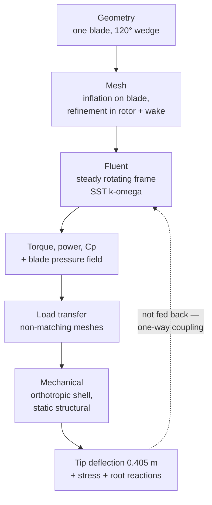

# ANSYS Simulation Portfolio — CFD, FEA and Fluid–Structure Interaction


Engineering simulations built in **ANSYS 2026 R1** (Fluent, CFX, Mechanical, SpaceClaim)
during summer 2026, alongside CornellX **ENGR2000X — A Hands-on Introduction to
Engineering Simulations** on edX.

The aerofoil case builds the underlying competencies — external aerodynamics, turbulence
modelling, near-wall meshing and formal verification & validation — which then carry into the
centrepiece: a **wind turbine fluid–structure interaction study**, coupling a rotating-frame CFD
solution to a structural FEA of the blade.

**Jad El Badaoui** — Aerospace Engineering, University of Bristol

---

## Headline results

| Study | Method | Key result | Validation status |
|---|---|---|---|
| [**NACA 0012 aerofoil**](naca0012-airfoil/README.md) | 2-D steady RANS, standard *k*–ε, $Re_c = 6\times10^{6}$ | $C_L \approx 1.06$; suction peak, pressure recovery and wake captured across the full $C_p$ distribution | Surface $C_p$ **agrees closely** with NASA data; $C_L$ within **1.4 %** of experiment ✅ |
| [**Wind turbine FSI**](turbine-fsi/README.md) | One-way CFD → FEA; 120° periodic sector, rotating frame, SST *k*–ω, orthotropic shell | Tip deflection **0.405 m**; root reaction verified to **0.116 %** against hand calculation | Verified numerically; **not** experimentally validated — $C_p$ still mesh-dependent ⚠️ |

> The part I'd most like a reader to notice isn't the contour plots — it's the chain of reasoning
> behind them. The aerofoil study is carried from hand calculation and governing equations, through
> mesh design and the finite-volume method, to formal numerical verification and comparison against
> published experimental data. That chain is what makes a CFD result mean something.

---

## Repository contents

```
├── naca0012-airfoil/     Full CFD workflow: pre-analysis → V&V     ◄ detailed write-up
├── turbine-fsi/          Rotating-frame CFD → shell FEA, one-way   ◄ detailed write-up
└── tools/preanalysis.py  Runnable pre-analysis & validation calculator
```

---

## 1. NACA 0012 Aerofoil — External Aerodynamics, Turbulence & Validation

**📖 [Read the complete technical write-up →](naca0012-airfoil/README.md)**

A two-dimensional RANS solution over a NACA 0012 section at 10° incidence and
$Re_c = 6\times10^{6}$, taken through the *entire* CFD argument — pre-analysis, geometry,
mesh design, turbulence closure, finite-volume solution, post-processing, numerical
verification, and validation against NASA experimental data.

The linked document covers, with full derivations:

| | |
|---|---|
| **Reynolds decomposition → RANS** | The closure problem stated explicitly, and why it arises |
| **Boussinesq eddy-viscosity hypothesis** | Why $\mu_t$ is *not* a fluid property |
| **Standard *k*–ε transport equations** | Both equations, all five calibrated constants, and the model's known weaknesses |
| **Finite-volume discretization** | Generic transport equation → face fluxes → $a_P\phi_P = \sum a_N\phi_N + b$ |
| **Near-wall theory and the $y^+$ criterion** | Viscous sublayer, buffer layer, log law, and first-cell sizing |
| **Verification** | Mass conservation, iterative convergence, domain independence, Richardson extrapolation & GCI |
| **Validation** | Surface $C_p$ against Gregory & O'Reilly, with Ladson's force data as reference |

### Results

| | |
|---|---|
|  |  |
| **Velocity magnitude** — stagnation at the leading edge, acceleration over the suction surface to nearly twice free-stream, wake deficit aft of the trailing edge. | **Pressure field** — the suction peak and trailing-edge recovery. Note that pressure barely varies *across* the thin boundary layer, which is exactly why lift is so much easier to predict than drag. |
|  |  |
| **Turbulent kinetic energy** — isolates the boundary layer as a thin high-TKE sheet that thickens aft and sheds into the wake. The most diagnostically useful of the four: if the near-wall mesh is too coarse, the layer smears across cells instead of appearing as a sharp sheet. | **Velocity vectors** — flow turning around the leading edge. |

### Validation

The predicted surface pressure distribution **overlaps the NASA experimental data closely** across
the chord — capturing the leading-edge suction peak, the pressure recovery toward the trailing
edge, and the stagnation region. The integrated lift follows from it at $C_L \approx 1.06$ against
an experimental 1.07–1.08, about **1.4 % low**, and a thin-aerofoil hand calculation of 1.097 done
before any solver was opened.

Because the $C_p$ distribution *is* the aerodynamic loading, matching it over the full chord is a
far stronger result than matching a single integrated coefficient — an integrated value can agree
through error cancellation between two compensating errors, whereas a point-by-point match cannot
happen by accident.

The comparison uses the NASA NACA 0012 validation resources — **Gregory & O'Reilly** for surface
pressure and **Ladson** for the force coefficients — at matched Reynolds number and incidence.

Alongside the physical validation, the write-up carries a full **numerical verification** argument:

- **Mass conservation** — normalized imbalance of order 10⁻⁷ of the incoming flow.
- **Iterative convergence** — residuals to ≈ 10⁻⁶ with flat force monitors, not residuals alone.
- **Near-wall audit** — the computed $y^+$ distribution checked against the range the chosen wall treatment actually requires.
- **Domain and grid independence** — the remaining work, set out as a controlled [verification matrix](naca0012-airfoil/README.md#142-the-verification-matrix) of six cases, one variable changed at a time, each with a stated acceptance criterion.

> **Verification and validation answer different questions.** Verification asks whether the
> equations were solved correctly; validation asks whether those equations describe the real flow.
> A converged solution of the wrong equations is still wrong — and that distinction is the most
> useful thing this project taught me.

---

## 2. Reproducible pre-analysis tool

[`tools/preanalysis.py`](tools/preanalysis.py) — a dependency-free Python script that recomputes
the entire NACA 0012 pre-analysis from the raw case inputs, so every number quoted in this
repository can be checked rather than taken on trust.

```console
$ python tools/preanalysis.py

2. Reynolds number and flow regime
----------------------------------
  Re_c = rho*V*c/mu              6.000e+06
  Regime                      turbulent boundary layer and wake expected

3. Free-stream and inlet conditions
-----------------------------------
  Dynamic pressure, q_inf           1557.4  Pa
  Inlet U_x = V*cos(alpha)          50.668  m/s
  Inlet U_y = V*sin(alpha)           8.934  m/s

5. Near-wall sizing for y+ = 30
-------------------------------
  Friction velocity, u_tau          1.8334  m/s
  First cell height, y_1         1.403e-04  m   (1.403e-04 c)
  Placement                   log layer - suits standard wall functions
```

It also handles any other case. To size a wall-resolved mesh at 5° incidence:

```console
$ python tools/preanalysis.py --alpha 5 --y-plus 1
```

Included: Reynolds number, dynamic pressure, inlet decomposition, thin-aerofoil lift, sectional
forces, flat-plate $y^+$ / first-cell-height sizing with inflation-stack totals, log-law placement
checks, Richardson extrapolation with GCI, and normalized mass-imbalance.

---

## 3. Wind Turbine — Fluid–Structure Interaction ⭐

**📖 [Read the complete technical write-up →](turbine-fsi/README.md)**

The main project. A three-bladed horizontal-axis wind turbine solved as a **one-way coupled FSI**:
a rotating-frame CFD solution on a 120° periodic sector produces the aerodynamic pressure field,
which is then mapped onto an orthotropic composite shell model as the load case for a static
structural analysis.

This is the interesting part — most course exercises are purely CFD *or* purely FEA. Here the
output of one physics domain becomes the input of the other, which is how real aeroelastic sizing
work is actually done — and it introduces a class of error, load transfer between non-matching
meshes, that no single-physics analysis has.



### Fluid domain

The rotor is solved in a **rotating reference frame**, so a steady-state solution captures rotation
without meshing a transient sliding interface, and **rotational periodicity** lets one blade in a
120° sector stand for all three — cutting the cost by a factor of three at the price of ruling out
tower shadow, wind shear and yaw.

Blade velocity in the stationary frame reaches **98.05 m/s at the tip** over a 44.2 m rotor,
against **98.12 m/s** from $\Omega R$ by hand — a 0.07 % agreement that verifies the rotation rate,
axis, units and root offset in a single check.

| | |
|---|---|
|  |  |
| **Computational mesh** — refined toward the blade surfaces to resolve the boundary layer. | **Blade velocity, stationary frame** — tip speed 98 m/s, linear $\Omega r$ distribution along span. |

### Sectional aerodynamics

Taking a cut through the blade shows the aerofoil behaving as expected — and behaving like the
NACA 0012 case above, which is the point of having done that study first. A **stagnation point at
the leading edge (+199 Pa)** and a **suction peak of −395 Pa** on the low-pressure surface. The
pressure difference across the section produces both the useful torque and the flapwise bending load.

| | |
|---|---|
|  |  |
| **Pressure contours** — stagnation +199 Pa, suction peak −395 Pa. | **Velocity vectors** — accelerated flow over the suction side, up to 34.8 m/s. |

### Linking the two physics domains

The **blade element velocity triangle** connects the aerodynamics to the structure. The blade sees
a relative velocity

$$
U_{\text{rel}} = U + \Omega R \qquad \text{(freestream + rotational component)}
$$

at an angle of attack $\alpha$ to the chord line. The resulting sectional lift $dF_L$ resolves into:

- **Tangential component** ($dF_T$) — drives rotor torque, i.e. the power the turbine extracts
- **Normal component** ($dF_N$) — flapwise bending load, i.e. what the structure has to survive

Because $\Omega R$ grows linearly with radius, $U_{\text{rel}}$ and the local angle of attack both
vary along the span — which is exactly why real blades are twisted, and why the bending moment
concentrates at the root.

### Structural response


The blade is modelled as a **homogenised orthotropic composite shell** — outer skin plus internal
spar, both tapering along the span, with a longitudinal stiffness 15× the transverse. The CFD
pressure field plus centrifugal inertia, with the root on a remote displacement, gives a **maximum
tip deflection of 0.405 m**. The profile is classic cantilever behaviour — near-zero at the root,
growing non-linearly toward the tip, since each span station carries the integrated moment of all
load outboard of it.

**The strongest check in the project** is the root radial reaction. For a rigidly rotating mass
distribution the total radial force reduces exactly to $m\,\Omega^2 r_{\text{cm}}$, independent of
how the mass is distributed. With a 22,473 kg blade and its centre of mass at 14.232 m, that gives
**1,576.3 kN** by hand against **1,578.1 kN** from ANSYS — **0.116 %**. Agreement to one part in a
thousand simultaneously verifies the mass, density, centre of mass, angular velocity, centrifugal
load implementation and reaction extraction.

**Why tip deflection matters:** it is a design-driving constraint on real turbines — the blade must
not strike the tower under peak gust loading — and it is also what decides whether one-way coupling
was legitimate. At 0.405 m against a 44.2 m radius, the deflection is **0.92 % of rotor radius**,
small enough that the one-way assumption looks defensible at this operating point.

### Limitations (honest ones)

- **The power coefficient is not converged.** The computed $C_p \approx 0.141$ sits well below the
  0.30–0.45 a real machine of this class achieves, and the refinement evidence shows it still moving
  at 7.7 million cells without entering an asymptotic range. It is a coarse-mesh number, not a
  performance prediction — and reporting that honestly is the point.
- **No experimental data exists** for either half, so the study is numerically verified and
  physically assessed, but cannot be called validated. Tip speed matching $\Omega R$ is kinematic
  verification; staying under the Betz limit is a bound check; the manufacturer $C_p$ comparison is
  plausibility at best.
- **One-way coupling only.** Deflection is not fed back, so the load is that of the *undeformed*
  blade. The 0.92 % deflection ratio supports the assumption, but the change in local **twist** —
  which is what actually sets angle of attack — was not extracted.
- **Periodic sector**, so no tower shadow, wind shear, yaw misalignment or transient gusts.
- **Static structural only** — no modal or fatigue analysis, and fatigue is what actually drives
  blade life in service. Gravity, a once-per-revolution edgewise load, is also omitted.
- **Von Mises against UTS is the wrong failure measure** for an orthotropic composite. The ≈ 16
  factor of safety is a scalar screen, not a strength assessment.
- **No grid-convergence study** on either the rotor or the structural mesh — the same criticism
  levelled at the aerofoil case in §1 applies here and has not been discharged.
- Run on the **ANSYS Student licence**, which caps mesh size and therefore limits boundary-layer
  resolution.

---

## Skills demonstrated

| Area | Detail |
|---|---|
| **CFD** | Fluent & CFX, rotating reference frames, rotational periodicity, RANS turbulence modelling, external aerodynamics |
| **Turbulence modelling** | Reynolds decomposition, closure problem, Boussinesq hypothesis, standard *k*–ε and SST *k*–ω, blending functions and the shear-stress limiter, wall functions vs. wall-resolved treatment |
| **FEA** | Static structural, shell idealisation, orthotropic composite constitutive modelling, cantilever load paths, reaction equilibrium |
| **Multiphysics** | One-way FSI — mapping a CFD pressure field onto a non-matching structural mesh, and checking that force and moment survive the transfer |
| **Meshing** | Boundary-layer inflation, bidirectional edge biasing, sphere-of-influence refinement, orthogonal-quality and aspect-ratio diagnostics |
| **Verification** | Mass conservation, iterative convergence, domain independence, grid convergence, Richardson extrapolation / GCI, $y^+$ audit, hand-calculation cross-checks on kinematics and centrifugal reaction |
| **Validation** | $C_p$ distribution compared against NASA experimental data at matched Reynolds number and incidence — and knowing when a comparison is *not* validation |
| **Theory** | Thin-aerofoil theory, blade element momentum theory, velocity triangles, law of the wall |

---

## A note on what's in this repository

**Result figures, original diagrams and written analysis only.** ANSYS project archives
(`.wbpj` / `.wbpz`) are deliberately **not** included, for two reasons:

1. Several embed **geometry supplied by CornellX ENGR2000X**, which is Cornell's copyrighted
   course material and not mine to redistribute.
2. Publishing complete solution archives for an active edX course would undermine it for other
   students.

For the same reason, the diagrams in the aerofoil write-up are **original renderings**, not
Cornell's slide images.

The ANSYS installer is likewise not here — it's licensed commercial software. If you want to
reproduce any of this, the course is freely auditable on edX and ANSYS offers a free Student licence.
