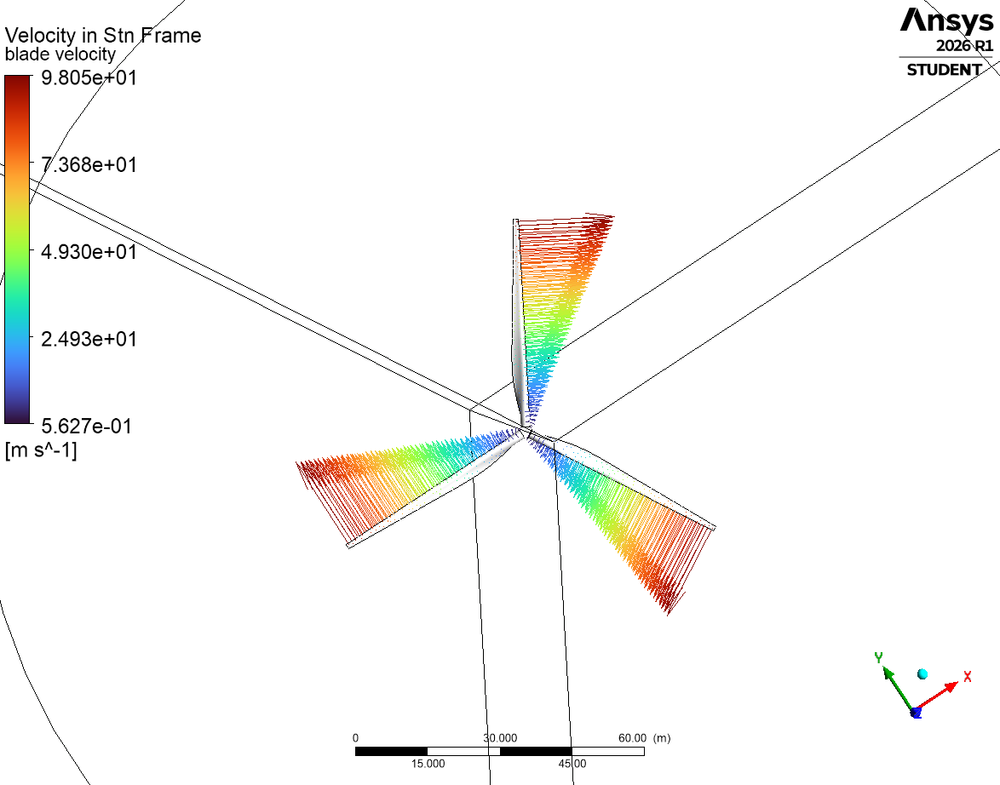
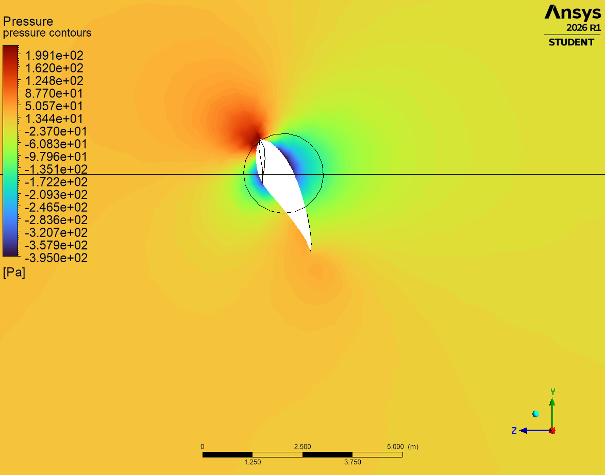
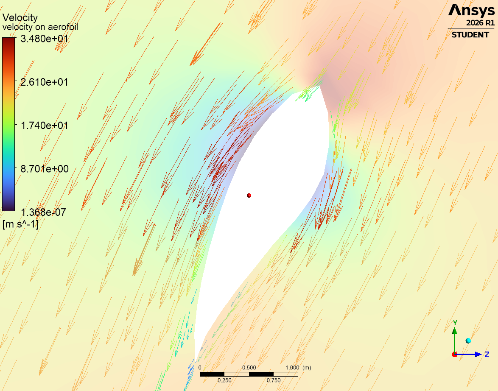
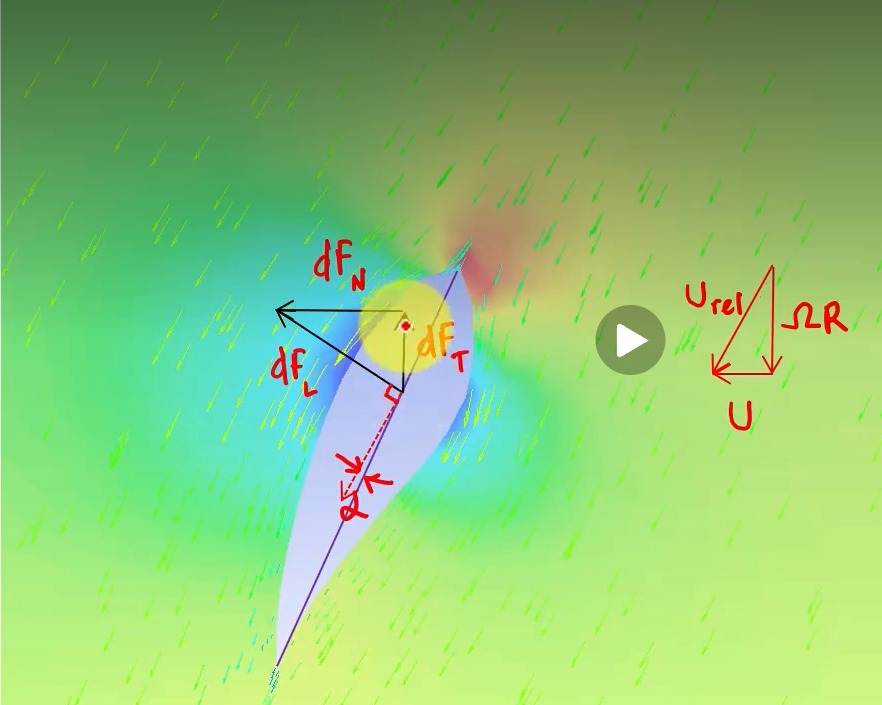
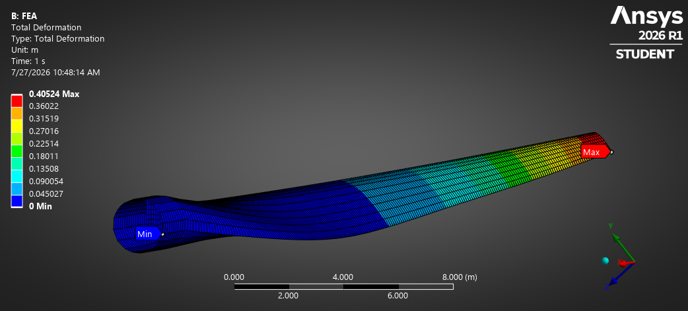
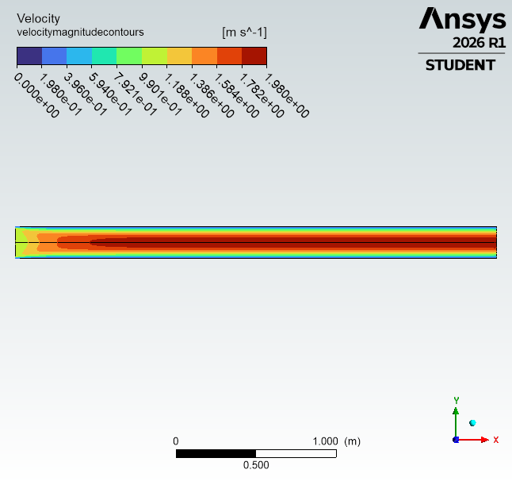
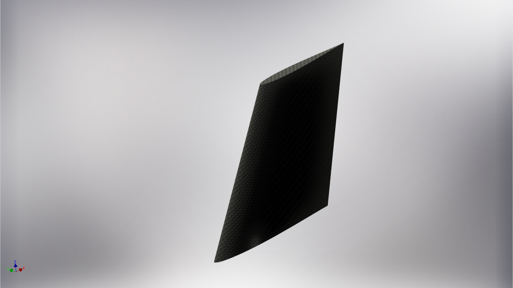

# ANSYS Simulation Portfolio — CFD, FEA and Fluid–Structure Interaction

Engineering simulations built in **ANSYS 2026 R1** (Fluent, CFX, Mechanical, SpaceClaim)
during summer 2026, alongside CornellX **ENGR2000X — A Hands-on Introduction to
Engineering Simulations** on edX.

The centrepiece is a **wind turbine fluid–structure interaction study**, which couples a
rotating-frame CFD solution to a structural FEA of the blade. The remaining cases build
the underlying competencies: external aerodynamics, turbulence modelling, mesh bias,
laminar internal flow, and composite geometry definition.

Jad El Badaoui — Aerospace Engineering, University of Bristol

---

## 1. Wind Turbine — Fluid–Structure Interaction ⭐

The main project. A three-bladed horizontal-axis wind turbine is solved as a **one-way
coupled FSI**: the CFD solution produces the aerodynamic pressure field, which is then
mapped onto the blade structure as the load case for a static structural analysis.

This is the interesting part — most course exercises are purely CFD *or* purely FEA. Here
the output of one physics domain becomes the input of the other, which is how real
aeroelastic sizing work is actually done.

### Workflow

```
Geometry ──► Mesh ──► Fluent/CFX (MRF)  ──►  pressure field
                                              │
                                              ▼
                                    Mechanical (static structural)
                                              │
                                              ▼
                                    deflection + stress
```

### Fluid domain

The rotor is solved in a **rotating (moving) reference frame**, so a steady-state solution
captures rotation without meshing a transient sliding interface. Blade velocity in the
stationary frame reaches **98 m/s at the tip**, over a rotor of roughly 45 m radius —
the linear `Ωr` span-wise gradient is clearly visible in the vector plot.

| | |
|---|---|
|  |  |
| **Computational mesh** — refined toward the blade surfaces to resolve the boundary layer. | **Blade velocity, stationary frame** — tip speed 98 m/s, linear `Ωr` distribution along span. |

### Sectional aerodynamics

Taking a cut through the blade shows the aerofoil behaving as expected: a **stagnation
point at the leading edge (+199 Pa)** and a **suction peak of −395 Pa** on the low-pressure
surface. The pressure difference across the section is what produces both the useful
torque and the flapwise bending load.

| | |
|---|---|
|  |  |
| **Pressure contours** — stagnation +199 Pa, suction peak −395 Pa. | **Velocity vectors** — accelerated flow over the suction side, up to 34.8 m/s. |

### Linking the two physics domains



The annotated section shows the **blade element velocity triangle** that connects the
aerodynamics to the structure. The blade sees a relative velocity

```
U_rel = U + ΩR          (freestream + rotational component)
```

at an angle of attack `α` to the chord line. The resulting sectional lift `dF_L` resolves
into:

- **`dF_T` (tangential)** — drives rotor torque, i.e. the power the turbine extracts
- **`dF_N` (normal)** — flapwise bending load, i.e. what the structure has to survive

Because `ΩR` grows linearly with radius, `U_rel` and the local angle of attack both vary
along the span — which is exactly why real blades are twisted, and why the bending moment
concentrates at the root.

### Structural response



The CFD pressure field applied to the blade, with the root fixed, gives a **maximum tip
deflection of 0.405 m**. The deformation profile is classic cantilever behaviour — near-zero
at the fixed root, growing non-linearly toward the tip, since each span station carries the
integrated moment of all aerodynamic load outboard of it.

**Why this matters:** tip deflection is a design-driving constraint on real turbines. The
blade must not strike the tower under peak gust loading, so this deflection is checked
directly against the tower clearance envelope.

### Limitations (honest ones)

- **One-way coupling only.** Deflection is not fed back into the fluid domain, so the
  aerodynamic load is that of the *undeformed* blade. Since 0.405 m of tip deflection
  changes the local angle of attack, a two-way coupled solution would give a somewhat
  different (generally lower) load — this is aeroelastic relief.
- **Steady MRF**, so no tower shadow, wind shear, yaw misalignment, or transient gusts.
- **Static structural only** — no modal or fatigue analysis, and fatigue is what actually
  drives blade life in service.
- Run on the **ANSYS Student licence**, which caps mesh size and therefore limits
  boundary-layer resolution.

---

## 2. NACA 0012 Aerofoil — External Aerodynamics & Turbulence

Two-dimensional RANS solution over a NACA 0012 section, used to build up turbulence
modelling and boundary-layer meshing technique. A **biased mesh** clusters cells toward the
surface and into the wake, so the boundary layer is resolved without paying for uniform
refinement across the whole domain.

| | |
|---|---|
|  |  |
| **Velocity magnitude** — stagnation at the leading edge, acceleration over the suction surface (peak ≈ 120 m/s), wake deficit aft of the trailing edge. | **Pressure field** — the suction peak and trailing-edge recovery. |
|  |  |
| **Turbulent kinetic energy** — cleanly isolates the boundary layer as a thin high-TKE sheet that thickens aft and sheds into the wake. A good check that the near-wall mesh is adequate. | **Velocity vectors** — flow turning around the leading edge. |

The TKE plot is the most diagnostically useful of the four: if the near-wall mesh is too
coarse, the boundary layer smears across cells instead of appearing as a sharp sheet.

---

## 3. Laminar Pipe Flow — Validated Against Analytical Solution



Developing laminar flow in a circular pipe. Uniform **1.0 m/s** inlet, no-slip walls, and
the profile develops downstream into the fully-developed parabolic (Hagen–Poiseuille)
distribution.

**This one has a genuine validation check.** For fully-developed laminar pipe flow, theory
gives a centreline velocity of exactly twice the mean:

```
u_max / u_mean = 2.0
```

The simulation reaches a centreline velocity of **1.98 m/s** against a 1.0 m/s inlet — a
**1 % error** against the analytical result. The entrance length needed to reach that
profile is also visible as the developing region at the inlet.

Being able to verify a solver against a closed-form solution before trusting it on a
problem that has no closed-form answer is the entire point of the exercise.

---

## 4. Composite Fin — Geometry & Layup



Swept composite fin modelled in SpaceClaim as a surface body for shell meshing, with a
carbon-fibre laminate material definition. Surface-body idealisation is the correct
approach for thin-walled composite structures — a solid mesh through a 2 mm skin would be
enormously wasteful and badly conditioned.

This ties into my composites research: **[Composite-Analysis](https://github.com/Jadbadawi/Composite-Analysis)**,
an experimental and numerical study of thin-ply quasi-isotropic and Double-Double laminates.

---

## Also completed (no figures exported)

- **2D steady-state heat conduction** — thermal FEA, plate with mixed temperature and flux
  boundary conditions; two mesh-refinement variants for convergence checking.

---

## Skills demonstrated

| Area | Detail |
|---|---|
| **CFD** | Fluent & CFX, rotating reference frames (MRF), RANS turbulence modelling, internal and external flow |
| **FEA** | Static structural, thermal conduction, shell vs solid idealisation, cantilever load paths |
| **Multiphysics** | One-way FSI — mapping a CFD pressure field onto a structural mesh |
| **Meshing** | Boundary-layer inflation, mesh biasing, refinement studies |
| **Verification** | Validation against analytical solutions (Hagen–Poiseuille), mesh sensitivity |
| **Theory** | Blade element momentum theory, velocity triangles, aerofoil pressure distributions |

---

## A note on what's in this repository

**Result figures and written analysis only.** ANSYS project archives (`.wbpj` / `.wbpz`) are
deliberately **not** included, for two reasons:

1. Several embed **geometry supplied by CornellX ENGR2000X**, which is Cornell's
   copyrighted course material and not mine to redistribute.
2. Publishing complete solution archives for an active edX course would undermine it for
   other students.

The ANSYS installer is likewise not here — it's licensed commercial software. If you want
to reproduce any of this, the course is freely auditable on edX and ANSYS offers a free
Student licence.
