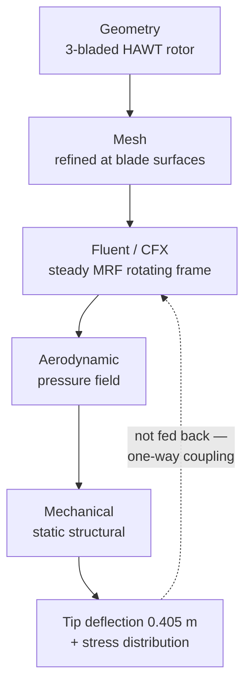

# ANSYS Simulation Portfolio — CFD, FEA and Fluid–Structure Interaction


Engineering simulations built in **ANSYS 2026 R1** (Fluent, CFX, Mechanical, SpaceClaim)
during summer 2026, alongside CornellX **ENGR2000X — A Hands-on Introduction to
Engineering Simulations** on edX.

The aerofoil case builds the underlying competencies — external aerodynamics, turbulence
modelling, near-wall meshing and formal verification & validation — which then carry into the
centrepiece: a **wind turbine fluid–structure interaction study**, coupling a rotating-frame CFD
solution to a structural FEA of the blade.

**Jad El Badaoui** — Aerospace Engineering, University of Bristol

---

## Headline results

| Study | Method | Key result | Validation status |
|---|---|---|---|
| [**NACA 0012 aerofoil**](naca0012-airfoil/README.md) | 2-D steady RANS, standard *k*–ε, $Re_c = 6\times10^{6}$ | $C_L = 1.06$, $C_D = 0.017$ | $C_L$ within **−1.4%** of NASA data ✅ · $C_D$ **+42%** ❌ — diagnosed to near-wall resolution |
| [**Wind turbine FSI**](#2-wind-turbine--fluidstructure-interaction) | One-way coupled CFD → FEA, MRF rotating frame | Tip deflection **0.405 m**, tip speed 98 m/s | Qualitative — cantilever load path as expected |

> The thing I'd most like a reader to notice is the second row of that table.
> Getting lift right was straightforward. Understanding **why the drag was wrong**, and being able
> to trace it to a specific, measurable mesh deficiency rather than guessing at solver settings,
> is the part that took real work — and it's written up in full.

---

## Repository contents

```
├── naca0012-airfoil/     Full CFD workflow: pre-analysis → V&V  ◄ the detailed write-up
├── turbine-fsi/          One-way fluid–structure interaction study
└── tools/preanalysis.py  Runnable pre-analysis & validation calculator
```

---

## 1. NACA 0012 Aerofoil — External Aerodynamics, Turbulence & Validation

**📖 [Read the complete technical write-up →](naca0012-airfoil/README.md)**

A two-dimensional RANS solution over a NACA 0012 section at 10° incidence and
$Re_c = 6\times10^{6}$, taken through the *entire* CFD argument — pre-analysis, geometry,
mesh design, turbulence closure, finite-volume solution, post-processing, numerical
verification, and validation against NASA experimental data.

The linked document covers, with full derivations:

| | |
|---|---|
| **Reynolds decomposition → RANS** | The closure problem stated explicitly, and why it arises |
| **Boussinesq eddy-viscosity hypothesis** | Why $\mu_t$ is *not* a fluid property |
| **Standard *k*–ε transport equations** | Both equations, all five calibrated constants, and the model's known weaknesses |
| **Finite-volume discretization** | Generic transport equation → face fluxes → $a_P\phi_P = \sum a_N\phi_N + b$ |
| **Near-wall theory and $y^+$** | Viscous sublayer, buffer layer, log law, and first-cell sizing |
| **Verification** | Mass conservation, iterative convergence, domain independence, Richardson extrapolation & GCI |
| **Validation** | $C_p$, $C_L$ and $C_D$ against Gregory & O'Reilly and Ladson |

### Results

| | |
|---|---|
|  |  |
| **Velocity magnitude** — stagnation at the leading edge, acceleration over the suction surface to nearly twice free-stream, wake deficit aft of the trailing edge. | **Pressure field** — the suction peak and trailing-edge recovery. Note that pressure barely varies *across* the thin boundary layer, which is exactly why lift is so much easier to predict than drag. |
|  |  |
| **Turbulent kinetic energy** — isolates the boundary layer as a thin high-TKE sheet that thickens aft and sheds into the wake. The most diagnostically useful of the four: if the near-wall mesh is too coarse, the layer smears across cells instead of appearing as a sharp sheet. | **Velocity vectors** — flow turning around the leading edge. |

### The interesting finding

$$C_L^{\text{CFD}} = 1.06 \ \text{vs} \ 1.07\text{–}1.08 \ \text{experiment} \quad (-1.4\%)$$
$$C_D^{\text{CFD}} = 0.017 \ \text{vs} \ 0.012 \ \text{experiment} \quad (+42\%)$$

Lift is essentially validated; drag is not. That asymmetry is not a coincidence and it isn't
solved by tuning the solver:

- **Pressure governs lift**, and pressure changes very little across a thin boundary layer — so lift tolerates a coarse near-wall mesh.
- **Drag is ~1% of the magnitude of lift** and depends on wall shear, boundary-layer growth and the wake. Small errors there become large *relative* errors in $C_D$.
- The computed $y^+$ distribution shows much of the aerofoil falls **outside** the 30–300 band that the standard wall functions in use actually require. **The mesh and the wall model were inconsistent with each other.**

The write-up ends with a controlled [verification matrix](naca0012-airfoil/README.md#14-improvement-plan-and-verification-matrix)
— six cases, one variable changed at a time, each with a stated acceptance criterion — rather than
a claim that the result is good enough.

> **Validation is quantity-specific.** A model validated for lift is not automatically validated
> for drag. That single sentence is the most useful thing this project taught me.

---

## 2. Wind Turbine — Fluid–Structure Interaction ⭐

The main project. A three-bladed horizontal-axis wind turbine solved as a **one-way coupled FSI**:
the CFD solution produces the aerodynamic pressure field, which is then mapped onto the blade
structure as the load case for a static structural analysis.

This is the interesting part — most course exercises are purely CFD *or* purely FEA. Here the
output of one physics domain becomes the input of the other, which is how real aeroelastic sizing
work is actually done.



### Fluid domain

The rotor is solved in a **rotating (moving) reference frame**, so a steady-state solution
captures rotation without meshing a transient sliding interface. Blade velocity in the stationary
frame reaches **98 m/s at the tip** over a rotor of roughly 45 m radius — the linear $\Omega r$
spanwise gradient is clearly visible in the vector plot.

| | |
|---|---|
|  |  |
| **Computational mesh** — refined toward the blade surfaces to resolve the boundary layer. | **Blade velocity, stationary frame** — tip speed 98 m/s, linear $\Omega r$ distribution along span. |

### Sectional aerodynamics

Taking a cut through the blade shows the aerofoil behaving as expected — and behaving like the
NACA 0012 case above, which is the point of having done that study first. A **stagnation point at
the leading edge (+199 Pa)** and a **suction peak of −395 Pa** on the low-pressure surface. The
pressure difference across the section produces both the useful torque and the flapwise bending load.

| | |
|---|---|
|  |  |
| **Pressure contours** — stagnation +199 Pa, suction peak −395 Pa. | **Velocity vectors** — accelerated flow over the suction side, up to 34.8 m/s. |

### Linking the two physics domains

The **blade element velocity triangle** connects the aerodynamics to the structure. The blade sees
a relative velocity

$$U_{\text{rel}} = U + \Omega R \qquad \text{(freestream + rotational component)}$$

at an angle of attack $\alpha$ to the chord line. The resulting sectional lift $dF_L$ resolves into:

- **$dF_T$ (tangential)** — drives rotor torque, i.e. the power the turbine extracts
- **$dF_N$ (normal)** — flapwise bending load, i.e. what the structure has to survive

Because $\Omega R$ grows linearly with radius, $U_{\text{rel}}$ and the local angle of attack both
vary along the span — which is exactly why real blades are twisted, and why the bending moment
concentrates at the root.

### Structural response


The CFD pressure field applied to the blade, with the root fixed, gives a **maximum tip deflection
of 0.405 m**. The deformation profile is classic cantilever behaviour — near-zero at the fixed root,
growing non-linearly toward the tip, since each span station carries the integrated moment of all
aerodynamic load outboard of it.

**Why this matters:** tip deflection is a design-driving constraint on real turbines. The blade must
not strike the tower under peak gust loading, so this deflection is checked directly against the
tower clearance envelope.

### Limitations (honest ones)

- **One-way coupling only.** Deflection is not fed back into the fluid domain, so the aerodynamic
  load is that of the *undeformed* blade. Since 0.405 m of tip deflection changes the local angle
  of attack, a two-way coupled solution would give a somewhat different (generally lower) load —
  this is aeroelastic relief.
- **Steady MRF**, so no tower shadow, wind shear, yaw misalignment, or transient gusts.
- **Static structural only** — no modal or fatigue analysis, and fatigue is what actually drives
  blade life in service.
- **No grid-convergence study** on the rotor case — the same criticism levelled at the aerofoil
  case in §1 applies here and has not yet been discharged.
- Run on the **ANSYS Student licence**, which caps mesh size and therefore limits boundary-layer
  resolution.

---

## 3. Reproducible pre-analysis tool

[`tools/preanalysis.py`](tools/preanalysis.py) — a dependency-free Python script that recomputes
the entire NACA 0012 pre-analysis and validation summary from the raw case inputs, so every number
quoted in this repository can be checked rather than taken on trust.

```console
$ python tools/preanalysis.py

2. Reynolds number and flow regime
----------------------------------
  Re_c = rho*V*c/mu              6.000e+06
  Regime                      turbulent boundary layer and wake expected

5. Near-wall sizing for y+ = 30
-------------------------------
  Friction velocity, u_tau          1.8334  m/s
  First cell height, y_1         1.403e-04  m   (1.403e-04 c)
  Placement                   log layer - suits standard wall functions

6. Validation against NASA experimental data
--------------------------------------------
  Quantity           CFD      Experiment       Error
  --------------------------------------------------
  CL               1.060       1.07-1.08       -1.4%
  CD               0.017           0.012       41.7%
```

It also handles any other case. To size a wall-resolved mesh at 5° incidence:

```console
$ python tools/preanalysis.py --alpha 5 --y-plus 1
```

Included: Reynolds number, dynamic pressure, inlet decomposition, thin-aerofoil lift, sectional
forces, flat-plate $y^+$ / first-cell-height sizing with inflation-stack totals, log-law placement
checks, percentage validation errors, Richardson extrapolation with GCI, and normalized mass-imbalance.

---

## Skills demonstrated

| Area | Detail |
|---|---|
| **CFD** | Fluent & CFX, rotating reference frames (MRF), RANS turbulence modelling, external aerodynamics |
| **Turbulence modelling** | Reynolds decomposition, closure problem, Boussinesq hypothesis, standard *k*–ε, wall functions vs. wall-resolved treatment |
| **FEA** | Static structural, cantilever load paths |
| **Multiphysics** | One-way FSI — mapping a CFD pressure field onto a structural mesh |
| **Meshing** | Boundary-layer inflation, bidirectional edge biasing, sphere-of-influence refinement, orthogonal-quality and aspect-ratio diagnostics |
| **Verification** | Mass conservation, iterative convergence, domain independence, grid convergence, Richardson extrapolation / GCI, $y^+$ audit |
| **Validation** | $C_p$ distribution and force-coefficient comparison against NASA experimental data; quantity-specific validation reasoning |
| **Theory** | Thin-aerofoil theory, blade element momentum theory, velocity triangles, law of the wall |

---

## A note on what's in this repository

**Result figures, original diagrams and written analysis only.** ANSYS project archives
(`.wbpj` / `.wbpz`) are deliberately **not** included, for two reasons:

1. Several embed **geometry supplied by CornellX ENGR2000X**, which is Cornell's copyrighted
   course material and not mine to redistribute.
2. Publishing complete solution archives for an active edX course would undermine it for other
   students.

For the same reason, the diagrams in the aerofoil write-up are **original renderings**, not
Cornell's slide images.

The ANSYS installer is likewise not here — it's licensed commercial software. If you want to
reproduce any of this, the course is freely auditable on edX and ANSYS offers a free Student licence.
