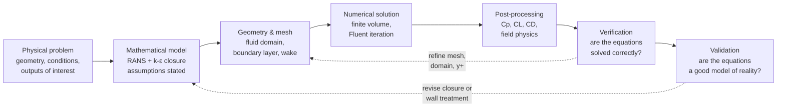

# Turbulent Flow Past a NACA 0012 Aerofoil

### A complete CFD workflow: pre-analysis → geometry → mesh → RANS closure → Fluent solution → post-processing → verification → validation

Two-dimensional steady RANS solution of the flow over a NACA 0012 section at 10° incidence
and a chord Reynolds number of 6 × 10⁶, solved in **ANSYS Fluent** with the standard *k*–ε
turbulence model, verified numerically and validated against NASA experimental data.

Jad El Badaoui — Aerospace Engineering, University of Bristol
Built alongside the Cornell MAE 5230 / ANSYS Fluent NACA 0012 module.

[← back to portfolio](../README.md)

---

## Contents

| | |
|---|---|
| [1. How to think through a CFD problem](#1-how-to-think-through-a-cfd-problem) | [9. Post-processing and physical interpretation](#9-post-processing-and-physical-interpretation) |
| [2. Physical problem and pre-analysis](#2-physical-problem-and-pre-analysis) | [10. Verification — solving the model correctly](#10-verification--solving-the-model-correctly) |
| [3. Reynolds number and flow regime](#3-reynolds-number-and-flow-regime) | [11. Near-wall verification and *y*⁺](#11-near-wall-verification-and-the-y-plus-criterion) |
| [4. Hand calculations before solving](#4-hand-calculations-before-solving) | [12. Validation against NACA 0012 experiments](#12-validation-against-naca-0012-experiments) |
| [5. From instantaneous flow to RANS](#5-from-instantaneous-flow-to-the-rans-equations) | [13. Results summary and honest assessment](#13-results-summary-and-honest-assessment) |
| [6. Turbulence closure: eddy viscosity and *k*–ε](#6-turbulence-closure-eddy-viscosity-and-two-equation-modelling) | [14. Improvement plan and verification matrix](#14-improvement-plan-and-verification-matrix) |
| [7. Geometry and mesh design](#7-geometry-and-mesh-design) | [15. Reusable CFD checklist](#15-reusable-cfd-checklist) |
| [8. Boundary conditions and solution strategy](#8-boundary-conditions-and-finite-volume-solution-strategy) | [16. Symbols and notation](#16-symbols-and-notation) |

---

## Case definition

| Parameter | Symbol | Value |
|---|---|---|
| Chord | $c$ | 1.00 m |
| Free-stream speed | $V_\infty$ | 51.45 m/s |
| Angle of attack | $\alpha$ | 10° |
| Density | $\rho$ | 1.1767 kg/m³ |
| Dynamic viscosity | $\mu$ | 1.009 × 10⁻⁵ kg/(m·s) |
| Chord Reynolds number | $Re_c$ | ≈ 6.0 × 10⁶ |
| Free-stream dynamic pressure | $q_\infty$ | 1557.4 Pa |
| Mesh size | — | ≈ 27,000 cells |
| Turbulence model | — | Standard *k*–ε, standard wall functions |

> Every number in this table is reproduced by [`tools/preanalysis.py`](../tools/preanalysis.py),
> a standalone script that recomputes the whole pre-analysis and validation summary from the
> raw inputs — so the arithmetic here is checkable rather than asserted.

---

## 1. How to think through a CFD problem

The central lesson of this exercise is that **a CFD calculation should never begin by opening
the solver.** A reliable analysis starts with a pre-analysis that connects the physical problem,
its mathematical description, the numerical method, hand calculations, and validation evidence.
The solver is only one link in a chain of engineering argument.

The ten steps applied to this case:

1. Define the physical problem, inputs, outputs and expected flow mechanisms.
2. State the modelling assumptions and governing equations.
3. Calculate the important non-dimensional parameters — above all, Reynolds number.
4. Prepare a clean fluid domain with meaningful boundary names.
5. Create a mesh that resolves the geometry, the boundary layer and the wake.
6. Apply boundary conditions consistent with the mathematical model.
7. Obtain a stable initial solution, *then* increase numerical accuracy.
8. Interpret pressure, velocity, lift and drag using physical reasoning.
9. Verify numerical correctness and quantify numerical uncertainty.
10. Validate the mathematical model against independent experiment.

### Verification is not validation

> **Verification** asks whether the equations were solved *correctly*.
> **Validation** asks whether those equations *represent the real flow*.
> They are different questions and both are required. A converged solution of the wrong
> equations is still wrong; a good physical model solved on a bad mesh is still wrong.

---

## 2. Physical problem and pre-analysis

Steady, turbulent, two-dimensional flow around a symmetric NACA 0012 aerofoil at 10° angle of
attack. Air enters at 51.45 m/s with constant density and viscosity. The outputs of interest are
the mean velocity and pressure fields, the surface pressure-coefficient distribution, and the
integrated lift and drag coefficients.

### 2.1 Modelling assumptions

Every assumption removes terms from, or simplifies, the governing equations. They must be stated
explicitly so that the limits of the prediction are understood.

- **Steady mean flow** — time-averaged quantities do not change with time after convergence.
- **Two-dimensional flow** — spanwise variation and tip vortices are neglected; forces are per unit span.
- **Incompressible, constant-property air** — $\rho$ and $\mu$ fixed.
- **Newtonian fluid** — viscous stress proportional to the mean strain rate.
- **Fully turbulent RANS** — $Re$ is high enough that turbulence must be represented by a closure model rather than resolved.
- **Fixed aerofoil, stationary mesh** — no mesh motion.
- **No significant body forces** in the momentum equations.
- **No-slip** on the upper and lower aerofoil surfaces.
- **External boundaries represent the undisturbed far field** — an approximation to infinity, and one that must itself be verified.

---

## 3. Reynolds number and flow regime

The first hand calculation is the chord-based Reynolds number, comparing inertial transport
with molecular momentum diffusion:

$$Re_c = \frac{\rho V_\infty c}{\mu} = \frac{1.1767 \times 51.45 \times 1.00}{1.009\times10^{-5}} \approx 6.0\times10^{6}$$

| Quantity | Interpretation |
|---|---|
| $\rho V_\infty c$ | Inertial transport over the chord scale |
| $\mu$ | Molecular momentum diffusion |
| $Re \gg 1$ | Inertia dominates globally — while viscosity remains decisive inside the boundary layer and wake |

$Re \approx 6\times10^{6}$ is far above the range of fully laminar aerofoil flow, so a turbulent
boundary layer and turbulent wake are expected over most of the chord. Resolving every turbulent
fluctuation directly (DNS) is utterly impractical at this Reynolds number, which is precisely why
a **Reynolds-averaged** formulation is used.

---

## 4. Hand calculations before solving

Predicting the sign, magnitude and spatial behaviour of the outputs *before* running Fluent is
what makes it possible to recognise an incorrect boundary condition, a poorly converged run, or
an unphysical solution.

### 4.1 Coefficient definitions

$$q_\infty = \tfrac{1}{2}\rho V_\infty^{2}, \qquad
C_L = \frac{L'}{q_\infty c}, \qquad
C_D = \frac{D'}{q_\infty c}, \qquad
C_p = \frac{p - p_\infty}{q_\infty}$$

$$q_\infty = \tfrac{1}{2}(1.1767)(51.45)^2 = 1557.4 \ \text{Pa}$$

In a two-dimensional calculation, lift and drag are reported **per unit span**. For $C_L \approx 1.10$
and $C_D \approx 0.012$ this gives $L' \approx 1713$ N/m and $D' \approx 18.7$ N/m — note the two
orders of magnitude between them, a fact that returns with a vengeance in §12.

### 4.2 Thin-aerofoil estimate of lift

$$C_L = 2\pi(\alpha - \alpha_0), \qquad \alpha_0 = 0 \ \text{for a symmetric NACA 0012}$$

$$C_L = 2\pi\left(10° \times \frac{\pi}{180°}\right) = 1.097 \approx 1.10$$

An excellent order-of-magnitude target. But thin-aerofoil theory assumes inviscid, attached,
small-angle flow and predicts **zero** viscous drag — so CFD and experiment are still required.

### 4.3 Inlet decomposition and force directions

$$U_x = V_\infty\cos\alpha = 51.45\cos(10°) = 50.668 \ \text{m/s}$$
$$U_y = V_\infty\sin\alpha = 51.45\sin(10°) = 8.934 \ \text{m/s}$$
$$\mathbf{e}_D = (\cos\alpha,\ \sin\alpha), \qquad \mathbf{e}_L = (-\sin\alpha,\ \cos\alpha)$$

Lift and drag are components *relative to the free-stream direction*, not the chord line — which
is why the unit vectors above matter when the aerofoil is left horizontal and the inflow is
angled. (An equivalent setup rotates the aerofoil and keeps the inlet horizontal.)

### 4.4 Expected physical trends

- The stagnation point sits **below** the leading edge because of the positive incidence.
- The upper surface accelerates strongly, producing a **suction peak** near the leading edge.
- The lower surface carries higher pressure over most of the chord — this pressure difference *is* the lift.
- Velocity is zero at the wall and rises rapidly through a very thin turbulent boundary layer.
- Pressure recovers toward the trailing edge; this **adverse pressure gradient** thickens the boundary layer and can eventually cause separation.
- A velocity-deficit **wake** forms behind the trailing edge.
- Drag arises from *both* wall shear and pressure. Unlike thin-aerofoil theory, viscous CFD predicts non-zero drag.
- $C_p$ should show a strongly negative upper-surface peak against a more positive lower-surface distribution.

---

## 5. From instantaneous flow to the RANS equations

Turbulent flow contains irregular fluctuations across a wide range of length and time scales.
**Reynolds decomposition** splits each instantaneous variable into a mean and a fluctuation:

$$u_i = \overline{u_i} + u_i', \qquad p = \overline{p} + p', \qquad \overline{u_i'} = 0$$

Substituting into the incompressible continuity and Navier–Stokes equations and averaging gives
the **Reynolds-averaged Navier–Stokes** equations:

$$\frac{\partial \overline{u_i}}{\partial x_i} = 0$$

$$\rho\left(\frac{\partial \overline{u_i}}{\partial t} + \overline{u_j}\frac{\partial \overline{u_i}}{\partial x_j}\right)
= -\frac{\partial \overline{p}}{\partial x_i}
+ \mu\frac{\partial^{2}\overline{u_i}}{\partial x_j \partial x_j}
- \rho\frac{\partial \overline{u_i' u_j'}}{\partial x_j}$$

The final term contains the **Reynolds stresses** $-\rho\,\overline{u_i'u_j'}$ — momentum transport
caused by turbulent fluctuations. They are new unknowns, and this is the **turbulence closure
problem**: the averaged equations contain more unknowns than equations.

### 5.1 Steady two-dimensional form

For the steady 2-D case solved here, with the turbulent contributions grouped into
$f_{\text{turb},x}$ and $f_{\text{turb},y}$:

$$\frac{\partial \overline{u}}{\partial x} + \frac{\partial \overline{v}}{\partial y} = 0$$

$$\rho\left(\overline{u}\frac{\partial \overline{u}}{\partial x} + \overline{v}\frac{\partial \overline{u}}{\partial y}\right)
= -\frac{\partial \overline{p}}{\partial x} + \mu\nabla^{2}\overline{u} + f_{\text{turb},x}$$

$$\rho\left(\overline{u}\frac{\partial \overline{v}}{\partial x} + \overline{v}\frac{\partial \overline{v}}{\partial y}\right)
= -\frac{\partial \overline{p}}{\partial y} + \mu\nabla^{2}\overline{v} + f_{\text{turb},y}$$

> **A detail worth flagging.** In the *x*-momentum equation the cross-stream convection term is
> $\overline{v}\,\partial\overline{u}/\partial y$ — the course material renders this incorrectly and it is
> corrected here. The local time-derivative terms vanish *only* because a steady mean solution
> is assumed; they are not universally absent.

**What the RANS equations give us:** the mean velocity and pressure fields that engineering
design actually needs. The unresolved turbulence enters solely through the Reynolds-stress terms —
and those must be modelled.

---

## 6. Turbulence closure: eddy viscosity and two-equation modelling

### 6.1 The Boussinesq hypothesis

The eddy-viscosity concept models turbulent momentum transport *by analogy with molecular
viscosity*. Just as molecular viscosity relates viscous stress to the mean strain rate, a
**turbulent viscosity** $\mu_t$ is introduced to relate the Reynolds stresses to the mean strain
rate:

$$-\rho\,\overline{u_i'u_j'} = 2\mu_t S_{ij} - \tfrac{2}{3}\rho k \delta_{ij},
\qquad
S_{ij} = \frac{1}{2}\left(\frac{\partial \overline{u_i}}{\partial x_j} + \frac{\partial \overline{u_j}}{\partial x_i}\right)$$

which in a two-dimensional shear layer reduces to

$$-\rho\,\overline{u'v'} = \mu_t\left(\frac{\partial \overline{u}}{\partial y} + \frac{\partial \overline{v}}{\partial x}\right)$$

**$\mu_t$ is not a fluid property.** Unlike the molecular viscosity $\mu$, it varies throughout the
flow because it depends on the local turbulence state. The entire job of the turbulence model is
to supply $\mu_t$.

### 6.2 The standard *k*–ε model

Two extra transport equations are solved. **$k$** is the kinetic energy held in the turbulent
velocity fluctuations; **$\varepsilon$** is the rate at which that energy is passed to the smallest
eddies and converted into internal energy.

$$k = \tfrac{1}{2}\overline{u_i'u_i'}, \qquad \mu_t = \rho C_\mu \frac{k^{2}}{\varepsilon}$$

**Turbulent kinetic energy transport:**

$$\frac{\partial(\rho k)}{\partial t} + \frac{\partial(\rho k \overline{u_j})}{\partial x_j}
= \frac{\partial}{\partial x_j}\left[\left(\mu + \frac{\mu_t}{\sigma_k}\right)\frac{\partial k}{\partial x_j}\right]
+ P_k - \rho\varepsilon$$

Left to right: transient storage, convection, effective diffusion, production by mean shear,
and dissipation. In a converged steady calculation the transient term is zero — though Fluent may
still use pseudo-time stepping to *reach* that state.

**Dissipation-rate transport:**

$$\frac{\partial(\rho \varepsilon)}{\partial t} + \frac{\partial(\rho \varepsilon \overline{u_j})}{\partial x_j}
= \frac{\partial}{\partial x_j}\left[\left(\mu + \frac{\mu_t}{\sigma_\varepsilon}\right)\frac{\partial \varepsilon}{\partial x_j}\right]
+ C_{1\varepsilon}\frac{\varepsilon}{k}P_k - C_{2\varepsilon}\rho\frac{\varepsilon^{2}}{k}$$

with production $P_k = 2\mu_t S_{ij}S_{ij}$ for incompressible flow. The $\varepsilon$ equation is
**empirical** and carries calibrated constants:

| Constant | $C_\mu$ | $C_{1\varepsilon}$ | $C_{2\varepsilon}$ | $\sigma_k$ | $\sigma_\varepsilon$ |
|---|---|---|---|---|---|
| **Value** | 0.09 | 1.44 | 1.92 | 1.00 | 1.30 |
| **Role** | Sets eddy-viscosity magnitude | Production in ε | Destruction in ε | Turbulent diffusion of *k* | Turbulent diffusion of ε |

The loop closes: mean velocity gradients drive turbulence production → $k$ and $\varepsilon$ give
$\mu_t$ → $\mu_t$ feeds back into the RANS momentum equations. The system is **fully coupled**,
even though the equations are solved sequentially.

> **Known limitation.** The standard *k*–ε model is robust and widely used, but it is
> comparatively weak under strong adverse pressure gradients, in separated flow, and in detailed
> near-wall regions — exactly the conditions that govern drag on an aerofoil. Its results must
> therefore be supported by appropriate wall treatment, adequate near-wall mesh, and validation
> data.

### 6.3 The complete mathematical model

| Model element | Unknown / output | Purpose |
|---|---|---|
| Continuity | $\overline{u}, \overline{v}$ | Enforces conservation of mass |
| *x*-momentum | $\overline{u}, \overline{p}$ | Conserves *x*-direction momentum |
| *y*-momentum | $\overline{v}, \overline{p}$ | Conserves *y*-direction momentum |
| *k* equation | $k$ | Models turbulent kinetic energy |
| ε equation | $\varepsilon$ | Models the turbulence dissipation rate |
| $\mu_t = \rho C_\mu k^2/\varepsilon$ | $\mu_t$ | Algebraic closure linking turbulence to the mean flow |

Plus boundary conditions for velocity, pressure, the turbulence quantities, and the no-slip wall.

---

## 7. Geometry and mesh design

### 7.1 Geometry — the domain is the *fluid*, not the aerofoil

The surface body passed to the mesher must represent **the fluid region**, i.e. the aerofoil
subtracted from the outer domain. This is the single most common setup mistake.

1. Create the outer far-field boundary and the NACA 0012 profile.
2. Generate the 2-D surface body representing the fluid region between them.
3. Set the surface body behaviour to **Fluid**.
4. **Suppress** the separate aerofoil line body / construction curve so it is not passed to the mesher as an unintended entity.
5. Check that only the intended fluid surface transfers to the Mesh system.
6. Create named selections — and name the fluid region itself.

| Named selection | Physical meaning | Fluent type |
|---|---|---|
| `farfield1` | Boundary through which incoming flow is prescribed | Velocity inlet |
| `farfield2` | Downstream boundary through which flow leaves | Pressure outlet |
| `upper` | Upper aerofoil surface | Wall, no slip |
| `lower` | Lower aerofoil surface | Wall, no slip |
| `fluid` | Computational flow region | Fluid cell zone |

> Extra line bodies, duplicate faces or missing names create incorrect boundary zones and confuse
> the solver — often silently.

### 7.2 Mesh strategy

The finite-volume mesh divides the fluid domain into control volumes; flow variables are stored
at cell centres and connectivity determines which neighbours exchange mass and momentum. The mesh
here contains **≈ 27,000 cells**.

**Global and local sizing**
- Coarse away from the aerofoil, where gradients are weak.
- A **sphere of influence** of radius ≈ 3*c* provides local refinement around the aerofoil.
- Local element size ≈ 0.05*c* within that region.
- The demonstrated sphere is centred near the leading edge; **shifting it aft covers more of the wake**, which matters for drag prediction.

**Edge sizing and bias**
Separate edge sizing on the upper and lower surfaces, with **bidirectional bias** giving small
divisions at both the leading and trailing edges and larger ones near mid-chord. The bias factor
is the ratio of largest to smallest division; increasing it concentrates more cells at the ends.

**Inflation (boundary-layer) mesh**

| Setting | Value | Purpose |
|---|---|---|
| Number of layers | 10 | Several cells normal to the wall |
| Growth rate | 1.2 | Each layer 1.2× thicker than the last |
| Maximum inflation thickness | 0.006*c* | Controls total height of the inflated region |
| Location | Upper and lower walls | Resolve steep near-wall velocity gradients |

Inflation is essential: velocity goes from zero at the no-slip wall to nearly the outer-flow
value over a *very* small distance. The trailing edge is the hard part — inflation layers there
tend to become distorted or too coarse, so the biased edge mesh and local refinement must be
inspected directly rather than trusted.

### 7.3 Mesh quality

| Metric | Interpretation | How to use it |
|---|---|---|
| **Orthogonal quality** | Near 1 indicates favourable face/centre alignment; low values mean non-orthogonality and increased discretization error | Display the worst cells and locate them geometrically |
| **Aspect ratio** | Ratio of longest to shortest cell dimension | High values are acceptable in a well-aligned boundary layer, undesirable where gradients are comparable in several directions |
| **Cell location** | The poorest cells here are **near the trailing edge** | Which matters, because the trailing edge and wake strongly influence drag |

> A single global minimum quality number is not enough. Inspect **where** the poor cells are,
> whether they align with the physics, and whether the solution is sensitive to improving them.

---

## 8. Boundary conditions and finite-volume solution strategy

### 8.1 Boundary conditions

| Boundary / setting | Specification | Physical meaning |
|---|---|---|
| `farfield1` | Velocity inlet; $U_x = 50.668$, $U_y = 8.934$ m/s | Imposes the 51.45 m/s free stream at 10° |
| Inlet turbulence | Intensity 5%; viscosity ratio $\mu_t/\mu = 10$ | Seeds a moderate, **estimated** inlet turbulence level |
| `farfield2` | Pressure outlet; gauge pressure 0 Pa | Lets flow leave while fixing the reference pressure |
| `upper`, `lower` | Stationary no-slip walls | Mean velocity zero at the surface |
| Operating pressure | ≈ 1 atm | Gauge pressure represents deviation from atmospheric |
| Near-wall treatment | Standard wall functions | Log-law relation estimates wall shear |

The inlet turbulence values are **estimates, not measurements**. Verification must therefore
include a sensitivity test in which intensity and viscosity ratio are varied (case `T1` in §14).
The outlet must be far enough downstream to avoid backflow — backflow usually signals an outlet
placed too close or a strongly separated flow.

> **Pressure reference.** For incompressible flow, only pressure *differences* drive the velocity
> field. Changing the absolute reference pressure shifts the whole pressure field by a constant
> and leaves the velocity solution untouched.

### 8.2 The finite-volume method

Fluent integrates each governing equation over every control volume. Starting from the generic
transport equation for a scalar $\phi$:

$$\frac{\partial(\rho\phi)}{\partial t} + \nabla\cdot(\rho\mathbf{u}\phi)
= \nabla\cdot(\Gamma_\phi \nabla\phi) + S_\phi$$

Integrating over control volume $\Omega_P$ and applying the divergence theorem turns volume
integrals into face sums:

$$\int_{\Omega_P}\frac{\partial(\rho\phi)}{\partial t}\,d\Omega
+ \sum_f (\rho\mathbf{u}\cdot\mathbf{n}A)_f \phi_f
= \sum_f (\Gamma_\phi \nabla\phi\cdot\mathbf{n}A)_f
+ \int_{\Omega_P} S_\phi \,d\Omega$$

which discretizes to one algebraic equation per cell:

$$a_P \phi_P = \sum_N a_N \phi_N + b$$

where the neighbour coefficients $a_N$ carry the effects of convection and diffusion. This is the
step that converts calculus into linear algebra — and it is where discretization error is born.

### 8.3 Solution procedure and observed behaviour

1. Initialize cell-centre values of $\overline{u}, \overline{v}, \overline{p}, k, \varepsilon$.
2. **Start first-order** — its extra numerical diffusion buys stability.
3. Monitor residuals **together with** $C_L$ and $C_D$.
4. Run until the initial solution is stable (residuals ≈ 10⁻³).
5. **Switch momentum and turbulence equations to second order** for the final solution.
6. Tighten residual targets to ≈ 10⁻⁶ and continue.
7. Confirm $C_L$ and $C_D$ have stopped changing and conservation errors are small.
8. Save the converged project before post-processing.

| Stage | $C_L$ | $C_D$ | Interpretation |
|---|---|---|---|
| First-order solution | ≈ 0.90 | ≈ 0.050 | Stable but heavily contaminated by numerical diffusion — lift too low, drag far too high |
| After switching to second order | rising | ≈ 0.026 | Physically encouraging: artificial dissipation is being removed |
| Final converged solution | **≈ 1.06** | **≈ 0.017** | Lift approaches experiment; drag remains high → points at near-wall modelling error |

> **Do not judge convergence from residuals alone.** A credible stopping decision combines
> residual reduction, *flat* force monitors, conservation checks, and results that no longer
> change with further iteration.

---

## 9. Post-processing and physical interpretation

### 9.1 Velocity field

| | |
|---|---|
|  |  |

- Far-field velocity matches the specified free stream — a fast boundary-condition sanity check.
- A low-velocity **stagnation region** forms near the leading edge, shifted to the lower surface.
- Flow accelerates strongly around the upper leading edge, reaching **nearly twice** the free-stream speed.
- The turbulent boundary layer is extremely thin — velocity climbs from zero to the outer value over a very short distance.
- **The mesh spans much of that boundary layer with roughly one cell.** This is inadequate for accurate drag, and it is the single most important defect in the case.
- Toward the trailing edge the flow decelerates and the boundary layer thickens under the adverse pressure gradient.

### 9.2 Pressure field

- Gauge pressure → 0 in the far field.
- Higher pressure on the lower surface, lower on the upper — **this difference is the lift**.
- High pressure at the stagnation point; a strong low-pressure **suction region** around the upper leading edge.
- Unlike velocity, pressure changes very little *across* a thin boundary layer, so there is no visible "pressure boundary layer".
- **Bernoulli cannot be applied across the viscous boundary layer** — shear stress and dissipation are first-order effects there.
- Pressure recovery toward the trailing edge creates the adverse gradient that thickens the boundary layer and can trigger separation.

### 9.3 Turbulence field

The TKE plot is the most diagnostically useful of the four. It isolates the boundary layer as a
thin high-*k* sheet that thickens aft and sheds into the wake. If the near-wall mesh is too coarse,
the boundary layer smears across cells instead of appearing as a sharp sheet — making this a
direct, visual check on near-wall resolution.

### 9.4 Pressure coefficient

In CFD-Post, $C_p$ is built as an expression — gauge pressure divided by $\tfrac{1}{2}\rho V_\infty^2$ —
then turned into a variable. Intersecting the upper and lower aerofoil boundaries with the front
symmetry plane creates a polyline along which $C_p$ is plotted against $x/c$. Experimental points
are imported as a second series.

Note the **inverted vertical axis** — the aerodynamic convention, so that stronger suction appears
higher on the page.

> Good agreement in $C_p$ demonstrates that the model captures the aerodynamic *loading*, and
> therefore lift. It does **not** prove that the near-wall velocity gradient and wall shear are
> accurate enough for drag.

---

## 10. Verification — solving the model correctly

Verification checks whether the mathematical model has been entered correctly and whether
numerical errors are small enough. It comes **before** using experiment to judge the physics.

| Verification question | Evidence required | Status |
|---|---|---|
| Are the trends physically sensible? | Stagnation, acceleration, suction, recovery, wake | ✅ Broadly satisfied |
| Are the boundary conditions honoured? | Far-field velocity/pressure checks; no slip at wall | ✅ Broadly satisfied |
| Are the conservation equations satisfied? | Net mass imbalance, ideally momentum balance | ✅ Imbalance ≈ 10⁻⁷ of incoming flow |
| Is iterative error small? | Residuals ≈ 10⁻⁶, flat $C_L$/$C_D$ histories | ✅ Reasonably satisfied |
| Is the domain large enough? | Repeat with farther boundaries | ❌ Not demonstrated — far field only ≈ 12.5*c* |
| Is discretization error small? | Three-mesh refinement study | ❌ Not demonstrated |
| Is the near-wall mesh compatible with the wall treatment? | $y^+$ distribution, boundary-layer cell count | ❌ **Not satisfied over much of the aerofoil** |
| Are the worst cells acceptable? | Improve trailing-edge orthogonality, re-solve | ⚠️ Needs improvement |

### 10.1 Conservation checks

For steady incompressible flow the mass entering and leaving must balance. A useful normalized check:

$$\varepsilon_m = \frac{|\dot{m}_{\text{in}} - \dot{m}_{\text{out}}|}{\dot{m}_{\text{in}}} \times 100\%$$

The reported net mass imbalance is of order **10⁻⁷** relative to incoming flow — very small. A
global *momentum* balance is also desirable but requires more post-processing, since pressure and
shear forces on all boundaries must be included.

### 10.2 Iterative convergence and linearization error

- Residuals should fall several orders of magnitude and reach their targets.
- Lift and drag histories should become **flat**, not merely oscillate about a trend.
- Run extra iterations after apparent convergence and confirm engineering quantities do not move.
- If $k$ and $\varepsilon$ residuals plateau, assess whether the remaining error changes $\mu_t$ and the force coefficients materially.

### 10.3 Domain-size independence

The far-field boundary is a *numerical approximation to infinity*. This domain extends to
roughly **12.5 chord lengths**, whereas the cited NASA reference meshes extend considerably
farther. The case should be repeated with progressively larger upstream, transverse and
downstream distances until $C_L$, $C_D$ and $C_p$ become insensitive to boundary placement.

### 10.4 Grid-convergence study

At least three systematically refined meshes are needed, with refinement covering the aerofoil
surface, first-layer height, wake and the problematic trailing edge. A simple relative-change
measure:

$$\Delta_\phi = \left|\frac{\phi_{\text{fine}} - \phi_{\text{medium}}}{\phi_{\text{fine}}}\right| \times 100\%$$

and, where the refinement ratio $r$ is consistent and convergence is monotonic, a formal
**Richardson extrapolation and Grid Convergence Index**:

$$\phi_{\text{ext}} = \phi_1 + \frac{\phi_1 - \phi_2}{r^{p}-1},
\qquad
\text{GCI}_{12} = 1.25\,\frac{|(\phi_1-\phi_2)/\phi_1|}{r^{p}-1}\times 100\%$$

| Mesh | Required changes | Quantities to compare |
|---|---|---|
| Coarse | Baseline cell sizes and layer count | $C_L$, $C_D$, $C_p$, residuals, $y^+$ |
| Medium | Systematic refinement, same topology | Same |
| Fine | Further systematic refinement | Same, plus computational cost |

> **Critical warning.** A solution can be *converged in iterations* but **not converged in space**.
> Low residuals do not compensate for a coarse boundary-layer mesh or a far-field boundary that is
> too close.

---

## 11. Near-wall verification and the y-plus criterion

Drag depends on wall shear; wall shear depends on the velocity gradient at the wall. So drag
accuracy is decided almost entirely by the near-wall mesh.

The turbulent boundary layer contains a viscous sublayer, a buffer layer, a log layer and an
outer layer. The appropriate first-cell location is described by the non-dimensional wall distance:

$$u_\tau = \sqrt{\frac{\tau_w}{\rho}}, \qquad
u^{+} = \frac{u}{u_\tau}, \qquad
y^{+} = \frac{\rho y u_\tau}{\mu} = \frac{y u_\tau}{\nu}$$

$$u^{+} = y^{+} \quad \text{(viscous sublayer)}, \qquad
u^{+} = \frac{1}{\kappa}\ln(y^{+}) + B \quad \text{(log layer)}$$

$$\kappa \approx 0.41, \qquad B \approx 5.2$$

| Near-wall approach | First-cell target | Interpretation |
|---|---|---|
| Standard wall functions | $30 < y^+ < 300$ | First cell centre lies in the log layer, where the log law estimates wall shear |
| Buffer layer | $11 < y^+ < 30$ | **Undesirable** — neither the viscous nor the log-law approximation is appropriate |
| Enhanced wall treatment / resolved wall | $y^+ \approx 1$ (below ≈ 5) | First cell lies inside the viscous sublayer; the near-wall profile is resolved directly |

**The finding for this case:** the computed $y^+$ distribution shows that much of the aerofoil is
**not** in the 30–300 range required by the standard wall functions actually being used. The model
and the mesh are inconsistent with each other — and that inconsistency lands squarely on drag.

### Remediation procedure

1. Run a preliminary solution and plot $y^+$ over the complete aerofoil.
2. Decide the strategy — wall functions **or** wall-resolved. Do not mix targets accidentally.
3. Estimate the revised first-cell-centre distance from $\;y_1 = y^{+}\mu/(\rho u_\tau)$.
4. Increase the number of inflation layers so the **whole** boundary layer is represented, not just the first cell.
5. Keep a smooth growth rate and maintain layer quality at the trailing edge.
6. Resolve the wake and the adverse-pressure-gradient region.
7. Re-solve, and repeat until $y^+$, $C_L$ and $C_D$ are all stable.

Refining to $y^+ \approx 1$ increases skewness and convergence difficulty, so layer growth, total
thickness and surface divisions must be redesigned **together**, not one at a time.

> ### Why lift can be right while drag is wrong
> Pressure determines most of the lift, and pressure changes little across a thin boundary layer —
> so lift is forgiving of near-wall mesh error. Drag is roughly **1% of the magnitude of lift** and
> draws important contributions from both wall shear *and* pressure. Small modelling or
> discretization errors therefore produce a large *relative* error in $C_D$. This single asymmetry
> explains the entire results table below.

---

## 12. Validation against NACA 0012 experiments

Validation asks whether the verified mathematical model accurately represents the real flow.
It requires comparison with independent measurements at **matching** Reynolds number and incidence.

$$\text{Error}(\%) = \frac{\phi_{\text{CFD}} - \phi_{\text{exp}}}{\phi_{\text{exp}}}\times 100\%$$

| Quantity | CFD | Experiment | Error | Assessment |
|---|---|---|---|---|
| $C_p$ distribution | Overlaps upper-surface data well | Gregory & O'Reilly | — | ✅ Strong agreement on pressure loading |
| Lift coefficient $C_L$ | ≈ 1.06 | 1.07 – 1.08 | **≈ −1.4%** | ✅ Very close |
| Drag coefficient $C_D$ | ≈ 0.017 | 0.012 | **≈ +42%** | ❌ **Not adequately validated** |

The total aerodynamic force is obtained by integrating pressure and viscous shear over the
aerofoil. Viscous shear contributes very little to *lift*, so $C_L$ is governed mainly by the
pressure difference and is well predicted. Drag is only about one percent of lift and receives
important contributions from *both* wall shear and pressure — hence its extreme sensitivity.

### What this comparison actually proves

- Excellent $C_p$ agreement and accurate $C_L$ → the mean pressure field and aerodynamic loading are modelled well.
- The $C_D$ error → the numerical representation of wall shear, boundary-layer growth and the trailing-edge wake is **not** sufficiently accurate.
- **Validation is quantity-specific.** A model validated for lift is *not* automatically validated for drag.
- Standard *k*–ε RANS may well be adequate for this attached-flow case once the near-wall mesh and treatment are fixed — but that must be **demonstrated, not assumed**.

> A strong validation never rests on one scalar coefficient. The surface $C_p$ distribution must
> be compared over the **complete chord**, because it reveals whether the model captures the
> suction peak, the pressure recovery, the stagnation region and the loading distribution.
> Agreement in $C_L$ alongside a poor $C_p$ distribution can occur purely through **error cancellation**.

### Validation sequence to follow after remeshing

1. Match Reynolds number, angle of attack and reference definitions exactly.
2. Demonstrate iterative, domain and grid convergence.
3. Confirm the chosen $y^+$ strategy and near-wall treatment.
4. Overlay CFD and experimental $C_p$ over the full chord.
5. Compare $C_L$ and $C_D$ against experimental uncertainty or ranges.
6. Report **numerical uncertainty separately** from disagreement caused by the turbulence model.
7. Explain remaining discrepancies *physically* — not as a bare percentage error.

---

## 13. Results summary and honest assessment

| Area | Assessment | Required action |
|---|---|---|
| Physical trends | Plausible, consistent with aerodynamic expectation | Retain as sanity checks for future meshes |
| Iterative convergence | Good with second order and tight residuals | Repeat after every mesh change |
| Mass conservation | Very good (≈ 10⁻⁷) | Continue reporting normalized imbalance |
| Far-field extent | Insufficiently verified | Run a domain-size study |
| Trailing-edge cells | Poor orthogonality / aspect ratio | Improve topology or local controls |
| Boundary-layer resolution | **Clearly insufficient** | Redesign first-layer height, layer count, growth |
| Wall treatment | Standard wall functions inconsistent with much of the $y^+$ field | Move to a consistent target, or $y^+ \approx 1$ with enhanced treatment |
| Lift validation | Good (−1.4%) | Confirm mesh independence |
| Drag validation | **Poor (+42%)** | Improve near-wall and wake resolution, then revalidate |

**The conclusion.** The mathematical model captures pressure and lift well, but the current mesh
does not resolve the near-wall flow sufficiently for a trustworthy drag prediction. The correct
next engineering step is *not* to change solver settings until the number improves — it is to run
a controlled near-wall, trailing-edge, wake and domain refinement study, and then repeat validation.

---

## 14. Improvement plan and verification matrix

A controlled test matrix turns the assessment above into evidence. **Change one major modelling
choice at a time**, converge every case to the same standard, and compare the same outputs.

| Case | Controlled change | Purpose | Acceptance signal |
|---|---|---|---|
| **B0** | Current baseline | Reference for all comparisons | Reproduces the documented $C_L$, $C_D$, $C_p$, $y^+$ trends |
| **D1** | Move far-field boundaries farther out | Test domain-size independence | Changes in $C_L$, $C_D$, $C_p$ become negligible |
| **M1** | Systematic medium mesh refinement | Estimate spatial discretization error | Results move consistently toward a limiting value |
| **M2** | Further fine-mesh refinement | Support Richardson / GCI assessment | Fine–medium difference within target uncertainty |
| **W1** | First cell at $y^+ \approx 1$, enhanced wall treatment | Improve wall shear and drag | $y^+$ target satisfied and $C_D$ moves toward experiment |
| **T1** | Vary inlet turbulence intensity and viscosity ratio | Test uncertain inlet turbulence inputs | Outputs insensitive over a plausible range |

---

## 15. Reusable CFD checklist

| Stage | Questions to answer before moving on |
|---|---|
| **Pre-analysis** | What is the flow regime? What forces and trends are expected? What hand calculation is available? |
| **Geometry** | Is the computational region the *fluid* domain? Are construction bodies suppressed? Are all boundaries named? |
| **Mesh** | Are leading edge, trailing edge, boundary layer and wake resolved? Where are the worst cells? |
| **Physics** | Are the assumptions, RANS equations, turbulence closure and material properties appropriate? |
| **Boundary conditions** | Do inlet components, outlet pressure, wall conditions and turbulence inputs match the physical problem? |
| **Solution** | Was a stable initial solution followed by higher-order accuracy? Are residuals *and* force monitors converged? |
| **Verification** | Are mass balance, domain independence, grid convergence and $y^+$ demonstrated? |
| **Post-processing** | Do the velocity and pressure fields match the pre-analysis expectations? |
| **Validation** | Do $C_p$, $C_L$ and $C_D$ agree with independent measurement within acceptable uncertainty? |
| **Reporting** | Are limitations, uncertainty and recommended improvements explained clearly? |

> **The final engineering principle.** CFD credibility comes from the complete chain:
> assumptions → equations → geometry → mesh → numerical method → verification → validation.
> A visually attractive contour plot without that chain is not evidence.

---

## 16. Symbols and notation

| Symbol | Meaning | Units |
|---|---|---|
| $c$ | Aerofoil chord | m |
| $V_\infty$ | Free-stream speed | m/s |
| $\alpha$ | Angle of attack | ° or rad |
| $\rho$ | Density | kg/m³ |
| $\mu$ | Dynamic viscosity | Pa·s |
| $\nu$ | Kinematic viscosity | m²/s |
| $\mu_t$ | Turbulent (eddy) viscosity | Pa·s |
| $Re$ | Reynolds number | – |
| $\overline{u}, \overline{v}$ | Mean velocity components | m/s |
| $u', v'$ | Turbulent velocity fluctuations | m/s |
| $\overline{p}$ | Mean static pressure | Pa |
| $q_\infty$ | Free-stream dynamic pressure | Pa |
| $k$ | Turbulent kinetic energy | m²/s² |
| $\varepsilon$ | Turbulent dissipation rate | m²/s³ |
| $S_{ij}$ | Mean strain-rate tensor | 1/s |
| $P_k$ | Production of turbulent kinetic energy | kg/(m·s³) |
| $\tau_w$ | Wall shear stress | Pa |
| $u_\tau$ | Friction velocity | m/s |
| $y^{+}$ | Non-dimensional wall distance | – |
| $C_p$ | Pressure coefficient | – |
| $C_L, C_D$ | Lift and drag coefficients | – |

---

## Sources and honest limitations

Organized from the **Cornell MAE 5230 Intermediate Fluid Dynamics / ANSYS Fluent NACA 0012**
teaching module and the supplied course transcripts on velocity contours, pressure contours,
pressure coefficient, verification, near-wall mesh considerations and validation. Equations have
been rewritten in standard tensor and two-dimensional forms to make the modelling logic explicit,
and one error in the course's *x*-momentum convection term has been corrected (§5.1).

Experimental comparison values are attributed to NASA's NACA 0012 validation resources:
**Gregory & O'Reilly** (surface pressure coefficient) and **Ladson** (lift and drag).

**Limitations of this document.** It summarizes a demonstrated teaching case. Exact solver menus,
defaults and recommended model choices vary with software version and with the flow problem —
every future case should repeat the verification and validation *logic* rather than copy these
settings without checking them. The figures are original renderings; Cornell's own slide images
are deliberately not redistributed.

[← back to portfolio](../README.md)
