# Turbulent Flow Past a NACA 0012 Aerofoil

### A complete CFD workflow, carried end to end: pre-analysis → geometry → mesh → RANS closure → Fluent solution → post-processing → verification → validation

Two-dimensional steady RANS solution of the flow over a NACA 0012 section at 10° incidence and a
chord Reynolds number of 6 × 10⁶, solved in **ANSYS Fluent** with the standard *k*–ε turbulence
model, verified numerically and validated against NASA experimental data.

Jad El Badaoui — Aerospace Engineering, University of Bristol
Built alongside the Cornell MAE 5230 / ANSYS Fluent NACA 0012 module.

[← back to portfolio](../README.md)

---

## What this document is

This is a written account of how the simulation was actually carried out, and of the reasoning
that justifies each decision in it. It is deliberately not a gallery of contour plots with
captions. Every figure here is evidence supporting an argument made in the text, and the text is
intended to stand on its own if the figures were removed.

The argument runs in one direction and does not skip steps: a physical problem is defined and its
outputs predicted by hand *before* any software is opened; those predictions fix what the
mathematical model must contain; the model fixes what the mesh must resolve; the mesh and solver
settings determine the numerical error; the numerical error must be quantified *before* the result
is compared with experiment; and only then can the model itself be judged. A result that arrives
at the end of that chain means something. The same contour plot produced without it means very
little.

### Contents

| | |
|---|---|
| [1. How to think through a CFD problem](#1-how-to-think-through-a-cfd-problem) | [9. Solving: finite volumes and the solution path](#9-solving-finite-volumes-and-the-solution-path) |
| [2. The physical problem and its assumptions](#2-the-physical-problem-and-its-assumptions) | [10. Reading the solution](#10-reading-the-solution) |
| [3. Reynolds number and flow regime](#3-reynolds-number-and-flow-regime) | [11. Verification — was the model solved correctly?](#11-verification--was-the-model-solved-correctly) |
| [4. Hand calculations before the solver](#4-hand-calculations-before-the-solver) | [12. Near-wall verification and the *y*⁺ criterion](#12-near-wall-verification-and-the-y-plus-criterion) |
| [5. From instantaneous flow to RANS](#5-from-instantaneous-flow-to-the-rans-equations) | [13. Validation — is the model a good description of reality?](#13-validation--is-the-model-a-good-description-of-reality) |
| [6. Turbulence closure: eddy viscosity and *k*–ε](#6-turbulence-closure-eddy-viscosity-and-two-equation-modelling) | [14. Assessment and what would be done next](#14-assessment-and-what-would-be-done-next) |
| [7. Building the geometry](#7-building-the-geometry) | [15. Reusable CFD checklist](#15-reusable-cfd-checklist) |
| [8. Designing the mesh](#8-designing-the-mesh) | [16. Symbols and notation](#16-symbols-and-notation) |

---

## Case definition

| Parameter | Symbol | Value |
|---|---|---|
| Chord | $c$ | 1.00 m |
| Free-stream speed | $V_\infty$ | 51.45 m/s |
| Angle of attack | $\alpha$ | 10° |
| Density | $\rho$ | 1.1767 kg/m³ |
| Dynamic viscosity | $\mu$ | 1.009 × 10⁻⁵ kg/(m·s) |
| Chord Reynolds number | $Re_c$ | ≈ 6.0 × 10⁶ |
| Free-stream dynamic pressure | $q_\infty$ | 1557.4 Pa |
| Mesh size | — | ≈ 27,000 cells |
| Turbulence model | — | Standard *k*–ε, standard wall functions |
| Far-field extent | — | ≈ 12.5 *c* |

> Every number in this table is reproduced by [`tools/preanalysis.py`](../tools/preanalysis.py),
> a standalone script that recomputes the whole pre-analysis and validation summary from the raw
> inputs — so the arithmetic here is checkable rather than asserted.

---

## 1. How to think through a CFD problem

The central lesson of this exercise is that **a CFD calculation should never begin by opening the
solver.** Fluent will produce a colourful, plausible-looking answer for almost any input it is
given, including inputs that are physically wrong. It has no mechanism for telling you that your
domain is too small, that your mesh cannot resolve the layer that sets your answer, or that your
turbulence model is being used outside the range it was calibrated for. Those judgements are the
engineer's, and they have to be made *before* the solver runs, because afterwards there is nothing
in the output that distinguishes a converged wrong answer from a converged right one.

So the analysis starts with a **pre-analysis**: a written statement of the physical problem, the
outputs wanted from it, the assumptions being made, the governing equations those assumptions
imply, and — critically — a hand calculation of roughly what the answer should be. The hand
calculation is what makes the CFD result falsifiable. Without it there is no independent
expectation to check against, and any output has to be accepted on faith.

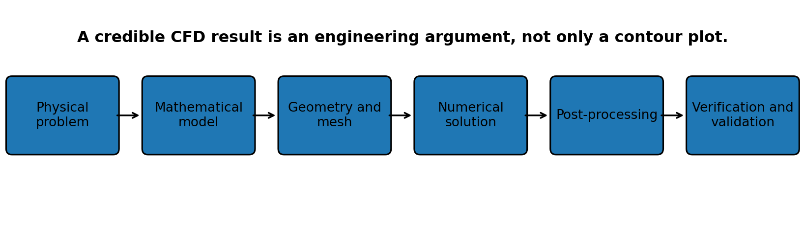

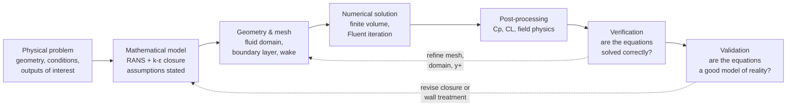

The ten steps, as applied to this case:

1. Define the physical problem, its inputs, its outputs and the flow mechanisms expected to appear.
2. State the modelling assumptions and the governing equations that follow from them.
3. Calculate the important non-dimensional parameters — above all, Reynolds number.
4. Prepare a clean fluid domain with meaningful boundary names.
5. Create a mesh that resolves the geometry, the boundary layer and the wake.
6. Apply boundary conditions consistent with the mathematical model.
7. Obtain a stable initial solution, *then* increase numerical accuracy.
8. Interpret pressure, velocity, lift and drag using physical reasoning.
9. Verify numerical correctness and quantify the numerical uncertainty.
10. Validate the mathematical model against independent experiment.

Note the ordering of the last two. Verification comes first, and it is not optional, because
comparing an unverified solution against experiment tells you nothing useful: if it disagrees you
cannot tell whether the physics model is wrong or the mesh is too coarse, and if it agrees you
cannot tell whether it agreed for the right reason.

### Verification is not validation

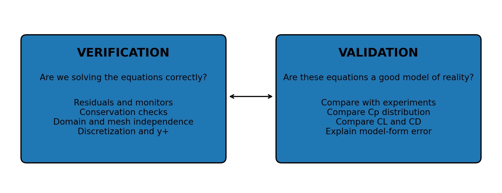

These are two different questions that are routinely conflated, and keeping them apart is the
single most useful habit this project taught me.

> **Verification** asks: *did I solve the equations I intended to solve, correctly?*
> It is a purely mathematical and numerical question. It is answered with mass balances,
> residual histories, domain-size studies, grid-refinement studies and $y^+$ audits — entirely
> from within the simulation, without reference to any experiment.
>
> **Validation** asks: *are the equations I solved a good description of the real flow?*
> It is a physical question. It can only be answered by comparison against independent
> measurement, and it is only meaningful once verification has established that what is being
> compared is a converged solution of the intended model rather than an artefact of the mesh.

A converged solution of the wrong equations is still wrong. A correct physical model solved on an
inadequate mesh is also still wrong. Both failures produce output that looks entirely normal.

---

## 2. The physical problem and its assumptions

The case is steady, turbulent, two-dimensional flow around a symmetric NACA 0012 aerofoil at 10°
angle of attack. The chord is 1 m and air approaches at 51.45 m/s with constant density and
viscosity. The outputs of interest are the mean velocity and pressure fields, the surface
pressure-coefficient distribution, and the integrated sectional force coefficients.

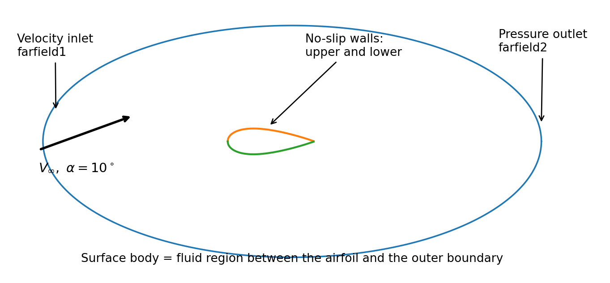

The domain is the region *between* the aerofoil surface and an outer far-field boundary placed
roughly 12.5 chord lengths away. That outer boundary is a numerical stand-in for infinity — the
real flow extends indefinitely, and truncating it is an approximation whose adequacy has to be
demonstrated rather than assumed. It is checked in §11.3.

### 2.1 Modelling assumptions, and what each one costs

Every assumption below removes terms from, or simplifies, the governing equations. Stating them
explicitly is what defines the limits of the prediction — an assumption that is never written down
cannot later be identified as the source of a discrepancy.

| Assumption | What it removes | What it costs |
|---|---|---|
| **Steady mean flow** | All $\partial/\partial t$ terms in the mean equations | Any genuinely unsteady behaviour — vortex shedding, buffet, stall oscillation — cannot appear. Valid here because the flow is attached at 10° |
| **Two-dimensional** | Spanwise derivatives and the third momentum equation | No tip vortices, no induced drag, no finite-wing effects. Forces are per unit span, i.e. *sectional* |
| **Incompressible, constant properties** | The energy equation and density coupling | Valid at M ≈ 0.15; would fail near the suction peak at higher speed |
| **Newtonian fluid** | Non-linear stress–strain behaviour | None meaningful for air |
| **Fully turbulent RANS** | Every resolved turbulent fluctuation | Transition is not modelled — the boundary layer is turbulent from the leading edge, whereas the real one has a short laminar run |
| **Fixed aerofoil, stationary mesh** | Mesh motion and aeroelastic coupling | No structural feedback |
| **No body forces** | Gravity terms in momentum | Negligible for air at this speed |
| **No-slip walls** | Nothing — this is a physical condition | Requires the mesh to resolve a very steep near-wall gradient, which drives most of §8 and §12 |

The two assumptions that matter most for the eventual result are *fully turbulent* and the choice
of **RANS** over a resolved simulation. Both are consequences of the Reynolds number, which is
therefore the first thing to calculate.

---

## 3. Reynolds number and flow regime

The chord-based Reynolds number compares inertial transport with molecular momentum diffusion:

$$
Re_c = \frac{\rho V_\infty c}{\mu} = \frac{1.1767 \times 51.45 \times 1.00}{1.009\times10^{-5}} \approx 6.0\times10^{6}
$$

| Quantity | Interpretation |
|---|---|
| $\rho V_\infty c$ | Inertial transport over the chord scale |
| $\mu$ | Molecular momentum diffusion |
| $Re \gg 1$ | Inertia dominates globally — while viscosity remains decisive inside the boundary layer and wake |

Six million is far above the range of fully laminar aerofoil flow, so a turbulent boundary layer
and turbulent wake are expected over essentially the whole chord. This single number determines
the entire modelling strategy that follows, in two ways.

**First, it rules out resolving the turbulence.** The number of grid points required for direct
numerical simulation scales roughly as $Re^{9/4}$; at $Re = 6\times10^6$ that is astronomically
beyond a desktop calculation. The turbulent fluctuations must therefore be *averaged out* and
their effect *modelled* — which is what the Reynolds-averaged formulation of §5 does.

**Second, it guarantees that the interesting physics is concentrated in a very thin layer.**
High Reynolds number means the viscous region adjacent to the wall is extremely thin compared with
the chord, but it does not mean viscosity is unimportant — it means viscosity's influence is
compressed into a small fraction of the domain where the velocity gradient is correspondingly
enormous. Every meshing decision in §8 and the whole of §12 follow from that fact.

---

## 4. Hand calculations before the solver

Predicting the sign, magnitude and spatial behaviour of the outputs *before* running Fluent is
what makes it possible afterwards to recognise an incorrect boundary condition, a poorly converged
run, or an unphysical solution. These estimates are not competing with the CFD; they are the
yardstick that makes the CFD interpretable.

### 4.1 Coefficient definitions

$$
q_\infty = \tfrac{1}{2}\rho V_\infty^{2}, \qquad
C_L = \frac{L'}{q_\infty c}, \qquad
C_D = \frac{D'}{q_\infty c}, \qquad
C_p = \frac{p - p_\infty}{q_\infty}
$$

$$
q_\infty = \tfrac{1}{2}(1.1767)(51.45)^2 = 1557.4 \ \text{Pa}
$$

In a two-dimensional calculation, lift and drag are reported **per unit span**. With the
thin-aerofoil estimate below, the sectional lift is $L' \approx 1713$ N/m.

The corresponding sectional drag on an attached aerofoil at this Reynolds number is smaller by
roughly **two orders of magnitude**. That disparity is worth registering at the pre-analysis stage,
long before any result exists, because it is the reason the two coefficients are not equally
forgiving of mesh error — a point that returns in §12 and governs the final assessment.

### 4.2 Thin-aerofoil estimate of lift

$$
C_L = 2\pi(\alpha - \alpha_0), \qquad \alpha_0 = 0 \ \text{for a symmetric NACA 0012}
$$

$$
C_L = 2\pi\left(10° \times \frac{\pi}{180°}\right) = 1.097 \approx 1.10
$$

This is an excellent order-of-magnitude target, and it is available in thirty seconds without any
software. But it comes from **inviscid, thin, attached, small-angle** theory: it predicts exactly
zero viscous drag, it slightly over-predicts lift because it ignores the boundary layer's
displacement effect on the effective camber, and it knows nothing about stall. So it establishes
what the answer should be *close to* while leaving genuine work for the CFD and the experiment.

### 4.3 Inlet decomposition and force directions

The aerofoil is left horizontal and the incidence is imposed by angling the inflow, so the inlet
velocity is decomposed as:

$$
U_x = V_\infty\cos\alpha = 51.45\cos(10°) = 50.668 \ \text{m/s}
$$
$$
U_y = V_\infty\sin\alpha = 51.45\sin(10°) = 8.934 \ \text{m/s}
$$

Lift and drag are then defined relative to the **free-stream direction**, not the chord line:

$$
\mathbf{e}_D = (\cos\alpha,\ \sin\alpha), \qquad \mathbf{e}_L = (-\sin\alpha,\ \cos\alpha)
$$

This is a real trap. If the force report is left in default axis-aligned components, the reported
"lift" is the chord-normal force, and at 10° the two differ by enough to matter. An equivalent and
equally valid setup rotates the aerofoil instead and keeps the inflow horizontal — but the two must
not be mixed.

### 4.4 The flow physics that should appear

Written down before solving, so that the post-processing in §10 is a test rather than a
description:

- The stagnation point sits **below** the leading edge, not at it, because of the positive incidence.
- The flow accelerates sharply around the upper leading edge, producing a **suction peak** — the strongest single feature in the pressure field.
- The lower surface carries higher pressure than the upper over most of the chord. **That pressure difference is the lift.**
- Velocity is zero at the wall and rises to the outer-flow value across a very thin turbulent boundary layer.
- Pressure **recovers** toward the trailing edge, creating an adverse gradient that thickens the boundary layer and, at higher incidence, would separate it.
- A velocity-deficit **wake** forms behind the trailing edge.
- Drag arises from **both** wall shear and the pressure distribution. Unlike thin-aerofoil theory, a viscous calculation predicts non-zero drag.
- $C_p$ should show a strongly negative upper-surface peak against a more positive lower-surface distribution, with the two curves converging near the trailing edge.

If any of these fail to appear, something is wrong with the setup — and that check costs nothing.

---

## 5. From instantaneous flow to the RANS equations

Turbulent flow contains irregular fluctuations across a wide range of length and time scales.
Since §3 established that resolving them is impossible here, they are removed by averaging.
**Reynolds decomposition** splits each instantaneous variable into a mean and a fluctuation:

$$
u_i = \overline{u_i} + u_i', \qquad p = \overline{p} + p', \qquad \overline{u_i'} = 0
$$

The overbar is a time average and the prime is the fluctuation; by construction the average of a
fluctuation is zero. Substituting these into the incompressible continuity and Navier–Stokes
equations and averaging the result gives the **Reynolds-averaged Navier–Stokes** equations:

$$
\frac{\partial \overline{u_i}}{\partial x_i} = 0
$$

$$
\begin{aligned}
\rho\left(\frac{\partial \overline{u_i}}{\partial t} + \overline{u_j}\frac{\partial \overline{u_i}}{\partial x_j}\right)
&= -\frac{\partial \overline{p}}{\partial x_i} +
\mu\frac{\partial^{2}\overline{u_i}}{\partial x_j \partial x_j} -
\rho\frac{\partial \overline{u_i' u_j'}}{\partial x_j}
\end{aligned}
$$

Almost every term survives averaging unchanged. The exception is the **non-linear convection
term**: because it is a product of two fluctuating quantities, its average does not reduce to the
product of the averages, and it leaves behind an extra term $-\rho\,\overline{u_i'u_j'}$ — the
**Reynolds stresses**.

These represent momentum transported by turbulent fluctuations, and they are typically far larger
than the viscous stresses away from the wall. They are also **new unknowns**. This is the
**turbulence closure problem**: averaging removed the need to resolve the fluctuations but left an
equation set with more unknowns than equations. No amount of algebra closes it — the missing
information was genuinely discarded by the averaging, and it has to be supplied by a model.

### 5.1 Steady two-dimensional form

For the steady 2-D case solved here, with the turbulent contributions grouped into
$f_{\text{turb},x}$ and $f_{\text{turb},y}$:

$$
\frac{\partial \overline{u}}{\partial x} + \frac{\partial \overline{v}}{\partial y} = 0
$$

$$
\begin{aligned}
\rho\left(\overline{u}\frac{\partial \overline{u}}{\partial x} + \overline{v}\frac{\partial \overline{u}}{\partial y}\right)
&= -\frac{\partial \overline{p}}{\partial x} + \mu\nabla^{2}\overline{u} + f_{\text{turb},x} \\\\
\rho\left(\overline{u}\frac{\partial \overline{v}}{\partial x} + \overline{v}\frac{\partial \overline{v}}{\partial y}\right)
&= -\frac{\partial \overline{p}}{\partial y} + \mu\nabla^{2}\overline{v} + f_{\text{turb},y}
\end{aligned}
$$

> **A detail worth flagging.** In the *x*-momentum equation the cross-stream convection term is
> $\overline{v}\,\partial\overline{u}/\partial y$ — the course material renders this incorrectly and it
> is corrected here. The local time-derivative terms vanish *only* because a steady mean solution
> is assumed; they are not universally absent.

**What the RANS equations deliver:** the mean velocity and pressure fields, which is exactly what
engineering design needs — nobody sizes a wing spar against an instantaneous eddy. The unresolved
turbulence enters solely through the Reynolds-stress terms, and everything that follows in §6 is
about supplying those.

---

## 6. Turbulence closure: eddy viscosity and two-equation modelling

### 6.1 The Boussinesq hypothesis

The eddy-viscosity concept models turbulent momentum transport *by analogy with molecular
viscosity*. The physical picture is that just as molecular collisions diffuse momentum down a
velocity gradient, turbulent eddies transport parcels of fluid across the shear layer and produce
a similar net effect — only far more strongly. So a **turbulent viscosity** $\mu_t$ is introduced,
relating the Reynolds stresses to the mean strain rate:

$$
\begin{aligned}
-\rho\,\overline{u_i'u_j'} &= 2\mu_t S_{ij} - \tfrac{2}{3}\rho k \delta_{ij} \\\\
S_{ij} &= \frac{1}{2}\left(\frac{\partial \overline{u_i}}{\partial x_j} + \frac{\partial \overline{u_j}}{\partial x_i}\right)
\end{aligned}
$$

which in a two-dimensional shear layer reduces to

$$
-\rho\,\overline{u'v'} = \mu_t\left(\frac{\partial \overline{u}}{\partial y} + \frac{\partial \overline{v}}{\partial x}\right)
$$

**The eddy viscosity is not a fluid property.** This is the point most easily missed. The molecular
viscosity $\mu$ is a property of air and appears in a table; the eddy viscosity $\mu_t$ is a
property of the *flow*: it varies from cell to cell, can exceed $\mu$ by orders of magnitude in the
outer layer, and must fall to zero at the wall. The entire job of a turbulence model is to supply a
field of $\mu_t$.

The analogy is also an approximation with a known weakness: it forces the Reynolds-stress tensor to
be aligned with the mean strain-rate tensor. Real turbulence is not obliged to comply, particularly
where the flow is strongly accelerated, curved, or separating.

### 6.2 The standard *k*–ε model

Two extra transport equations are solved. The first carries the **turbulent kinetic energy** $k$ —
the energy held in the turbulent velocity fluctuations, that is, how energetic the turbulence is.
The second carries the **dissipation rate** $\varepsilon$ — the rate at which that energy cascades
to the smallest eddies and is converted into internal energy, that is, how quickly the turbulence
is being destroyed. Between them they set both a velocity scale and a length scale for the
turbulence, which is all that is needed to form a viscosity:

$$
k = \tfrac{1}{2}\overline{u_i'u_i'}, \qquad \mu_t = \rho C_\mu \frac{k^{2}}{\varepsilon}
$$

**Turbulent kinetic energy transport:**

$$
\begin{aligned}
\frac{\partial(\rho k)}{\partial t} + \frac{\partial(\rho k \overline{u_j})}{\partial x_j}
&= \frac{\partial}{\partial x_j}\left[\left(\mu + \frac{\mu_t}{\sigma_k}\right)\frac{\partial k}{\partial x_j}\right] +
P_k - \rho\varepsilon
\end{aligned}
$$

Left to right: transient storage, convection by the mean flow, effective diffusion, production by
mean shear, and destruction by dissipation. In a converged steady calculation the transient term is
zero — though Fluent may still use pseudo-time stepping to *reach* that state, which is why
residual histories can look transient even in a steady run.

**Dissipation-rate transport:**

$$
\begin{aligned}
\frac{\partial(\rho \varepsilon)}{\partial t} + \frac{\partial(\rho \varepsilon \overline{u_j})}{\partial x_j}
&= \frac{\partial}{\partial x_j}\left[\left(\mu + \frac{\mu_t}{\sigma_\varepsilon}\right)\frac{\partial \varepsilon}{\partial x_j}\right] \\\\
&\quad + C_{1\varepsilon}\frac{\varepsilon}{k}P_k - C_{2\varepsilon}\rho\frac{\varepsilon^{2}}{k}
\end{aligned}
$$

with production $P_k = 2\mu_t S_{ij}S_{ij}$ for incompressible flow. The $k$ equation can at least
be derived from the Navier–Stokes equations; the $\varepsilon$ equation is **largely empirical**,
constructed by analogy and fitted to canonical flows. Its constants are calibration, not physics:

| Constant | $C_\mu$ | $C_{1\varepsilon}$ | $C_{2\varepsilon}$ | $\sigma_k$ | $\sigma_\varepsilon$ |
|---|---|---|---|---|---|
| **Value** | 0.09 | 1.44 | 1.92 | 1.00 | 1.30 |
| **Role** | Sets eddy-viscosity magnitude | Production in ε | Destruction in ε | Turbulent diffusion of *k* | Turbulent diffusion of ε |

The loop then closes: mean velocity gradients drive turbulence production → $k$ and $\varepsilon$
give $\mu_t$ → $\mu_t$ feeds back into the RANS momentum equations and changes those same
gradients. The system is **fully coupled**, even though Fluent solves the equations sequentially —
which is exactly why the solution has to be iterated rather than solved in one pass.

> **Known limitation, stated up front.** The standard *k*–ε model is robust, cheap and very widely
> used, but it was calibrated principally on free shear flows. It is comparatively weak under
> strong adverse pressure gradients, in separated flow, and in the near-wall region — which is to
> say, weak in precisely the conditions that determine drag on an aerofoil. It is a reasonable
> choice for the attached, moderately loaded case here, but its output must be supported by an
> appropriate wall treatment, an adequate near-wall mesh, and comparison against data. This
> limitation is not a footnote; it is a prediction about where the result will be weakest, and
> §12 confirms it.

### 6.3 The complete mathematical model

| Model element | Unknown / output | Purpose |
|---|---|---|
| Continuity | $\overline{u}, \overline{v}$ | Enforces conservation of mass |
| *x*-momentum | $\overline{u}, \overline{p}$ | Conserves *x*-direction momentum |
| *y*-momentum | $\overline{v}, \overline{p}$ | Conserves *y*-direction momentum |
| *k* equation | $k$ | Models turbulent kinetic energy |
| ε equation | $\varepsilon$ | Models the turbulence dissipation rate |
| $\mu_t = \rho C_\mu k^2/\varepsilon$ | $\mu_t$ | Algebraic closure linking turbulence to the mean flow |

Five transport equations plus one algebraic relation, for five unknown fields
($\overline{u}, \overline{v}, \overline{p}, k, \varepsilon$) — plus boundary conditions for
velocity, pressure, the turbulence quantities and the no-slip wall. The system is now closed, and
the problem becomes a numerical one.

---

## 7. Building the geometry

### 7.1 The domain is the *fluid*, not the aerofoil

The surface body passed to the mesher must represent **the region the equations are solved in** —
the aerofoil subtracted from the outer domain, leaving the air around it. This sounds obvious and
is the single most common setup mistake, because CAD naturally produces the solid.

The build sequence:

1. Create the outer far-field boundary and the NACA 0012 profile.
2. Generate the 2-D surface body representing the fluid region between them.
3. Set that surface body's behaviour to **Fluid**.
4. **Suppress** the separate aerofoil line body / construction curve so it is not passed to the mesher as an unintended entity.
5. Check that only the intended fluid surface transfers to the Mesh system.
6. Create named selections for every boundary — and name the fluid region itself.

### 7.2 Named selections

Naming boundaries in the geometry stage is what allows physical conditions to be applied
meaningfully in the solver rather than to anonymous auto-generated zones:

| Named selection | Physical meaning | Fluent type |
|---|---|---|
| `farfield1` | Boundary through which incoming flow is prescribed | Velocity inlet |
| `farfield2` | Downstream boundary through which flow leaves | Pressure outlet |
| `upper` | Upper aerofoil surface | Wall, no slip |
| `lower` | Lower aerofoil surface | Wall, no slip |
| `fluid` | Computational flow region | Fluid cell zone |

Splitting the aerofoil into `upper` and `lower` is deliberate rather than cosmetic. It allows
independent edge sizing on each surface (§8.2), and it makes the upper and lower $C_p$
distributions separable in post-processing (§10.4) — which is what makes the validation comparison
possible at all.

> A clean geometry contains **only** the fluid domain the mathematical model requires. Extra line
> bodies, duplicate faces or unnamed boundaries produce incorrect zones and confuse the solver —
> often silently, with no error message and a perfectly plausible-looking result.

---

## 8. Designing the mesh

The finite-volume mesh divides the fluid domain into control volumes. Flow variables are stored at
cell centres, and connectivity determines which neighbours exchange mass and momentum. The mesh
here contains **≈ 27,000 cells**.

Mesh design is not a matter of making cells small everywhere — that is unaffordable and
unnecessary. It is a matter of **spending cells where the gradients are**, which the pre-analysis
in §4.4 has already identified: the leading edge, the boundary layer, the trailing edge and the
wake.

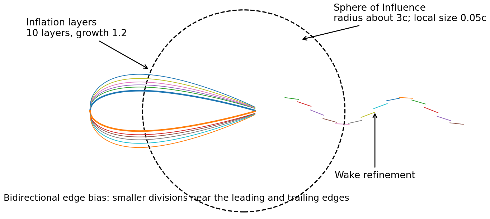

### 8.1 Global and local sizing

- The mesh is deliberately **coarse away from the aerofoil**, where gradients are weak and cells would be wasted.
- A **sphere of influence** of radius ≈ 3 *c* provides local refinement around the aerofoil.
- Local element size ≈ **0.05 *c*** within that region.
- The sphere as demonstrated is centred near the leading edge. **Shifting it aft would cover more of the wake** — and since the wake carries the pressure-drag signature, that is a real improvement rather than a cosmetic one.

### 8.2 Edge sizing and bias

Separate edge sizing is applied to the upper and lower surfaces, with **bidirectional bias**: small
divisions at *both* the leading and trailing edges, larger ones near mid-chord. The bias factor is
the ratio of the largest division to the smallest, so increasing it concentrates more cells at the
ends.

The reason is directly physical. Surface curvature and streamwise pressure gradient are extreme at
the leading edge (the suction peak) and at the trailing edge (the Kutta condition and the start of
the wake), and comparatively gentle over the middle of the chord. Uniform spacing would
simultaneously under-resolve the ends and waste cells in the middle.

### 8.3 Inflation — the boundary-layer mesh

| Setting | Value | Purpose |
|---|---|---|
| Number of layers | 10 | Several cells normal to the wall |
| Growth rate | 1.2 | Each layer 1.2× thicker than the last |
| Maximum inflation thickness | 0.006 *c* | Controls total height of the inflated region |
| Location | Upper and lower walls | Resolve steep near-wall velocity gradients |

Inflation exists because of the no-slip condition: velocity goes from zero at the wall to nearly
the outer-flow value over a *very* small distance, and that gradient is what produces wall shear.
Isotropic cells small enough to capture it would be ruinously expensive, so the layers are made
deliberately **anisotropic** — thin normal to the wall, long along it — which is efficient
precisely because the flow varies rapidly in one direction and slowly in the other.

The trailing edge is the hard part. Inflation layers from the upper and lower surfaces converge
there, and they tend to become distorted, collapsed or too coarse. Since the trailing edge sets the
Kutta condition and seeds the wake, the biased edge mesh and local refinement in that region have
to be inspected directly rather than trusted to the automatic mesher.

### 8.4 Mesh quality

| Metric | Interpretation | How to use it |
|---|---|---|
| **Orthogonal quality** | Near 1 indicates favourable alignment between the face normal and the vector joining cell centres; low values mean non-orthogonality, which forces the solver into correction terms and increases discretization error | Display the worst cells and locate them geometrically |
| **Aspect ratio** | Ratio of longest to shortest cell dimension | High values are perfectly acceptable in a *well-aligned* boundary layer, and undesirable where gradients are comparable in several directions |
| **Cell location** | The poorest cells here are **near the trailing edge** | Which matters, because the trailing edge and wake strongly influence the drag |

> A single global minimum-quality number is nearly useless on its own. What matters is **where**
> the poor cells are, whether their stretching is aligned with the flow, and whether improving them
> changes the answer. A high-aspect-ratio cell buried in an inflation layer parallel to the wall is
> fine; the same cell sitting in the wake is not.

---

## 9. Solving: finite volumes and the solution path

### 9.1 Boundary conditions

| Boundary / setting | Specification | Physical meaning |
|---|---|---|
| `farfield1` | Velocity inlet; $U_x = 50.668$, $U_y = 8.934$ m/s | Imposes the 51.45 m/s free stream at 10° |
| Inlet turbulence | Intensity 5 %; viscosity ratio $\mu_t/\mu = 10$ | Seeds a moderate, **estimated** inlet turbulence level |
| `farfield2` | Pressure outlet; gauge pressure 0 Pa | Lets flow leave while fixing the reference pressure |
| `upper`, `lower` | Stationary no-slip walls | Mean velocity zero at the surface |
| Operating pressure | ≈ 1 atm | Gauge pressure represents deviation from atmospheric |
| Near-wall treatment | Standard wall functions | A log-law relation estimates wall shear from the first cell |

Two of these deserve comment.

**The inlet turbulence values are estimates, not measurements.** Nothing in the problem statement
fixes the free-stream turbulence intensity; 5 % and $\mu_t/\mu = 10$ are conventional placeholders.
Since they set the inlet values of $k$ and $\varepsilon$, and $\mu_t$ follows from those, they are
an uncertain input to the model and must be treated as such — which is why a sensitivity test on
them appears as case `T1` in §14.

**The outlet must be far enough downstream to avoid backflow.** Reversed flow across a pressure
outlet means the boundary condition is being applied where the flow is not actually leaving, and
Fluent has to invent inlet values for it. It usually signals an outlet placed too close, or a
strongly separated flow.

> **Pressure reference.** For incompressible flow only pressure *differences* drive the velocity
> field. Changing the absolute reference pressure shifts the entire pressure field by a constant
> and leaves the velocity solution untouched — which is why gauge pressure is a perfectly
> legitimate thing to plot, and why a far-field gauge pressure of zero is a boundary condition
> rather than a physical claim.

### 9.2 The finite-volume method

The differential equations of §5 and §6 have no analytical solution for this geometry, so they are
converted into algebra. Fluent integrates each governing equation over every control volume,
starting from the generic transport equation for a scalar $\phi$:

$$
\frac{\partial(\rho\phi)}{\partial t} + \nabla\cdot(\rho\mathbf{u}\phi)
= \nabla\cdot(\Gamma_\phi \nabla\phi) + S_\phi
$$

Integrating over control volume $\Omega_P$ and applying the divergence theorem converts the volume
integrals of the convection and diffusion terms into sums over the cell's faces:

$$
\begin{aligned}
\int_{\Omega_P}\frac{\partial(\rho\phi)}{\partial t}\,d\Omega +
\sum_f (\rho\mathbf{u}\cdot\mathbf{n}A)_f \phi_f
&= \sum_f (\Gamma_\phi \nabla\phi\cdot\mathbf{n}A)_f +
\int_{\Omega_P} S_\phi \,d\Omega
\end{aligned}
$$

which discretizes to one algebraic equation per cell:

$$
a_P \phi_P = \sum_N a_N \phi_N + b
$$

where the neighbour coefficients $a_N$ carry the effects of convection and diffusion, and $b$
collects sources and boundary contributions.

Two things are worth drawing out of this. First, the method is **conservative by construction**:
whatever flux leaves one cell through a face enters its neighbour through the same face, so mass
and momentum are conserved discretely as well as continuously — which is what makes the mass
balance check in §11.1 meaningful. Second, the face value $\phi_f$ does not exist; it has to be
*interpolated* from cell-centre values, and the choice of interpolation scheme is where
**discretization error is born**.

### 9.3 Coupling and iteration

The system is non-linear (convection involves the velocity multiplying its own gradient) and
coupled (pressure and velocity appear in each other's equations; $\mu_t$ depends on $k$ and
$\varepsilon$, which depend on the velocity gradients). So it is solved iteratively:

1. Initialize cell-centre values of $\overline{u}, \overline{v}, \overline{p}, k, \varepsilon$.
2. Linearize the non-linear terms about the current field.
3. Couple pressure and velocity so that momentum and continuity are satisfied together.
4. Solve the linear systems for each variable in turn.
5. Update fluxes, $\mu_t$ and material quantities; repeat.

### 9.4 The solution path actually followed

The order of operations here matters as much as the settings themselves:

1. **Start first-order.** First-order upwind interpolation is unconditionally stable and heavily damped, so it converges from a poor initial guess where a second-order scheme would diverge. It is a means of getting a physically sensible starting field, not an answer.
2. **Monitor the force coefficients alongside the residuals** — $C_L$ and $C_D$, not residuals alone.
3. Run until that initial solution is stable — residuals of order **10⁻³**.
4. **Switch momentum and turbulence equations to second order** for the final solution.
5. Tighten residual targets to ≈ **10⁻⁶** and continue iterating.
6. Confirm the force coefficients have stopped changing and conservation errors are small.
7. Save the converged case before post-processing.

**What happened at each stage, and what it means:**

| Stage | Observed behaviour | Interpretation |
|---|---|---|
| First-order solution | $C_L \approx 0.9$; drag substantially over-predicted; converges readily | Stable but heavily contaminated by **numerical diffusion**. First-order upwind adds an artificial dissipation that acts like an extra viscosity, smearing the very gradients that generate lift and shear |
| After switching to second order | $C_L$ rises toward 1.0+; drag falls sharply | Physically encouraging. Removing artificial dissipation moves **both** coefficients toward their expected values simultaneously — exactly the trend a correct setup should show |
| Final converged solution | $C_L \approx 1.06$, flat under further iteration | Iterative and discretization-scheme error reduced; the remaining sensitivity is to **mesh resolution**, not solver settings |

The *direction* of that movement is more informative than any single value. A switch to second
order that made the coefficients worse, or moved them in opposite directions, would point to a
setup or mesh problem rather than an accuracy gain — and would need investigating before going
any further.

> **Do not judge convergence from residuals alone.** Residuals measure how well the *current*
> discrete equations are satisfied; they say nothing about whether those equations resolve the
> physics. A credible stopping decision combines residual reduction, **flat** force monitors,
> conservation checks, and results that no longer change with further iteration.

---

## 10. Reading the solution

Post-processing is where the predictions of §4.4 get tested. Each field below is checked against
what was expected, not merely described.

### 10.1 Velocity field

| | |
|---|---|
| 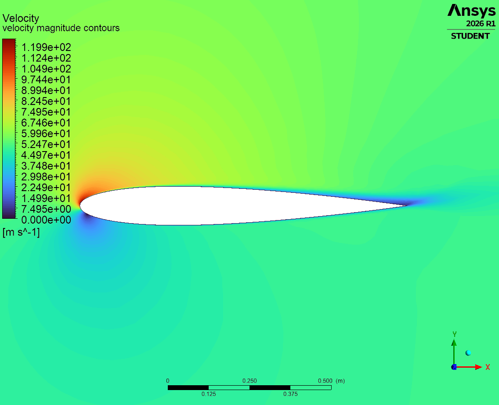 | 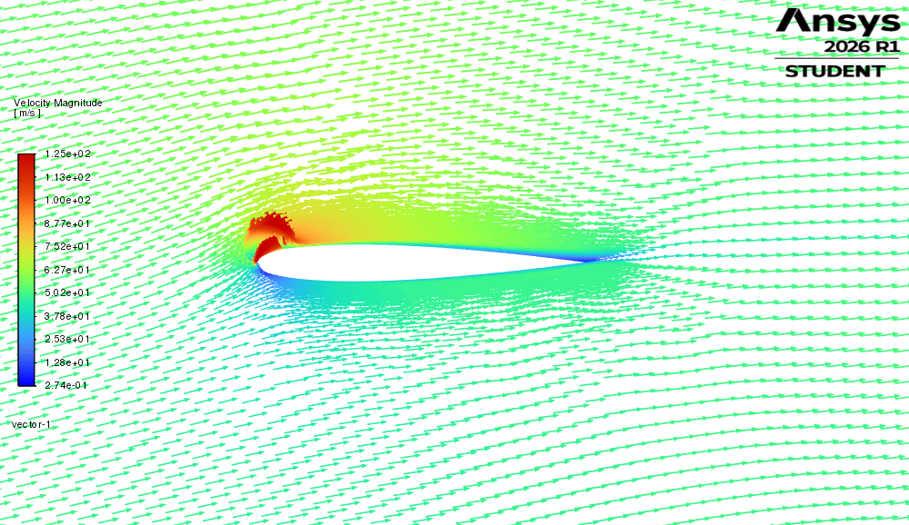 |

- **Far-field velocity matches the specified free stream** — the fastest available check that the boundary conditions were applied as intended.
- A low-velocity **stagnation region** forms near the leading edge, displaced toward the lower surface, exactly as the positive incidence requires.
- Flow accelerates strongly around the upper leading edge, reaching **nearly twice** the free-stream speed. This is the velocity signature of the suction peak.
- The turbulent boundary layer is **extremely thin** — velocity climbs from zero to the outer value over a very short distance, visible only on close inspection.
- Toward the trailing edge the flow decelerates and the boundary layer thickens under the adverse pressure gradient, then sheds into the wake as a velocity deficit.
- **The mesh spans much of that boundary layer with roughly one cell.** This is the most important observation in the whole post-processing stage. It is sufficient to capture the pressure field, which varies slowly across the layer — but it cannot resolve the near-wall velocity *gradient*, and it is the first thing that must be fixed if wall-shear-dependent quantities are to be relied on. §12 quantifies exactly how far off it is.

### 10.2 Pressure field

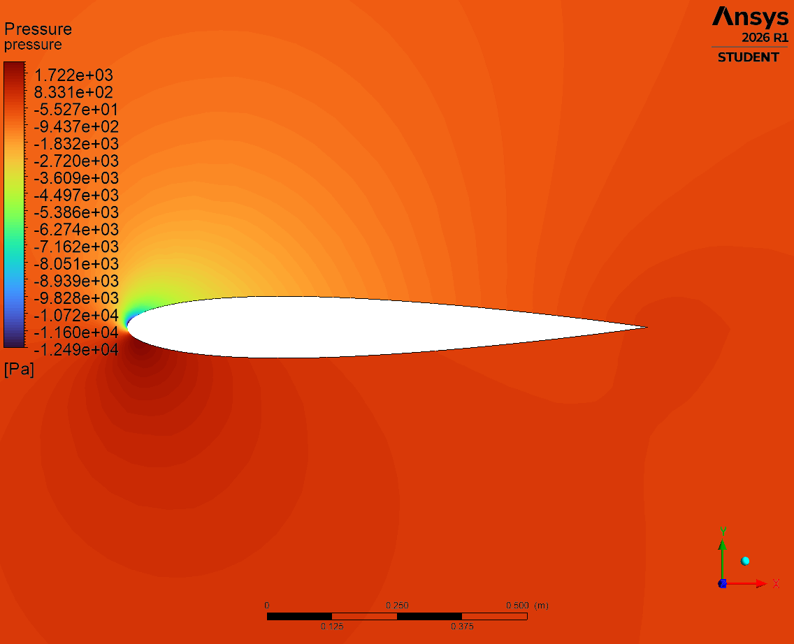

- Gauge pressure tends to zero in the far field — consistent with the outlet condition.
- Higher pressure on the lower surface, lower on the upper. **This difference is the lift.**
- High pressure at the stagnation point; a strong low-pressure **suction region** wrapping the upper leading edge.
- Unlike the velocity, pressure changes very little *across* the thin boundary layer — there is no visible "pressure boundary layer". This is a genuine result of boundary-layer theory ($\partial p/\partial y \approx 0$ across a thin layer), not a plotting artefact, and it is the reason the pressure field is comparatively insensitive to near-wall mesh quality.
- **Bernoulli cannot be applied across the viscous boundary layer.** Shear stress and dissipation are first-order effects there, so total pressure is not conserved along a near-wall streamline. Bernoulli remains a legitimate way to reason about the outer, effectively inviscid flow.
- Pressure recovery toward the trailing edge produces the adverse gradient that thickens the layer and, at higher incidence, would separate it.

### 10.3 Turbulence field

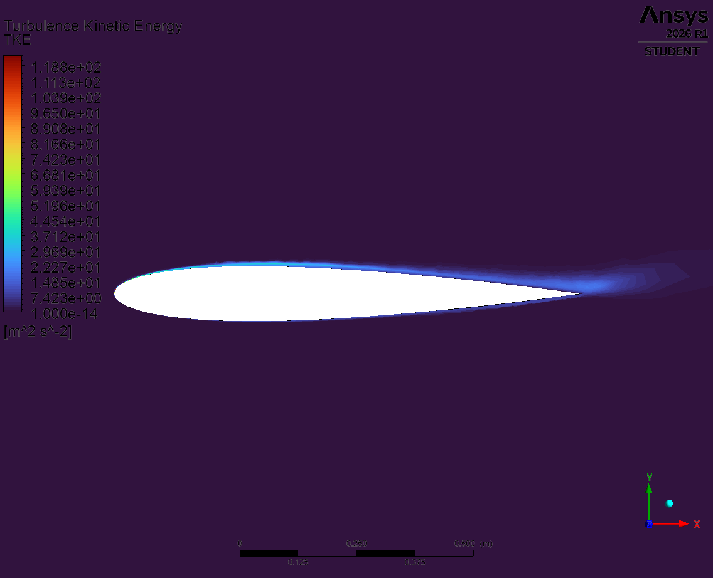

The TKE plot is the most diagnostically useful of the four, and it is the one most often skipped.
It isolates the boundary layer as a thin, high-$k$ sheet hugging the surface, thickening toward the
trailing edge and shedding into the wake — a direct picture of where turbulent momentum transport
is actually happening.

It also functions as a **visual mesh check**. Turbulence production peaks where mean shear is
greatest, which is very close to the wall. If the near-wall mesh is adequate, that shows up as a
sharp, well-defined sheet. If it is too coarse, the peak is smeared across cells and the sheet
looks diffuse — which is a direct visual symptom of exactly the resolution problem quantified in
§12.

### 10.4 Pressure coefficient

The surface $C_p$ distribution is the primary validation quantity, so it is worth stating how it
was extracted rather than treating it as a button press:

1. In CFD-Post, build $C_p$ as an **expression** — gauge pressure divided by $\tfrac{1}{2}\rho V_\infty^2$, using the free-stream values from the case definition.
2. Create a **variable** from that expression so it can be plotted.
3. **Intersect** the `upper` and `lower` aerofoil boundaries with the front symmetry plane to create a polyline running along each surface.
4. Plot $C_p$ against $x/c$ along that polyline.
5. Import the experimental points as a second data series on the same axes.

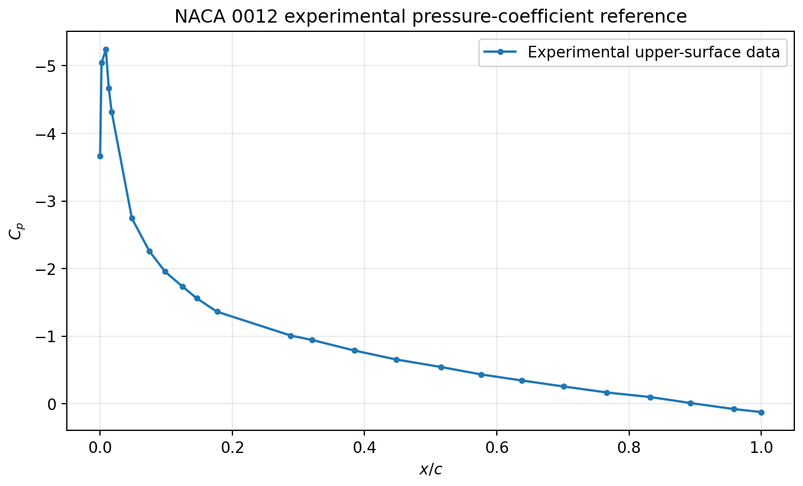

Note the **inverted vertical axis**. This is the aerodynamic convention: suction is negative $C_p$,
and inverting the axis puts stronger suction higher on the page, so the plot reads the same way
round as the physical loading on the section.

> Good agreement in $C_p$ demonstrates that the model captures the aerodynamic **loading**, and
> therefore the lift that follows from integrating it. It is a statement about the pressure field
> specifically. The near-wall velocity gradient and the wall shear are a separate question, and
> they are verified separately through the $y^+$ audit in §12.

---

## 11. Verification — was the model solved correctly?

Verification asks whether the mathematical model was entered correctly and whether the numerical
errors are small enough to draw conclusions from. It comes **before** any comparison with
experiment, and it is answered entirely from within the simulation.

Six checks, honestly scored:

| Verification question | Evidence required | Status |
|---|---|---|
| Are the trends physically sensible? | Stagnation, acceleration, suction, recovery, wake | ✅ Broadly satisfied (§10) |
| Are the boundary conditions honoured? | Far-field velocity/pressure checks; no slip at wall | ✅ Broadly satisfied |
| Are the conservation equations satisfied? | Net mass imbalance, ideally momentum balance | ✅ Imbalance ≈ 10⁻⁷ of incoming flow |
| Is iterative error small? | Residuals ≈ 10⁻⁶, flat force histories | ✅ Reasonably satisfied |
| Is the domain large enough? | Repeat with the boundaries farther out | ❌ Not demonstrated — far field only ≈ 12.5 *c* |
| Is discretization error small? | Three-mesh systematic refinement study | ❌ Not demonstrated |
| Is the near-wall mesh compatible with the wall treatment? | $y^+$ distribution, boundary-layer cell count | ❌ **Not satisfied over much of the aerofoil** |
| Are the worst cells acceptable? | Improve trailing-edge orthogonality, re-solve | ⚠️ Needs improvement |

Four passes, three failures and one partial. Stating that plainly is the point of the exercise —
the failures are what define the next piece of work in §14.

### 11.1 Conservation checks

For steady incompressible flow, the mass entering the domain must equal the mass leaving it.
A useful normalized measure:

$$
\varepsilon_m = \frac{|\dot{m}_{\text{in}} - \dot{m}_{\text{out}}|}{\dot{m}_{\text{in}}} \times 100\%
$$

The reported net imbalance is of order **10⁻⁷** relative to the incoming flow — very small, and
confirmation that the discrete equations are being satisfied to tight tolerance. A global
**momentum** balance would be a stronger check but requires more post-processing, since the
pressure and shear forces on every boundary have to be integrated and included.

It is worth being clear about what this check does and does not prove. A perfect mass balance
confirms the solver is converging the equations it was given. It says nothing whatsoever about
whether the mesh resolves the physics — a badly under-resolved solution can conserve mass to
machine precision.

### 11.2 Iterative convergence and linearization error

- Residuals should fall several orders of magnitude and reach their targets.
- Lift and drag histories should become **flat**, not merely oscillate about a trend. A monitor still drifting slowly at the point of stopping means the answer is being read before it exists.
- Run extra iterations *after* apparent convergence and confirm the engineering quantities do not move.
- If $k$ and $\varepsilon$ residuals plateau above target, assess whether the remaining error changes $\mu_t$ enough to change the forces — a plateau that does not move the answer is tolerable; one that does is not.

### 11.3 Domain-size independence

The far-field boundary is a **numerical approximation to infinity**. Placing it too close forces
the flow to be uniform where it physically is not, artificially constraining the circulation around
the aerofoil and altering the loading.

This domain extends to roughly **12.5 chord lengths**, whereas the NASA reference meshes used for
the validation data extend considerably farther. The case should be repeated with progressively
larger upstream, transverse and downstream distances until $C_L$, $C_D$ and $C_p$ become
insensitive to boundary placement. **Until that is done, the far-field influence cannot be
distinguished from a modelling error** — which is precisely why this is verification and must
precede validation.

### 11.4 Grid convergence

At least three systematically refined meshes are required — same topology, same controls, uniformly
scaled — with the refinement covering the aerofoil surface, the first-layer height, the wake and
the problematic trailing-edge region. Refining one region only tells you about that region.

A simple relative-change measure:

$$
\Delta_\phi = \left|\frac{\phi_{\text{fine}} - \phi_{\text{medium}}}{\phi_{\text{fine}}}\right| \times 100\%
$$

and, where the refinement ratio $r$ is consistent and the convergence is monotonic, a formal
**Richardson extrapolation and Grid Convergence Index**:

$$
\phi_{\text{ext}} = \phi_1 + \frac{\phi_1 - \phi_2}{r^{p}-1},
\qquad
\text{GCI}_{12} = 1.25\,\frac{|(\phi_1-\phi_2)/\phi_1|}{r^{p}-1}\times 100\%
$$

The GCI converts the difference between two meshes into an **error band** on the finer one, which
is what turns "the answer changed a bit when I refined" into a reportable numerical uncertainty.
It is the piece that allows numerical error and physical modelling error to be separated in the
validation comparison — without it, any disagreement with experiment is unattributable.

| Mesh | Required changes | Quantities to compare |
|---|---|---|
| Coarse | Baseline cell sizes and layer count | $C_L$, $C_D$, $C_p$, residuals, $y^+$ |
| Medium | Systematic refinement, same topology | Same |
| Fine | Further systematic refinement | Same, plus computational cost |

> **The critical warning.** A solution can be *converged in iterations* but **not converged in
> space**. These are independent failures. Driving residuals to 10⁻¹⁰ does nothing to compensate
> for a boundary layer spanned by one cell or a far-field boundary that is too close — it just
> means the wrong answer has been computed very precisely.

---

## 12. Near-wall verification and the *y*-plus criterion

This section is where the case's weakness lives, and it is worth setting out properly.

Wall shear stress is set by the velocity gradient at the wall, $\tau_w = \mu(\partial u/\partial y)_{y=0}$.
Capturing that gradient requires either resolving the near-wall profile with cells, or modelling it
with a wall function. Both are legitimate — but they demand **opposite** things from the mesh, and
the mesh must be built for whichever one is actually being used.

The turbulent boundary layer has a layered structure: a **viscous sublayer** immediately at the
wall where molecular viscosity dominates, a **buffer layer**, a **log layer** where turbulent
transport dominates and the velocity profile is logarithmic, and an outer layer. The position of
the first cell within that structure is described by the non-dimensional wall distance:

$$
u_\tau = \sqrt{\frac{\tau_w}{\rho}}, \qquad
u^{+} = \frac{u}{u_\tau}, \qquad
y^{+} = \frac{\rho y u_\tau}{\mu} = \frac{y u_\tau}{\nu}
$$

$$
u^{+} = y^{+} \quad \text{(viscous sublayer)}, \qquad
u^{+} = \frac{1}{\kappa}\ln(y^{+}) + B \quad \text{(log layer)}
$$

$$
\kappa \approx 0.41, \qquad B \approx 5.2
$$

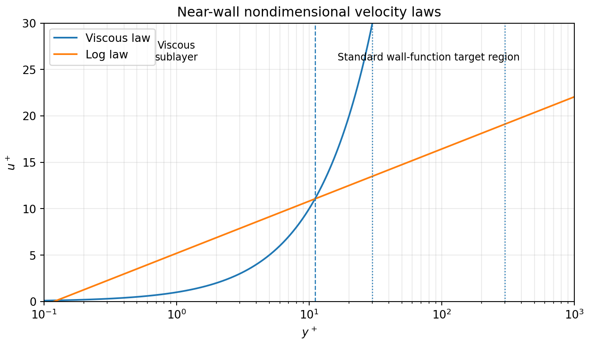

| Near-wall approach | First-cell target | Interpretation |
|---|---|---|
| **Standard wall functions** | $30 < y^+ < 300$ | First cell centre sits in the log layer, where the log law is valid and can supply the wall shear analytically |
| **Buffer layer** | $11 < y^+ < 30$ | **Undesirable** — neither the linear sublayer relation nor the log law is accurate here, so whichever the code applies is wrong |
| **Enhanced wall treatment / wall-resolved** | $y^+ \approx 1$ (below ≈ 5) | First cell sits inside the viscous sublayer; the profile is resolved directly rather than assumed |

Note that $y^+$ is not a mesh parameter that can be set in advance — it depends on $u_\tau$, which
depends on the solution. It can be *estimated* beforehand from a flat-plate correlation (which is
what [`tools/preanalysis.py`](../tools/preanalysis.py) does), but it must be **checked after
solving**.

### The finding for this case

The computed $y^+$ distribution shows that **much of the aerofoil is not in the 30–300 range that
the standard wall functions being used actually require.** The mesh and the wall treatment are
therefore inconsistent with one another: the solver is applying a log-law relation at points where
the log law does not hold.

That is a verification failure, not a physics failure — the model is fine, but it is not being
solved under the conditions it assumes. It also has a specific, predictable consequence: the
quantity it damages most is **wall shear**, and therefore the quantities that depend on wall shear.
The pressure field, which barely varies across the layer (§10.2), is largely unaffected.

### Remediation procedure

1. Run a preliminary solution and plot $y^+$ over the **complete** aerofoil, not at a single station.
2. Decide the strategy — wall functions **or** wall-resolved. Do not mix targets accidentally.
3. Estimate the revised first-cell-centre distance from $\;y_1 = y^{+}\mu/(\rho u_\tau)$, using $u_\tau$ from the preliminary solution.
4. **Increase the number of inflation layers** so the whole boundary layer is represented, not just the first cell. Getting $y^+$ right with too few layers only relocates the problem outward.
5. Keep a smooth growth rate and maintain layer quality at the trailing edge, where §8.4 already identified the worst cells.
6. Resolve the wake and the adverse-pressure-gradient region.
7. Re-solve, and repeat until $y^+$, $C_L$ and $C_D$ are all stable.

Refining to $y^+ \approx 1$ makes the first cells very thin, which raises aspect ratios and skewness
and can make convergence harder — so layer height, growth rate, total thickness and surface
divisions must be redesigned **together**, not adjusted one at a time.

> ### Why lift and drag are not equally easy to predict
>
> This is the physical insight that ties the whole document together.
>
> **Lift** comes almost entirely from the pressure difference between the surfaces. Pressure varies
> very little across a thin boundary layer, so the pressure field — and therefore the lift — is
> comparatively **forgiving of near-wall mesh error**. A mesh that resolves the outer flow and the
> surface pressure distribution can predict lift well even with a marginal boundary-layer mesh.
>
> **Drag** is roughly **1 % of the magnitude of lift** and draws important contributions from both
> the wall shear *and* the pressure distribution. It is a small difference between larger
> quantities, and it depends directly on the wall-normal velocity gradient — the very thing an
> under-resolved near-wall mesh gets wrong.
>
> The consequence is that the same absolute error produces a far larger **relative** error in drag
> than in lift. Good agreement in lift is therefore not evidence that drag is right, and any mesh
> must be judged against whichever of the two the analysis actually depends on.

---

## 13. Validation — is the model a good description of reality?

Only now, with the numerical behaviour characterised and its weaknesses identified, is the
comparison against experiment meaningful.

Validation requires **matched conditions**. Reynolds number, angle of attack, and the reference
quantities used to non-dimensionalise the coefficients must all correspond to the experiment,
or the comparison measures the mismatch rather than the model. The reference data is taken from
the NASA NACA 0012 validation resources — **Gregory & O'Reilly** for the surface pressure
distribution and **Ladson** for the force coefficients — at $Re_c = 6\times10^6$ and 10° incidence.

### 13.1 Surface pressure distribution — the primary comparison

The predicted $C_p$ **overlaps the experimental upper-surface data closely across the chord.**
The solution reproduces, individually:

| Feature | Physical significance |
|---|---|
| Leading-edge **suction peak** | The dominant contribution to lift, and the hardest part of the distribution to capture — it requires both the leading-edge mesh refinement and the correct incidence |
| **Pressure recovery** toward the trailing edge | Sets the adverse gradient that governs boundary-layer thickening and separation onset |
| **Stagnation region** below the leading edge | Confirms the incidence and the inlet decomposition of §4.3 were correctly imposed |
| Loading distribution over the full chord | Determines the sectional pitching moment as well as the lift |

> **Why the distribution is the result that matters.** A strong validation never rests on a single
> scalar. An integrated coefficient is one number produced by integrating a whole curve, so two
> compensating errors — say, an under-predicted suction peak and an over-predicted mid-chord
> loading — can integrate to exactly the right answer. That is **error cancellation**: the right
> result for the wrong reason, and it is invisible if only the integrated value is checked.
>
> Matching the distribution point by point over the complete chord cannot happen by accident.
> It is the difference between evidence that the model is right and evidence that it is not
> obviously wrong.

### 13.2 Integrated lift

| Quantity | CFD | Experimental reference | Assessment |
|---|---|---|---|
| $C_p$ distribution | Overlaps the upper-surface data across the chord | Gregory & O'Reilly | **Strong agreement** for the aerodynamic loading |
| $C_L$ | ≈ **1.06** | 1.07 – 1.08 | ≈ **1.4 % below** the midpoint of the experimental range |
| Thin-aerofoil estimate (§4.2) | 1.097 | 1.07 – 1.08 | ≈ 2 % above — as expected, since inviscid theory ignores the boundary-layer displacement effect |

The lift result is close, and — more importantly — it is close **for a demonstrable reason**. It
rests on a $C_p$ distribution that matches the measurement point by point, so it is not a product
of cancellation. The pre-analysis hand calculation, the CFD and the experiment all agree to within
a few percent, and each was arrived at independently.

### 13.3 What the comparison does and does not establish

**Established:**

- The mean pressure field and the aerodynamic loading are modelled well. The total aerodynamic force comes from integrating pressure **and** viscous shear over the surface; viscous shear contributes very little to lift, so $C_L$ is governed almost entirely by the pressure difference — exactly the quantity the $C_p$ comparison validates directly.
- The standard *k*–ε closure, the domain and the boundary conditions are adequate for predicting the loading on this attached-flow case.
- The setup is correct in the ways a setup can be wrong: incidence, inlet decomposition, reference values and force directions are all confirmed by the agreement.

**Not established:**

- **Anything that depends on wall shear.** The $y^+$ audit in §12 showed the near-wall mesh is inconsistent with the wall treatment, so the wall-shear-dependent quantities are not supported by the current resolution, regardless of what value they take. The near-wall mesh, the boundary-layer growth and the trailing-edge wake all need to be resolved properly before those results mean anything.
- **Mesh independence.** §11.4 has not been carried out, so the numerical uncertainty on the lift result is unquantified. Agreement within 1.4 % is encouraging, but without a grid-convergence study it cannot be shown that the remaining difference is a modelling error rather than a discretization error.
- **Domain independence.** §11.3 likewise remains outstanding.

> **Validation is quantity-specific.** A model validated for lift is *not* thereby validated for
> drag, or for moment, or for separation onset. Each output quantity depends on different features
> of the solution and has to be validated on its own terms. This is probably the single most
> transferable conclusion from the whole exercise.

### 13.4 The validation sequence to follow after remeshing

1. Match Reynolds number, angle of attack and reference definitions exactly.
2. Demonstrate iterative, domain **and** grid convergence — all three.
3. Confirm the chosen $y^+$ strategy is consistent with the near-wall treatment actually selected.
4. Overlay CFD and experimental $C_p$ over the full chord, both surfaces.
5. Compare the integrated coefficients against the experimental range, not a single value.
6. Report **numerical uncertainty separately** from disagreement attributable to the turbulence model.
7. Explain any remaining discrepancy *physically* — not as a bare percentage.

---

## 14. Assessment and what would be done next

### 14.1 Honest scorecard

| Area | Assessment | Required action |
|---|---|---|
| Physical trends | Plausible, consistent with the pre-analysis predictions | Retain as sanity checks for every future mesh |
| Iterative convergence | Good with second order and tight residuals | Repeat after every mesh change |
| Mass conservation | Very good (≈ 10⁻⁷) | Continue reporting the normalized imbalance |
| Far-field extent | Insufficiently verified | Run the domain-size study |
| Trailing-edge cells | Poor orthogonality / aspect ratio | Improve topology or local controls |
| Boundary-layer resolution | **Clearly insufficient** | Redesign first-layer height, layer count and growth rate together |
| Wall treatment | Standard wall functions inconsistent with much of the $y^+$ field | Move to a consistent target, or $y^+ \approx 1$ with enhanced treatment |
| Pressure-distribution validation | Close agreement with experiment across the chord | Confirm mesh independence |
| Lift validation | $C_L \approx 1.06$ against 1.07–1.08 experimental | Confirm mesh independence, then quantify numerical uncertainty |
| Wall-shear-dependent quantities | Not supported by the current near-wall resolution | Improve near-wall and wake resolution, then revalidate |

**The conclusion.** The mathematical model captures the pressure field and the aerodynamic loading
well, the $C_p$ comparison confirms it against experiment point by point, and the lift follows
correctly from it. What the current mesh does not do is resolve the near-wall flow finely enough to
support quantities that depend directly on wall shear — and §12 explains precisely why that
particular limitation produces a good lift result alongside an unreliable one for drag.

The correct next engineering step is **not** to adjust solver settings until a number looks better.
Tuning inputs against a known answer is curve-fitting, not simulation, and it produces a model with
no predictive value for any case where the answer is not already known. The right step is a
controlled refinement study, changing one thing at a time, followed by a repeat of the validation.

### 14.2 The verification matrix

A controlled test matrix turns the scorecard above into evidence. **Change one major modelling
choice at a time**, converge every case to the same standard, and compare the same outputs against
the same baseline.

| Case | Controlled change | Purpose | Acceptance signal |
|---|---|---|---|
| **B0** | Current baseline | Reference for all comparisons | Reproduces the documented $C_L$, $C_p$ and $y^+$ trends |
| **D1** | Move far-field boundaries farther out | Test domain-size independence | Changes in $C_L$, $C_D$ and $C_p$ become negligible |
| **M1** | Systematic medium mesh refinement | Estimate spatial discretization error | Results move consistently toward a limiting value |
| **M2** | Further fine-mesh refinement | Support Richardson / GCI assessment | Fine–medium difference falls within the target uncertainty |
| **W1** | First cell at $y^+ \approx 1$ with enhanced wall treatment | Resolve the viscous sublayer directly for accurate wall shear | $y^+$ target satisfied and wall-shear-dependent outputs stabilise |
| **T1** | Vary inlet turbulence intensity and viscosity ratio | Test the uncertain inlet turbulence inputs of §9.1 | Outputs insensitive over a plausible range |

The order matters: **D1 before M1/M2**, because there is no point refining a mesh inside a domain
that is the wrong size, and **W1 after the mesh study**, because changing the wall treatment
changes what "refined" means near the wall.

---

## 15. Reusable CFD checklist

The workflow above generalises. Stripped of this particular case, it is a set of questions that
have to be answerable before each stage can be considered finished:

| Stage | Questions to answer before moving on |
|---|---|
| **Pre-analysis** | What is the flow regime? What forces and trends are expected? What hand calculation is available to check against? |
| **Geometry** | Is the computational region the *fluid* domain? Are construction bodies suppressed? Are all boundaries named? |
| **Mesh** | Are the leading edge, trailing edge, boundary layer and wake resolved? Where are the worst cells, and does their location matter? |
| **Physics** | Are the assumptions, RANS equations, turbulence closure and material properties appropriate to this flow? |
| **Boundary conditions** | Do the inlet components, outlet pressure, wall conditions and turbulence inputs match the physical problem? Which of them are estimates? |
| **Solution** | Was a stable first-order solution followed by second-order accuracy? Are residuals *and* force monitors converged? |
| **Verification** | Are mass balance, iterative convergence, domain independence, grid convergence and $y^+$ all demonstrated? |
| **Post-processing** | Do the velocity and pressure fields match the pre-analysis expectations — and if not, why not? |
| **Validation** | Do $C_p$ and the integrated coefficients agree with independent measurement within a stated uncertainty? |
| **Reporting** | Are the limitations, the numerical uncertainty and the recommended improvements set out explicitly? |

> **The final engineering principle.** CFD credibility comes from the complete chain:
> assumptions → equations → geometry → mesh → numerical method → verification → validation.
> Each link constrains the next, and the argument is only as strong as its weakest one. A visually
> attractive contour plot without that chain behind it is not evidence of anything.

---

## 16. Symbols and notation

| Symbol | Meaning | Units |
|---|---|---|
| $c$ | Aerofoil chord | m |
| $V_\infty$ | Free-stream speed | m/s |
| $\alpha$ | Angle of attack | ° or rad |
| $\rho$ | Density | kg/m³ |
| $\mu$ | Dynamic viscosity | Pa·s |
| $\nu$ | Kinematic viscosity | m²/s |
| $\mu_t$ | Turbulent (eddy) viscosity | Pa·s |
| $Re$ | Reynolds number | – |
| $\overline{u}, \overline{v}$ | Mean velocity components | m/s |
| $u', v'$ | Turbulent velocity fluctuations | m/s |
| $\overline{p}$ | Mean static pressure | Pa |
| $q_\infty$ | Free-stream dynamic pressure | Pa |
| $k$ | Turbulent kinetic energy | m²/s² |
| $\varepsilon$ | Turbulent dissipation rate | m²/s³ |
| $S_{ij}$ | Mean strain-rate tensor | 1/s |
| $P_k$ | Production of turbulent kinetic energy | kg/(m·s³) |
| $\tau_w$ | Wall shear stress | Pa |
| $u_\tau$ | Friction velocity | m/s |
| $y^{+}$ | Non-dimensional wall distance | – |
| $u^{+}$ | Non-dimensional velocity | – |
| $\kappa, B$ | Log-law constants | – |
| $C_p$ | Pressure coefficient | – |
| $C_L, C_D$ | Sectional lift and drag coefficients | – |
| $\text{GCI}$ | Grid Convergence Index | % |

---

## Sources and honest limitations

Organized from the **Cornell MAE 5230 Intermediate Fluid Dynamics / ANSYS Fluent NACA 0012**
teaching module and the supplied course transcripts on velocity contours, pressure contours,
pressure coefficient, verification, near-wall mesh considerations and validation. The equations
have been rewritten in standard tensor and two-dimensional forms to make the modelling logic
explicit, and one error in the course's *x*-momentum convection term has been corrected (§5.1).

Experimental comparison values are attributed to NASA's NACA 0012 validation resources:
**Gregory & O'Reilly** (surface pressure coefficient) and **Ladson** (lift and drag).

**Limitations of this document.** It describes one demonstrated teaching case. Exact solver menus,
defaults and recommended model choices vary with software version and with the flow problem — every
future case should repeat the verification and validation *logic* rather than copy these settings
without checking them. The verification failures identified in §11 and §12 are stated as found and
have not been discharged; the results should be read with those limitations attached rather than in
spite of them. The figures are original renderings; Cornell's own slide images are deliberately not
redistributed.

[← back to portfolio](../README.md)
