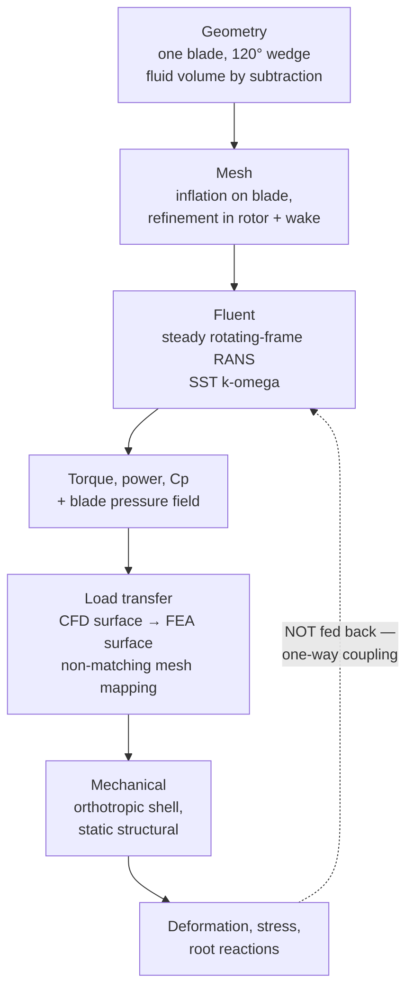

# Wind Turbine Blade — Rotating-Frame CFD and One-Way Fluid–Structure Interaction

### The full multiphysics chain: periodic sector → rotating-frame RANS → torque and power → pressure mapping → orthotropic shell FEA → verification and validation

A three-bladed horizontal-axis wind turbine solved as a **one-way coupled FSI**. A steady
120° periodic RANS solution in a rotating reference frame produces the aerodynamic pressure field
on one blade; that field is mapped onto a composite shell structural model in ANSYS Mechanical,
which predicts deformation, stress and root reactions.

Jad El Badaoui — Aerospace Engineering, University of Bristol
Built alongside the Cornell / ANSYS wind-turbine FSI module.

[← back to portfolio](../README.md) · [NACA 0012 aerofoil study →](../naca0012-airfoil/README.md)

---

## What this document is

This is an account of how the turbine simulation was carried out and of the evidence that does —
and does not — support its results. It is written as one continuous argument because the project
*is* one argument: the structural answer is only as good as the aerodynamic pressure field feeding
it, and neither half can be judged alone.

Two things make this study different from the [aerofoil case](../naca0012-airfoil/README.md) that
precedes it. First, the rotation: solving in a **rotating reference frame** adds Coriolis and
centripetal terms to the momentum equation and makes the blade's local operating condition a
function of radius. Second, the coupling: the output of one physics domain becomes the input of
another, which introduces a class of error — load transfer between non-matching meshes — that a
single-physics analysis simply does not have.

The honest headline is stated up front rather than buried: **the aerodynamic power coefficient is
strongly mesh-dependent and the study is not experimentally validated.** The structural half, by
contrast, carries one very strong quantitative verification. Both conclusions are argued below.

### Contents

| | |
|---|---|
| [1. The engineering problem and coupling strategy](#1-the-engineering-problem-and-coupling-strategy) | [10. CFD verification](#10-cfd-verification--was-the-flow-model-solved-correctly) |
| [2. Why a 120° sector is legitimate](#2-why-a-120-sector-is-legitimate) | [11. The coupling: transferring the pressure field](#11-the-coupling-transferring-the-pressure-field) |
| [3. Geometry and computational domain](#3-geometry-and-computational-domain) | [12. The structural model](#12-the-structural-model-shell-idealisation-and-orthotropy) |
| [4. Mathematical model: rotating-frame RANS](#4-mathematical-model-rotating-frame-rans) | [13. Shell theory and the finite-element formulation](#13-shell-theory-and-the-finite-element-formulation) |
| [5. Boundary conditions and the periodic interface](#5-boundary-conditions-and-the-periodic-interface) | [14. Structural loads and constraints](#14-structural-loads-and-constraints) |
| [6. Mesh design](#6-mesh-design) | [15. The structural hand calculation](#15-the-structural-hand-calculation) |
| [7. Solver setup and convergence](#7-solver-setup-and-convergence) | [16. Structural results](#16-structural-results) |
| [8. Pre-analysis and hand calculations](#8-pre-analysis-and-hand-calculations) | [17. Structural verification](#17-structural-verification) |
| [9. Aerodynamic results](#9-aerodynamic-results) | [18. Validation status and honest assessment](#18-validation-status-and-honest-assessment) |
| [19. Recommended simulation campaign](#19-recommended-simulation-campaign) | [20. Conclusions](#20-conclusions) |
| [21. Symbols and notation](#21-symbols-and-notation) | [Sources and honest limitations](#sources-and-honest-limitations) |

---

## Case definition

| Parameter | Symbol | Value |
|---|---|---|
| Blade span (geometry) | — | 43.2 m |
| Root-to-axis offset | — | 1.0 m |
| Rotor radius | $R$ | 44.2 m |
| Rotor diameter | $D$ | 88.4 m |
| Number of blades | $B$ | 3 |
| Free-stream wind speed | $V_\infty$ | 12.0 m/s, along $-z$ |
| Angular velocity | $\Omega$ | −2.22 rad/s about $z$ |
| Tip speed | $\Omega R$ | 98.12 m/s |
| Tip-speed ratio | $\lambda$ | 8.18 |
| Swept area | $A = \pi R^2$ | 6,137.5 m² |
| Air density | $\rho$ | 1.225 kg/m³ |
| Dynamic viscosity | $\mu$ | 1.7894 × 10⁻⁵ kg/(m·s) |
| Turbulence closure | — | SST *k*–ω |
| Sector modelled | — | 120°, one blade, rotational periodicity |
| Aerofoil sections | — | Cylindrical root → S818 → S825 → S826, 4° tip pitch |
| Structural material | — | Homogenised orthotropic composite |
| Blade mass | $m$ | 22,473 kg |

> **A note on the radius convention.** The blade span alone is 43.2 m, but the root sits 1 m
> outboard of the rotation axis, so the tip radius is 44.2 m. Using span alone gives a tip-speed
> ratio of 7.99; using the true radius gives 8.18. Both are consistent with the intended operating
> range, but swept area scales as $R^2$ and power coefficient scales inversely with it — so the
> convention must be stated wherever $C_p$ or $\lambda$ is quoted. Everything below uses
> $R = 44.2$ m.

---

## 1. The engineering problem and coupling strategy

The object is to predict the steady aerodynamic loading on a large horizontal-axis wind-turbine
blade, and then the structural response that loading produces. The rotor turns clockwise viewed
from the front, represented by a negative angular velocity about the global $z$ axis, while the
wind approaches along $-z$ at 12 m/s.

### 1.1 What "one-way" means, and what it costs

The aerodynamic pressure is computed on the **undeformed** blade. The structural deformation that
results is never returned to Fluent, so the flow solution never sees the deflected shape.

This is efficient and entirely standard for an initial design study, but it is a modelling
assumption with a condition attached. It is defensible only when the deformation is small enough
that it does not materially change the blade twist, the local angle of attack, or the rotor
clearance. A blade that deflects significantly changes its own aerodynamic loading — the phenomenon
known as aeroelastic relief — and a one-way model cannot capture it.

> **A converged Mechanical solve does not prove one-way coupling was valid.** That is a separate
> question, answered by comparing the computed tip deflection against the rotor radius and by
> checking how much the effective twist changed. §18.1 performs that check explicitly rather than
> assuming it.

### 1.2 Modelling assumptions

| Assumption | What it removes | What it costs |
|---|---|---|
| **Steady rotating frame** | Mesh motion and all time-dependence | No transient gust response, no vortex shedding, no start-up or shutdown loads |
| **120° rotational periodicity** | Two thirds of the domain | No tower shadow, no wind shear, no yaw misalignment, no blade-to-blade variation |
| **Incompressible, constant-property air** | Density coupling and the energy equation | Valid — tip Mach number is about 0.29 |
| **SST *k*–ω RANS** | Every resolved turbulent fluctuation | Turbulence is modelled, not resolved; separation prediction depends on the closure |
| **No hub or tower** | Hub blockage and tower interference | Root-region flow is idealised; a 1 m root offset stands in for the hub radius |
| **One-way coupling** | Aerodynamic feedback from deformation | Loading is that of the undeformed blade (see §18.1) |
| **Homogenised orthotropic composite** | Ply stacking, adhesive layers, local fibre orientation | No ply-level stresses, no delamination, no laminate coupling effects |
| **Shell idealisation** | Through-thickness meshing | Efficient and appropriate for a slender blade; not valid at thick junctions |
| **Gravity omitted** | Self-weight and its once-per-revolution cycle | Removes a significant edgewise load and the principal fatigue driver |
| **Pressure-only transfer** | Aerodynamic wall shear on the structure | Shear is small compared with pressure for bending, but it is genuinely absent |

The last four are structural and are revisited in §12 and §14. The important habit is that each
one is written down, so that a later discrepancy can be attributed rather than guessed at.

---

## 2. Why a 120° sector is legitimate

Solving one blade instead of three cuts the cost by roughly a factor of three. The justification
is symmetry: for an ideal three-bladed rotor, the geometry and the mean flow repeat every 120°.

Scalar quantities — pressure, turbulent kinetic energy, specific dissipation rate — take identical
values at corresponding points in each sector. Vectors are the subtle case.

> **The correction that matters.** It is tempting to write $\mathbf{v}(r,\theta_1) = \mathbf{v}(r,\theta_2)$
> and treat the periodic faces as a straight copy. That is exact **only** in a coordinate basis
> that rotates with $\theta$. In fixed global Cartesian components, the velocity vector must be
> **rotated by 120°** when mapped from one periodic face to the other. This is precisely why the
> interface is created in Fluent as a *rotational periodic* interface rather than by copying three
> Cartesian components across — and getting it wrong produces a solution that looks plausible while
> silently violating momentum continuity at the interface.

What periodicity buys in cost, it forbids in physics. The assumption is that all three blades and
their inflow are identical and evenly spaced. That rules out, by construction:

- **Tower shadow** — the flow deficit as each blade passes the tower.
- **Wind shear** — the vertical velocity gradient in the atmospheric boundary layer, which makes a blade's loading vary through every revolution.
- **Yaw misalignment** — inflow at an angle to the rotor axis.
- **Blade-to-blade differences** — manufacturing tolerance, pitch error, icing.
- **Any transient interaction** whatsoever.

Each of those breaks 120° periodicity and requires a full-rotor, usually transient, model. For a
steady performance and load estimate at a single operating point, the sector is the right trade.
For fatigue analysis it is not — and fatigue, not ultimate load, is what determines blade life.

---

## 3. Geometry and computational domain

### 3.1 Blade preparation

The imported blade arrives as multiple surface bodies and has to be positioned before anything can
be meshed. Its span lies along $-x$, the wind comes along $-z$, and rotation is about $z$.

1. **Rotate to the operating orientation.** A −70° rotation straightens the blade; −66° is used instead, so the tip retains a **4° pitch offset**.
2. **Translate** so the root is centred on the global rotation system.
3. **Translate 1 m along the $-x$ direction**, representing the distance from the rotor axis to the blade root.
4. **Close the open root** with a surface built from the root edges — the body must be watertight before it can be subtracted.
5. **Duplicate the blade** and preserve the copy as the *FEA blade*.
6. For the CFD blade, **suppress the internal spar surfaces** and sew the outer surfaces into a closed solid.

Step 5 is the one that matters later and is easy to skip. The CFD blade gets consumed by the
Boolean subtraction that creates the fluid volume; without an independent structural copy, the
geometry needed for Part 2 is destroyed. The two copies must also remain in the same position and
scale, because the pressure mapping in §11 depends on their surfaces coinciding.

Step 6 reflects a real difference in what each solver needs: the flow only ever touches the
**wetted outer surface**, so the internal spar is irrelevant to Fluent and would only complicate
the solid. The structure, conversely, cannot be modelled without it — the spar is the primary
load-carrying member.

### 3.2 Fluid domain

The domain is a 120° wedge built by sketching an upstream sector about **90 m** ahead of the rotor
plane and a downstream sector about **180 m** behind it, both at an outer radius of roughly
**120 m**, then skinning between them. The blade solid is subtracted, and what remains — the air
around the blade — is the computational domain.

The downstream extent is deliberately **twice** the upstream extent. Upstream, the flow is only
mildly perturbed and approaches the free stream quickly. Downstream, the wake carries a velocity
deficit and a rotational swirl component that need physical distance to develop and decay. Placing
the outlet too close forces an artificial recovery and corrupts the pressure field back at the
rotor plane — where the loads are.

> **Geometry checks before meshing.** Confirm that the fluid body is watertight; that the blade was
> subtracted exactly once; that the rotation axis passes through the origin; that units are metres,
> not millimetres; that the sector angle is exactly 120°; and that the two periodic faces are
> geometrically congruent under a 120° rotation. Each of these produces a plausible-looking but
> wrong answer if violated.

### 3.3 Named selections

| Named selection | Purpose | Fluent type |
|---|---|---|
| `inlet` | Upstream inflow surface, prescribed wind velocity | Velocity inlet |
| `top inlet` | Additional inflow face required by the wedge geometry | Velocity inlet |
| `outlet` | Downstream boundary | Pressure outlet |
| `periodic 1` / `periodic 2` | The two radial side faces, paired by a 120° rotational interface | Interface |
| `blade` | The complete wetted blade surface | No-slip wall, and the FSI transfer surface |
| `fluid` | The air region | Fluid cell zone, carries the frame-motion setting |

The `blade` selection does double duty — it is both the no-slip wall for the flow and the surface
whose pressure gets exported to Mechanical. If any part of the wetted surface is missing from it,
that area silently receives no structural load.

---

## 4. Mathematical model: rotating-frame RANS

### 4.1 Reynolds averaging and the closure problem

As in the [aerofoil study](../naca0012-airfoil/README.md#5-from-instantaneous-flow-to-the-rans-equations),
the instantaneous turbulent field is decomposed into a mean and a fluctuation, and the equations
are time-averaged:

$$
u_i = \overline{u_i} + u_i', \qquad p = \overline{p} + p', \qquad \overline{u_i'} = 0
$$

Averaging the non-linear convection term leaves the **Reynolds stresses**
$-\rho\,\overline{u_i'u_j'}$ behind as new unknowns. The averaged equations are not closed until a
turbulence model relates those stresses to mean-flow quantities.

### 4.2 Continuity in the rotating frame

For steady incompressible flow, the divergence of the mean **relative** velocity vanishes:

$$
\nabla \cdot \overline{\mathbf{u}}_r = 0
$$

In integral form, the net mass flux across every closed control volume is zero — which is the basis
of the conservation check in §10.2.

### 4.3 Momentum with frame-rotation terms

This is where the turbine departs from the aerofoil. Solving in a frame that rotates with the rotor
lets a genuinely unsteady problem be treated as steady, but the price is two extra acceleration
terms:

$$
\rho\left(\overline{\mathbf{u}}_r \cdot \nabla\right)\overline{\mathbf{u}}_r +
\rho\underbrace{\left(2\boldsymbol{\Omega} \times \overline{\mathbf{u}}_r\right)}_{\text{Coriolis}} +
\rho\underbrace{\left[\boldsymbol{\Omega} \times \left(\boldsymbol{\Omega} \times \mathbf{r}\right)\right]}_{\text{centripetal}}
= -\nabla \overline{p} + \nabla \cdot \boldsymbol{\tau}_{\text{eff}}
$$

- The **Coriolis** term depends on the relative velocity and deflects the apparent direction of motion within the rotating frame. On a rotating blade it is what drives spanwise flow in separated regions.
- The **centripetal** term arises purely because the frame itself rotates about the axis, and grows as $\Omega^2 r$.

There is **no Euler term** here, because $\Omega$ is constant at this steady operating point. An
accelerating or decelerating rotor would add $\rho\,(d\boldsymbol{\Omega}/dt) \times \mathbf{r}$.

Fluent introduces these source terms automatically once frame motion is enabled on the fluid cell
zone — which means that if frame motion is *not* enabled, the solver runs happily and produces the
flow past a stationary blade. There is no error message. The tip-speed check in §9.1 exists
precisely to catch this class of mistake.

### 4.4 Eddy-viscosity closure

The Boussinesq hypothesis relates the anisotropic part of the Reynolds stresses to the mean strain
rate through a turbulent viscosity:

$$
-\rho\,\overline{u_i'u_j'} = 2\mu_t S_{ij} - \tfrac{2}{3}\rho k \delta_{ij},
\qquad
k = \tfrac{1}{2}\overline{u_i'u_i'}
$$

As before, $\mu_t$ is a modelled property of the flow, not of the fluid, and varies throughout the
domain.

### 4.5 The SST *k*–ω model, and why not *k*–ε

The shear-stress-transport model solves two transport equations — one for turbulent kinetic energy
$k$, one for **specific** dissipation rate $\omega$:

$$
\begin{aligned}
\nabla \cdot \left(\rho \overline{\mathbf{u}}_r k\right)
&= P_k - \beta^{*}\rho k \omega + \nabla \cdot \left[\left(\mu + \sigma_k \mu_t\right)\nabla k\right] \\\\
\nabla \cdot \left(\rho \overline{\mathbf{u}}_r \omega\right)
&= \alpha \rho S^{2} - \beta \rho \omega^{2} +
\nabla \cdot \left[\left(\mu + \sigma_\omega \mu_t\right)\nabla \omega\right] +
2\left(1 - F_1\right)\frac{\rho \sigma_{\omega 2}}{\omega}\nabla k \cdot \nabla \omega
\end{aligned}
$$

with the eddy viscosity limited by

$$
\mu_t = \frac{\rho a_1 k}{\max\left(a_1 \omega,\ S F_2\right)}
$$

Three features make this the right closure for a turbine blade, and each is a direct response to a
weakness of the standard *k*–ε model used in the aerofoil study:

1. **Near-wall behaviour.** The $\omega$ formulation integrates cleanly to the wall without the damping functions *k*–ε requires. Since the blade loading — and therefore the structural load case — depends on the near-wall solution, this matters.
2. **Free-stream insensitivity.** Pure *k*–ω is notoriously sensitive to the free-stream value of $\omega$. The blending function $F_1$ switches to a transformed *k*–ε formulation in the outer flow, which removes that sensitivity while keeping the near-wall advantage.
3. **The shear-stress limiter.** The $\max$ in the denominator above caps $\mu_t$ in adverse-pressure-gradient regions. Standard eddy-viscosity models systematically over-predict $\mu_t$ there, which artificially keeps the boundary layer attached and under-predicts separation. Turbine blades operate with significant adverse gradients over the outboard suction surface, so this correction is directly relevant.

None of that removes the need for an appropriate near-wall mesh. The limiter improves the model;
it does not compensate for a first cell in the wrong layer.

### 4.6 Relative wind: why there is no single Reynolds number

The blade does not see 12 m/s. It sees the vector sum of the axial wind and its own tangential
motion:

$$
W(r) = \sqrt{V_\infty^{2} + \left(\Omega r\right)^{2}},
\qquad
Re(r) = \frac{\rho\, W(r)\, c(r)}{\mu}
$$

At the root, $\Omega r$ is small and the local flow angle is dominated by the wind. At the tip,
$\Omega R = 98.12$ m/s against $V_\infty = 12$ m/s, so the relative wind is
$W(R) \approx 98.9$ m/s — over eight times the free-stream speed — and arrives at a shallow angle
to the rotor plane.

Two consequences follow, and they shape the rest of the study:

- **The Reynolds number is local**, varying with both radius and local chord $c(r)$. A single global $Re$ cannot characterise this blade, which is why the near-wall mesh requirement also varies along the span.
- **Dynamic pressure scales with the square of the relative wind**, so it is roughly 67 times greater at the tip than the free-stream value alone would suggest. The outboard third of the blade generates most of the torque *and* most of the bending moment — which is exactly why tip-region mesh resolution turns out to dominate the $C_p$ result in §10.4.

This radial variation is also why real blades are **twisted**: to keep the local angle of attack
near its efficient value as the inflow angle changes along the span.

---

## 5. Boundary conditions and the periodic interface

| Boundary / zone | Specification | Physical meaning |
|---|---|---|
| `inlet` | Velocity inlet, components $(0, 0, -12)$ m/s | The undisturbed wind |
| Inlet turbulence | Intensity 5 %, viscosity ratio $\mu_t/\mu = 10$ | Estimated atmospheric turbulence |
| `top inlet` | Same velocity and turbulence inputs | Inflow through the outer radial face |
| `outlet` | Pressure outlet, 0 Pa gauge | Flow leaves; reference pressure fixed |
| `blade` | No-slip wall | In the rotating frame the blade is stationary relative to the cell zone |
| Periodic sides | Changed from wall to interface; rotational periodic pair, 120° about $z$ | Reproduces the other two sectors |
| `fluid` | Air; frame motion at −2.22 rad/s about $z$ | Introduces the Coriolis and centripetal source terms |

Two clarifications worth making explicit:

**Zero gauge pressure is not a vacuum.** It means the absolute pressure equals the operating
pressure, about 1 atm. For incompressible flow only pressure *differences* drive the velocity
field, so adding a constant to the whole pressure field changes nothing.

**The inlet turbulence values are estimates, not measurements.** Nothing in the problem statement
fixes the atmospheric turbulence intensity for this site; 5 % and $\mu_t/\mu = 10$ are conventional
placeholders that set the inlet $k$ and $\omega$. They are modelling inputs carrying real
uncertainty, which is why a sensitivity study on them appears in the campaign in §19.2.

### 5.1 Creating the periodic interface

1. Change `periodic 1` and `periodic 2` from **wall** to **interface**.
2. In Mesh Interfaces, create a new interface.
3. Enable periodic boundary conditions and matching.
4. Select **Rotational**, use the $z$ axis, disable automatic offset if necessary, and enter **120°**.
5. Assign one face as side 1 and the other as side 2; create.
6. Display the interface and confirm the faces overlap after rotation, with **no unmatched face zones remaining**.

Step 6 is not optional. Leaving the sides as walls — the default type on import — produces a
solution in which the sector behaves as a duct with two solid side walls. It converges. It looks
reasonable. It is completely wrong, because the blade is then operating inside a 120° channel
rather than in an open rotor.

---

## 6. Mesh design

The mesh must resolve the three-dimensional blade surface, the near-wall velocity gradients, the
tip region and the downstream wake, while staying cheap enough to run repeatedly during
verification. Those goals are in direct tension, and how that tension is resolved turns out to be
the decisive issue in this study.

### 6.1 Baseline and refined meshes

| | Baseline (tutorial) | Refined |
|---|---|---|
| Cell count | ≈ 350,000–400,000 | ≈ 7.7 million |
| Blade face sizing | Default | 0.05 m |
| Inflation | Layers normal to the blade | 10 layers, growth rate 1.2 |
| Region refinement | — | 50 m sphere of influence, 1 m elements |
| Relevance centre | Coarse–medium | Fine |

The sphere of influence covers the rotor and the near wake, where the tip vortices form and
convect. Refining there is not cosmetic: the tip vortex sets the induced flow angle over the
outboard blade, which is where most of the torque is produced.

### 6.2 Near-wall resolution

The first-cell height must be chosen for the intended wall treatment:

$$
u_\tau = \sqrt{\frac{\tau_w}{\rho}}, \qquad y^{+} = \frac{\rho\, y_1\, u_\tau}{\mu}
$$

For a **wall-resolved** SST *k*–ω solution — which is how the model is intended to be used — the
target is $y^+ \approx 1$ over most of the blade, with enough inflation layers to cover the
boundary layer smoothly and no abrupt jump from the last prism layer into the tetrahedral bulk.

Because $u_\tau$ depends on the wall shear, which is part of the answer, $y^+$ can only be
*estimated* in advance and must be **checked after solving**. And because the relative wind varies
by nearly an order of magnitude from root to tip (§4.6), a single first-layer height cannot give a
uniform $y^+$ along the span — the outboard sections will always sit higher.

### 6.3 Quality metrics

| Metric | Interpretation |
|---|---|
| **Skewness** | Departure from ideal cell shape. Lower is better |
| **Orthogonal quality** | Alignment of face normals with cell-centre vectors. Higher is better |
| **Aspect ratio** | Acceptable in a well-aligned boundary-layer prism; risky where high gradients are not aligned with the short cell direction |
| **Growth / transition** | Cell size should change gradually from blade and wake out to the far field |
| **Periodic conformity** | Corresponding periodic faces must map cleanly under 120° rotation |

> **The rule.** Do not accept a mesh because its *average* quality is good. Find the worst cells and
> ask whether they sit somewhere load-sensitive. A mediocre cell out in the far field is nearly
> harmless; the same cell at the leading edge, the tip vortex or the trailing edge can move the
> torque.

---

## 7. Solver setup and convergence

| Setting | Choice | Reason |
|---|---|---|
| Precision | Double | Large 3-D model with a wide range of pressure magnitudes |
| Solver | Steady, pressure-based | Incompressible, steady operating point |
| Viscous model | SST *k*–ω | §4.5 |
| Cell-zone motion | Frame motion, $\Omega_z = -2.22$ rad/s | §4.3 |
| Pressure–velocity coupling | Coupled | More robust than segregated for strongly coupled rotating flow |
| Stabilisation | Pseudo-transient, high-order term relaxation | Damps the early iterations without adding steady-state error |
| Initialisation | Standard, computed from inlet | — |
| Residual target | 10⁻⁶ on all equations | — |
| Primary monitor | Integral static pressure on the blade | Physical, and directly relevant to the FSI transfer |
| Additional monitors | Torque, $C_p$, thrust, mass imbalance | — |
| Initial run | 1,500 iterations, extended to 3,000 | Establish iteration independence |

Note that Fluent solves for six primary cell-centred unknowns — $u$, $v$, $w$, $p$, $k$, $\omega$.
At 400,000 cells that is of order **2.4 million unknowns**; the refined mesh is roughly twenty
times larger again. Torque, streamlines and every other reported quantity are derived from those
fields in post-processing.

> **A requested iteration count is not a convergence criterion.** Convergence means residuals are
> acceptably small **and** the engineering outputs have reached stable plateaus. Extending the run
> from 1,500 to 3,000 iterations changes the outputs only slightly, though the longer solution is
> the more fully converged of the two — and the correct way to report this is as a *quantified*
> iteration uncertainty, not as an assertion that the solution "converged".

---

## 8. Pre-analysis and hand calculations

Every one of these is available before Fluent runs, and each provides an independent check on some
part of the setup.

### 8.1 Tip speed and tip-speed ratio

$$
\Omega R = 2.22 \times 44.2 = 98.12\ \text{m/s},
\qquad
\lambda = \frac{\Omega R}{V_\infty} = \frac{98.12}{12} = 8.18
$$

A tip-speed ratio around 8 is typical for a modern three-bladed horizontal-axis machine — high
enough for good aerodynamic efficiency, low enough to limit tip noise and erosion.

### 8.2 Available wind power

$$
A = \pi R^{2} = \pi \left(44.2\right)^{2} = 6{,}137.5\ \text{m}^{2}
$$

$$
P_{\text{wind}} = \tfrac{1}{2}\rho A V_\infty^{3}
= \tfrac{1}{2}\left(1.225\right)\left(6137.5\right)\left(12\right)^{3}
= 6.496\ \text{MW}
$$

The cubic dependence on wind speed is the single most important scaling relation in wind energy:
a 10 % increase in wind speed carries 33 % more power.

### 8.3 Power coefficient and the Betz limit

$$
P_{\text{rot}} = B\, \left|T_{\text{blade}}\right| \Omega,
\qquad
C_p = \frac{P_{\text{rot}}}{P_{\text{wind}}} = \frac{P_{\text{rot}}}{\tfrac{1}{2}\rho A V_\infty^{3}}
$$

$C_p$ is the fraction of the kinetic power passing through the swept area that is converted into
mechanical rotor power. It is bounded above by the **Betz limit**:

$$
C_{p,\max} = \frac{16}{27} \approx 0.5926
$$

The bound is not an efficiency of the machine but a consequence of mass conservation: extracting
*all* the kinetic energy would require the air to stop dead behind the rotor, which would prevent
any further air passing through it. Any reported $C_p$ above 0.5926 for an unshrouded rotor
indicates an error in area, sign, blade count or scaling.

### 8.4 A plausibility reference

A commercial machine of this class — 1.5 MW rated at 11.5 m/s on an 82.5 m rotor — implies

$$
C_p \approx \frac{1.5 \times 10^{6}}{\tfrac{1}{2}\left(1.225\right)\pi\left(41.25\right)^{2}\left(11.5\right)^{3}} \approx 0.301
$$

This is an **order-of-magnitude reference, not a validation target**, and §18 explains at some
length why. The diameter, wind speed, blade geometry, control state and even the definition of
"rated output" all differ from the model.

### 8.5 Expected physical trends

Written before solving, so post-processing is a test rather than a description:

- Tangential speed and relative wind increase strongly with radius, so tip loads and tip mesh requirements dominate.
- The pressure difference between suction and pressure surfaces generates most of the useful torque; viscous shear opposes rotation.
- The wake shows an axial velocity deficit and a rotational swirl component.
- High gradients appear near the leading edge, the tip and the wall.
- Loading varies along the span because chord, twist and relative velocity all vary.
- $C_p$ should stabilise with iteration and approach a limiting value under mesh refinement.

That last expectation is the one the study fails to meet, and §10.4 deals with it directly.

---

## 9. Aerodynamic results

### 9.1 The kinematic check

| | |
|---|---|
|  | Blade velocity in the stationary frame. The linear $\Omega r$ distribution along the span is clearly visible — velocity grows from near zero at the root to its maximum at the tip. |

CFD-Post reports a tip speed of **98.05 m/s** against the hand calculation of **98.12 m/s** — a
difference of 0.07 %.

This is a genuinely valuable check, and it is worth being precise about what it establishes. It
confirms the **rotation rate, the rotation axis, the direction of rotation, the units and the root
offset** are all correct — that is, it verifies the entire kinematic setup, including whether frame
motion was actually enabled (§4.3). What it does **not** do is validate the aerodynamics in any
respect. The tip speed is a purely kinematic quantity: $\Omega R$ would come out right even if the
turbulence model, the mesh and the boundary conditions were all badly wrong.

### 9.2 Sectional aerodynamics

Cutting a plane through the blade shows the section behaving exactly as the
[aerofoil study](../naca0012-airfoil/README.md) predicts it should — which is the point of having
done that study first.

| | |
|---|---|
|  |  |
| **Pressure** — stagnation at the leading edge at **+199 Pa**, suction peak of **−395 Pa** on the low-pressure surface. | **Velocity** — accelerated flow over the suction side, reaching **34.8 m/s** at this station. |

The structure is the familiar one: a stagnation point on the pressure side of the leading edge,
strong acceleration around the nose producing a suction peak, and pressure recovery toward the
trailing edge. The suction peak is about twice the stagnation pressure in magnitude, which is
typical of a well-behaved attached section.

The engineering significance is that this pressure difference does two jobs simultaneously:

- Its **tangential** component produces the torque that drives the rotor — the useful output.
- Its **normal** component produces the flapwise bending load — what the structure has to survive.

Those are the two halves of this project, and they come from the same integral.

### 9.3 From torque to power coefficient

Torque is extracted about the $z$ axis with the moment centre at the origin, using the blade
surface. Fluent reports the pressure and viscous contributions separately, which is useful
diagnostically — a shift in the viscous share between meshes points straight at near-wall
resolution.

With a one-blade torque of **137,115 N·m**:

$$
P_{\text{rot}} = 3 \times 137{,}115 \times 2.22 = 0.913\ \text{MW}
$$

$$
C_p = \frac{0.913}{6.496} = 0.141
$$

> **The scaling trap.** The torque reported on the modelled blade is **one-blade** torque. Multiply
> by three exactly once when computing rotor power. In particular, do **not** multiply a value taken
> after setting three graphical instances in CFD-Post (§9.4) — graphical instances duplicate the
> *display*, not the solved physics, and multiplying again gives three times the true power and a
> $C_p$ of 0.42 that looks far more respectable and is entirely fictitious.

The result passes the Betz check comfortably: 0.141 is well below 0.5926. But passing a bound is a
weak statement. A real machine of this class achieves roughly 0.30–0.45, so **0.141 is low by
better than a factor of two**, and §10.4 explains why that is a mesh result rather than a physical
one.

### 9.4 Visualising the full rotor

The solved domain contains one blade. In CFD-Post, setting the fluid region to three graphical
instances with rotation about $z$ over a full circle produces a picture of the complete rotor
without solving the other two sectors. This is a **display operation only**, and the warning in
§9.3 applies.

---

## 10. CFD verification — was the flow model solved correctly?

### 10.1 Input and setup verification

- Confirm blade and fluid dimensions after import — metres versus millimetres is the classic failure.
- Confirm the rotation origin lies on the rotor axis, and $\Omega = -2.22$ rad/s about $z$.
- Confirm the root sits 1 m from the axis, and that the radius used in the power calculation matches the geometry (§ the radius-convention note).
- Confirm air properties, dimensionality and the steady incompressible assumption.
- Display every named selection; check no wetted blade surface is missing from the wall or FSI transfer set.
- Display the periodic interface; verify the 120° mapping, face orientation and flux continuity.
- Confirm the outlet gauge pressure is understood relative to the operating pressure.

### 10.2 Conservation

The net mass imbalance should be a very small fraction of the inlet mass flow:

$$
\varepsilon_m = \frac{\left|\dot{m}_{\text{in}} - \dot{m}_{\text{out}}\right|}{\dot{m}_{\text{in}}} \times 100\%
$$

Report the **signed mass flow through every open boundary**, not just the residual plot, and check
that the periodic faces cancel as an internal pair. A small residual does not guarantee global
conservation, and a balanced mass flow does not prove the momentum solution is accurate. Both are
necessary; neither is sufficient.

### 10.3 Iteration independence

Extend from 1,500 to 3,000 iterations and **quantify** the percentage change in torque, $C_p$,
thrust and integral blade pressure. Compare averages over a late iteration window rather than
picking a single point from an oscillating history.

| Evidence | Acceptance question |
|---|---|
| Residuals | All target equations approach 10⁻⁶ without persistent growth |
| Torque / $C_p$ | Stable plateau, no drift over the final hundreds of iterations |
| Integral blade pressure | Stable, and consistent with torque convergence |
| Mass balance | Small relative imbalance |
| Field behaviour | No isolated non-physical spikes, no reversed outlet flow, no interface discontinuity |

### 10.4 Mesh convergence — the decisive finding

This is the most important result in the aerodynamic half of the study, and it is a negative one.

The supplied refinement evidence shows $C_p$ changing **substantially** as the mesh grows from the
tutorial scale to multi-million-cell meshes. Worse, the finest point is still higher than the one
before it — the sequence has not turned over into an asymptotic range, so there is no limiting
value to extrapolate to and a Grid Convergence Index cannot legitimately be computed yet.

Two conclusions follow, and they should be stated plainly:

1. **The tutorial mesh is not mesh-independent.** It is entirely adequate for learning the workflow, and it is not adequate for a performance claim.
2. **The power coefficient is a coarse-mesh result, not a prediction of this turbine's performance.** At $C_p \approx 0.141$, the gap to the 0.30–0.45 a real machine achieves is best explained by insufficient resolution — particularly at the tip, where §4.6 established that most of the torque is generated and where the tip vortex sets the local inflow angle.

A proper study needs at least three systematically refined meshes with the same geometry, domain,
turbulence model, boundary conditions and convergence tolerance. For a 3-D mesh a characteristic
cell size scales as $N^{-1/3}$, so the refinement ratio should be reasonably uniform. The reporting
table should carry cell count, quality metrics, first-layer height, $y^+$ statistics, torque,
$C_p$, thrust, runtime and percentage change from the next-finer mesh.

> Reporting a mesh-sensitive number without its sensitivity is the single most common way a CFD
> result misleads. The finding that $C_p$ has not converged is more useful than the value of $C_p$.

### 10.5 Near-wall verification

- Plot $y^+$ over the **entire** blade; report minimum, maximum, area-weighted mean and the fraction of surface inside the intended range.
- Refine the leading edge, tip and trailing edge, not merely the first-layer height.
- Check the inflation stack covers the boundary layer without collapsing or transitioning abruptly.
- Vary inlet turbulence intensity and viscosity ratio to show that $C_p$ and torque are not controlled by guessed boundary values.
- Compare SST *k*–ω against a credible alternative closure — but only once the mesh is suitable for both. **Model sensitivity is not a substitute for experimental validation.**

### 10.6 Domain-size independence

Rerun with larger upstream, downstream and radial extents, and compare torque, thrust, pressure
distribution and outlet backflow. The downstream boundary matters most, because the wake needs room
(§3.2). Change the far-field placement **without** simultaneously changing the near-blade mesh —
otherwise the two effects cannot be separated, and the study proves nothing.

### 10.7 Periodicity verification

- Compare pressure and velocity at paired periodic locations *after* applying the 120° rotational mapping.
- Check that mass and momentum flux through one periodic face are balanced by the mapped flux through the other.
- Inspect contours across the interface for visible discontinuities.

And remember what periodicity structurally cannot represent (§2): tower shadow, yaw, wind shear and
blade-to-blade variation. Those are not verification failures — they are outside the model.

---

## 11. The coupling: transferring the pressure field

The Workbench link is made by dragging the Fluent **Solution** cell onto the Mechanical **Setup**
cell. Mechanical then imports the pressure field from the CFD blade boundary onto the FEA blade
surface.

The two meshes are **different**. The CFD surface mesh was built to resolve boundary layers; the
structural mesh was built to resolve bending. So the pressure must be interpolated onto the
structural nodes or integration points, and that interpolation is a genuine additional source of
error — one that exists in no single-physics analysis.

> **Coverage is not conservation.** A mapping report showing 100 % of target nodes received a value
> proves only that nothing was left blank. It says nothing about whether the *total force and
> moment* survived the transfer. Those must be integrated on both sides and compared — a common
> engineering target is agreement within 1 % on global resultants, tighter when stress margins are
> small. This is the check most often skipped, and the one most likely to invalidate everything
> downstream.

Three further transfer checks:

- **No internal spar face should receive fluid pressure.** The spar is internal; it is not wetted. If it picks up pressure, the load case is wrong.
- **The one-blade load must not be multiplied by three.** The structural model represents one blade. The factor of three belongs in the power calculation (§9.3) and nowhere else.
- **Wall shear is not transferred** by a pressure object. Its contribution to bending is small, but its absence should be stated rather than assumed away.

---

## 12. The structural model: shell idealisation and orthotropy

### 12.1 Why shells

The blade is a thin curved skin with an internal spar, spanning 43.2 m with a wall thickness
measured in centimetres. Meshing that thickness with solid elements would demand an enormous number
of cells with terrible aspect ratios.

A **shell idealisation** stores the midsurface geometry and an assigned thickness, then
reconstructs the through-thickness strain and stress analytically from shell theory. For a
structure whose in-plane dimensions vastly exceed its thickness, this is not merely cheaper — it is
better conditioned.

| Component | Start | Start thickness | End | End thickness | Variation |
|---|---|---|---|---|---|
| Outer shell | $x = -1.0$ m | 0.100 m | $x = -44.2$ m | 0.005 m | Linear |
| Internal spar | $x = -3.0$ m | 0.100 m | $x = -44.2$ m | 0.030 m | Linear |

Note the spar starts 2 m further outboard than the skin, and that both taper by a factor of 20 or
more toward the tip — following the bending moment, which is greatest at the root and vanishes at
the free tip.

> A **shell element** and a **quadrilateral element** describe different things. "Shell" identifies
> the structural formulation and how many through-thickness dimensions are represented analytically.
> "Quadrilateral" describes the in-plane element shape. This model uses shell elements, meshed with
> mapped quadrilaterals wherever the surface topology allows.

### 12.2 The orthotropic material

The blade is assigned a single **homogenised orthotropic** material. Orthotropy means stiffness
depends on direction: the longitudinal direction is far stiffer than the transverse ones,
approximating fibres aligned predominantly along the span.

| Property | Symbol | Value |
|---|---|---|
| Density | $\rho$ | 1550 kg/m³ |
| Young's modulus, direction 1 | $E_1$ | 113.75 GPa |
| Young's modulus, direction 2 | $E_2$ | 7.583 GPa |
| Young's modulus, direction 3 | $E_3$ | 7.583 GPa |
| Poisson's ratio | $\nu_{12}$ | 0.32 |
| Poisson's ratio | $\nu_{23}$ | 0.37 |
| Poisson's ratio | $\nu_{13}$ | 0.35 |
| Shear modulus | $G_{12}$ | 5.446 GPa |
| Shear modulus | $G_{23}$ | 2.964 GPa |
| Shear modulus | $G_{13}$ | 2.964 GPa |

$E_1$ exceeds $E_2$ by a factor of **15**. That ratio is the entire point of a composite blade, and
it is also what makes material orientation critical.

The reverse Poisson ratios are not independent — symmetry of the compliance matrix requires:

$$
\frac{\nu_{21}}{E_2} = \frac{\nu_{12}}{E_1},
\qquad
\frac{\nu_{32}}{E_3} = \frac{\nu_{23}}{E_2},
\qquad
\frac{\nu_{31}}{E_3} = \frac{\nu_{13}}{E_1}
$$

giving $\nu_{21} = 0.02133$, $\nu_{32} = 0.37000$ and $\nu_{31} = 0.02333$.

> **Material-axis verification.** The stiff $E_1$ direction must be aligned with the intended
> fibre and span direction. Correct numerical values with an incorrect orientation produce a
> converged, plausible-looking and physically meaningless solution — and nothing in the results
> flags it. Plot the element coordinate systems and confirm shell normals and local axes *before*
> solving.

What this material model **cannot** represent: individual plies, stacking sequence, adhesive layers,
local fibre-orientation changes, or ply-level failure. Using one homogenised orthotropic material
instead of a real laminate is a major model-form assumption — as distinct from the choice of
aerofoil sections, which is a geometric definition rather than a simplification.

---

## 13. Shell theory and the finite-element formulation

### 13.1 From beams to shells

Euler–Bernoulli beam theory reduces a slender 3-D structure to the deformation of its midline,
assuming plane sections remain plane. Plate theory extends this to a flat 2-D midsurface. **Shell
theory** generalises plate theory to a *curved* midsurface whose local tangent and normal
directions change from point to point — which is what a twisted, tapered turbine blade requires.

Each shell node carries **six** degrees of freedom: three translations and three rotations.
The displacement through the thickness is expressed using the midsurface motion plus a rotation,
so the strain varies linearly through the thickness:

$$
\mathbf{u}\left(x, y, z\right) = \mathbf{u}_0\left(x, y\right) + z\,\boldsymbol{\theta}\left(x, y\right),
\qquad
\boldsymbol{\varepsilon} = \boldsymbol{\varepsilon}_0 + z\,\boldsymbol{\kappa}
$$

Midsurface strain $\boldsymbol{\varepsilon}_0$ produces **membrane force resultants**; curvature
change $\boldsymbol{\kappa}$ produces **bending moments**. The standard laminate relation couples
them:

$$
\begin{bmatrix} \mathbf{N} \\\\ \mathbf{M} \end{bmatrix}
=
\begin{bmatrix} \mathbf{A} & \mathbf{B} \\\\ \mathbf{B} & \mathbf{D} \end{bmatrix}
\begin{bmatrix} \boldsymbol{\varepsilon}_0 \\\\ \boldsymbol{\kappa} \end{bmatrix}
$$

For a single homogeneous orthotropic layer centred on the midsurface, the coupling matrix
$\mathbf{B}$ is zero. A real unsymmetric laminate would have $\mathbf{B} \neq 0$, meaning membrane
loads produce bending and vice versa — an effect the homogenised model structurally cannot capture.

### 13.2 The finite-element system

The continuous problem asks for displacement and rotation fields over the whole curved midsurface.
Finite elements replace those with nodal degrees of freedom, interpolated inside each element by
shape functions $\mathbf{N}$. The strain–displacement matrix $\mathbf{B}$ differentiates the
interpolated field; the constitutive matrix $\mathbf{D}$ converts strain to stress. Element
stiffness matrices are integrated and assembled into a global sparse system:

$$
\mathbf{K}\mathbf{q} = \mathbf{f}_p + \mathbf{f}_\Omega,
\qquad
\mathbf{K} = \int_{V} \mathbf{B}^{T}\mathbf{D}\,\mathbf{B}\ dV
$$

Equivalently, the same equations follow from minimising the total potential energy — internal strain
energy balanced against the work done by aerodynamic pressure and centrifugal body loading:

$$
\Pi = \tfrac{1}{2}\int_{V} \boldsymbol{\varepsilon}^{T}\mathbf{D}\,\boldsymbol{\varepsilon}\ dV -
\int_{S} \mathbf{u}^{T} p\,\mathbf{n}\ dS -
\int_{V} \mathbf{u}^{T} \mathbf{b}_\Omega\ dV
$$

Setting the first variation $\delta\Pi = 0$ gives the global algebraic equations. Essential boundary
conditions prescribe selected degrees of freedom; the rest are solved for, and stresses, strains
and reactions are recovered in post-processing.

For scale: a simple nine-node illustration with six degrees of freedom per node gives 54 unknowns,
of which 18 might be fixed, leaving 36 equations. The real blade mesh carries thousands of shell
elements and correspondingly many thousands of coupled equations.

---

## 14. Structural loads and constraints

The load case combines three things, and omits two more.

### 14.1 Mapped aerodynamic pressure

From §11. Acts normal to the wetted surface. Note that low *gauge* pressure regions can still
produce large structural loading, because it is the **front-to-back pressure difference** across
the section that drives bending, not the absolute level.

### 14.2 Centrifugal inertia

Rotation produces an outward body force per unit volume:

$$
\mathbf{b}_\Omega = \rho\,\Omega^{2}\,\mathbf{r}
$$

directed radially outward from the rotation axis. For a 22.5 tonne blade at 2.22 rad/s this is
**not** a secondary effect — as §15 shows, it produces a root reaction of over 1,500 kN and
dominates the spanwise stress.

### 14.3 Root support

The root is represented by a **remote displacement**, coupling the root surface to a remote point
standing in for the hub connection.

> Calling this "fixed" is only accurate if all six remote degrees of freedom are constrained. The
> exact set of constrained and released DOFs directly controls the global stiffness and therefore
> the tip deflection, so every one of them should be listed in the report rather than left to the
> default.

### 14.4 What is absent

- **Gravity** — omitted by the supplied assumptions. For a horizontal-axis rotor this removes a significant edgewise load that reverses once per revolution, and which is a principal fatigue driver.
- **Aerodynamic wall shear** — not carried by a pressure-only transfer (§11).

| Load / BC | Value | Check required |
|---|---|---|
| Imported pressure | From the Fluent solution | 100 % mapping **and** force/moment conservation |
| Angular velocity | −2.22 rad/s about $z$ | Axis, sign and units |
| Centrifugal inertia | From density and rotation | Root radial reaction against hand calculation (§15) |
| Gravity | Not included | State explicitly as an assumption |
| Root support | Remote displacement | Record every constrained and released DOF |
| Aerodynamic shear | Not included | Assess whether negligible |

---

## 15. The structural hand calculation

This is the strongest independent check in the whole project, and it is worth doing carefully.

For a rigidly rotating mass distribution, the total radial force is the volume integral of
$\rho\,\Omega^{2} r$ — which reduces exactly to the total mass times the centre-of-mass radius:

$$
R_{\text{root}} = \int_{V} \rho\,\Omega^{2} r\ dV = m\,\Omega^{2}\, r_{\text{cm}}
$$

With $m = 22{,}473$ kg, $\Omega = 2.22$ rad/s, and the centre of mass at
$(-14.232,\ -0.213,\ 0.160)$ m — so $r_{\text{cm}} = 14.232$ m along the span:

$$
R_{\text{root}} = 22{,}473 \times \left(2.22\right)^{2} \times 14.232 = 1{,}576.3\ \text{kN}
$$

Because the blade extends along $-x$, the centrifugal load acts outward in $-x$ and the root
reaction acts in the opposite direction.

The elegance of this check is that the reduction to $m\,\Omega^2 r_{\text{cm}}$ requires **no
assumption about how the mass is distributed** — it follows from the definition of the centre of
mass. So it tests the mass, the density, the geometry, the rotation rate and the reaction
extraction simultaneously, against a result that cannot be fudged.

### Expected trends, written before reading the contours

- Deformation should be largest near the free tip, and should move **away from the incoming wind** under aerodynamic pressure.
- The root force reaction should be dominated by its $x$ component, because centrifugal loading acts along the span.
- The root moment reaction should be dominated by the transverse axis associated with **flapwise** bending — the $y$ axis here.
- High stresses are expected near the root and at spar–skin load-transfer regions. Isolated peaks must be checked for mesh sensitivity and geometric singularity before being believed.
- Global force and moment equilibrium: the remote-support reactions should balance the vector sum of the imported pressure and centrifugal loads.

---

## 16. Structural results

### 16.1 Deformation

The blade bends **away from the incoming wind**, consistent with the direction of the mapped
aerodynamic loading, with a maximum tip deflection of **0.405 m**. The profile is classic
cantilever behaviour — near zero at the constrained root, growing non-linearly toward the tip,
because each span station carries the integrated moment of all the aerodynamic load outboard of it.

> Always display the undeformed wireframe alongside the deformed shape, and state the deformation
> scale. A true-scale plot and a 20× magnified plot look completely different and are trivially
> confused.

**Why tip deflection is a design driver.** The blade must not strike the tower under peak gust
loading, so this deflection is checked directly against the tower clearance envelope. It is also
the number that decides whether one-way coupling was legitimate at all — see §18.1.

### 16.2 Stress

The maximum equivalent (von Mises) stress is approximately **33.36 MPa**, occurring where the spar
joins the skin on the wind-facing side. That location is physically sensible: it is where the spar
transfers bending load into the shell, so it is a genuine load path rather than an artefact.

It is also, for the same reason, exactly the kind of location where a stress value should be
treated with caution — junction stresses are sensitive to CAD simplification, to how the spar–skin
connection is modelled, and to local mesh density.

Against the supplied ultimate tensile strength of 537 MPa for the unidirectional glass/epoxy:

$$
\text{FoS} = \frac{537}{33.36} \approx 16
$$

> **This factor of safety is a screening number, not a strength assessment.** Von Mises stress is an
> isotropic, ductile-material yield measure. It is fundamentally the wrong quantity for an
> orthotropic composite, which has different strengths in tension, compression and shear, and
> different strengths along and across the fibres. A credible composite assessment needs the local
> stress **components in material axes** and a direction-sensitive criterion — maximum stress,
> maximum strain, Tsai–Hill, Tsai–Wu or Hashin. A comfortable von Mises margin can coexist with a
> transverse-tension or interlaminar-shear failure, because von Mises never looks at those.

### 16.3 Reactions

| Output | Observation | Interpretation |
|---|---|---|
| Total deformation | 0.405 m at the tip, away from the wind | Consistent with the mapped pressure direction |
| Equivalent stress | ≈ 33.36 MPa at the spar–skin junction | Plausible load path; check mesh sensitivity and use composite criteria |
| Force reaction | Dominated by the $x$ component | Consistent with centrifugal loading along the span |
| Moment reaction | Dominated by the $y$ component | Consistent with flapwise bending as the primary mode |

Every one of those matches the trends written down in §15 before the contours were read.

---

## 17. Structural verification

### 17.1 The root-reaction check

ANSYS reports a root radial reaction of **1,578.1 kN** against the hand calculation of
**1,576.3 kN** — a difference of **0.116 %**.

This is the strongest quantitative verification in the project. It confirms, simultaneously and
independently of any solver internals: the blade mass, the material density, the centre-of-mass
location, the angular velocity and its axis, the centrifugal load implementation, and the reaction
extraction. Agreement to roughly one part in a thousand is not a coincidence that survives an error
in any of those.

It is worth being equally clear about its limits. This verifies the **centrifugal** load path only.
It says nothing about the aerodynamic pressure mapping, nothing about the composite stresses, and
nothing about deformation accuracy. It is verification against mechanics, not validation against
test data.

### 17.2 Input and setup verification

- Confirm consistent SI units across density, moduli, geometry, pressure and angular velocity.
- Resolve the span inconsistency in the source material: one overview states 42.3 m, while the coordinates place the root at $x = -1$ m and the tip at $x = -44.2$ m, implying a 43.2 m span and 44.2 m tip radius. **The coordinate-based values are used throughout this document**, because they are the ones consistent with the centrifugal calculation that verifies to 0.116 %.
- Plot shell normals, top/bottom faces and local material axes.
- Confirm skin and spar thickness functions at root, mid-span and tip.
- List every remote-displacement constraint and release.
- Confirm gravity is *intentionally* omitted and that the pressure object excludes wall shear.

### 17.3 Mesh convergence — not demonstrated

The structural mesh uses mapped quadrilaterals where the topology permits, a global face size of
0.2 m, and about **4,000 shell elements**, with a reported average orthogonal quality of **0.998**.

That quality figure is excellent and proves considerably less than it appears to. It says the
elements are well shaped. It says nothing about whether the answer has converged.

**No structural mesh-refinement study was performed.** At least three systematically refined meshes
should be solved, tracking tip deformation, root force, root moment, total strain energy, and
stress away from singular points.

> **The junction-stress caveat.** Peak stress at a sharp geometric junction — exactly where the
> 33.36 MPa maximum occurs — may increase *without limit* as the mesh is refined, because the
> idealised geometry has a singularity the real structure does not. In that situation the highest
> nodal value is not a converged quantity and never will be. The correct reporting is a path-based,
> area-averaged or hot-spot stress at a defined physical distance from the junction.

### 17.4 Solver and formulation checks

- Confirm the linear static solve completed without unconstrained rigid-body modes or severe element warnings.
- Inspect the energy balance, total strain energy and reaction equilibrium.
- Re-run with **large-deflection** geometry enabled if the tip displacement or rotation is not small.
- Compare the shell result against a simple beam estimate, or a local solid submodel at the critical junction.
- Check sensitivity to shell element formulation, integration points and the spar–skin connection treatment.

---

## 18. Validation status and honest assessment

### 18.1 Was one-way coupling justified?

The source material left this check outstanding for want of a deflection number. With the
structural result in hand it can be closed:

$$
\frac{\delta_{\text{tip}}}{R} = \frac{0.405}{44.2} = 0.92\%
$$

A tip deflection under 1 % of rotor radius is small. On that basis the one-way assumption looks
**defensible** for this operating point: the deflected blade presents very nearly the same
geometry to the flow as the undeformed one, so the aerodynamic load it was computed with remains
approximately correct.

Two honest qualifications. First, the displacement ratio is a necessary check, not a sufficient
one — what actually matters aerodynamically is the change in **local twist**, since angle of attack
is what sets the loading, and a small deflection with significant torsional rotation could still
matter. That twist change has not been extracted. Second, this is a single steady operating point;
under peak gust loading the deflection would be substantially larger and the conclusion could
reverse.

### 18.2 What has and has not been established

**Verified:**

| Check | Result |
|---|---|
| Kinematic setup (rotation rate, axis, radius, units) | Tip speed 98.05 m/s vs 98.12 m/s hand calculation — 0.07 % |
| Centrifugal load path and reaction extraction | Root reaction 1,578.1 kN vs 1,576.3 kN — 0.116 % |
| Physical plausibility of the flow field | Stagnation, suction peak, pressure recovery, wake all present and correctly located |
| Structural load-path direction | Force reaction in $x$, moment reaction in $y$, deflection away from wind — all as predicted |
| Power bound | $C_p = 0.141$, comfortably below the Betz limit of 0.5926 |
| One-way coupling adequacy | Tip deflection 0.92 % of rotor radius (§18.1, with caveats) |

**Not established:**

| Gap | Consequence |
|---|---|
| CFD mesh independence | $C_p$ still changing at 7.7 M cells, not in the asymptotic range — **0.141 is a coarse-mesh value** |
| CFD domain independence | Far-field placement not shown to be sufficient |
| Structural mesh independence | No refinement study; junction stress may not be a converged quantity at all |
| Pressure-transfer conservation | Force and moment resultants not compared across the mapping |
| Composite failure assessment | Von Mises against UTS is a scalar screen, not a direction-sensitive criterion |
| **Experimental validation** | **No matched measurement data exists for either half of this project** |

### 18.3 Why the study is verified but not validated

This distinction is the most transferable thing the project teaches, and it is worth stating
precisely.

> **Verification** asks whether the equations were solved correctly. It is answered from within the
> simulation — mass balances, iteration studies, mesh refinement, hand calculations.
>
> **Validation** asks whether those equations describe the real turbine. It can *only* be answered
> against independent measurement.

Several results in this study look like validation and are not:

- **Agreement of tip speed with the analytical value** of $\Omega R$ is a kinematic verification. It would agree even if the aerodynamics were entirely wrong.
- **Staying below the Betz limit** is a physical bound check. Almost any non-absurd result passes it.
- **Comparison with a manufacturer's rated power coefficient** of about 0.30 is a plausibility comparison, and a weak one: the reference rotor is 82.5 m against the model's 88.4 m, its rated wind speed is 11.5 m/s against 12 m/s, the blade only *resembles* the reference geometry, and "rated output" is electrical power after drivetrain and generator losses rather than aerodynamic rotor power. A single steady point also cannot represent a power curve.
- **Stress below UTS** is a screening ratio using the wrong failure measure for the material.

What formal validation would actually require:

| Target | Evidence needed |
|---|---|
| Rotor performance | Measured torque, $C_p$ and thrust coefficient at matched $V_\infty$, $\Omega$ and pitch |
| Blade loading | Pressure taps, or sectional normal/tangential force distributions along the span |
| Wake | Velocity deficit, swirl and turbulence at defined downstream planes |
| Structural response | Measured deflection or strain-gauge data under the same operating load |
| Uncertainty | Measurement uncertainty and repeatability — needed *before* CFD error can be judged |

A proper comparison combines experimental and numerical uncertainty. A discrepancy smaller than
both may not be meaningful; one larger than their combined range indicates a model-form, input or
experimental inconsistency worth investigating.

---

## 19. Recommended simulation campaign

Change one thing at a time, converge every case to the same standard, report the same quantities.

### 19.1 Aerodynamic

| Case | Change | Purpose | Acceptance signal |
|---|---|---|---|
| **A0** | Baseline | Reference for all comparisons | Reproduces documented torque, $C_p$, $y^+$ |
| **A1–A3** | Three systematic mesh refinements with improved tip and wake resolution | Establish mesh independence | $C_p$ approaches a limiting value; sequence enters the asymptotic range |
| **A4** | Larger radial and downstream extents | Domain independence | Torque, thrust and pressure distribution insensitive to boundary placement |
| **A5** | Vary inlet turbulence intensity and viscosity ratio | Test guessed inlet values | $C_p$ and torque insensitive over a plausible range |
| **A6** | Alternative turbulence closure | Quantify model-form sensitivity | Only meaningful once the mesh suits both models |

Order matters: **A4 before A1–A3**, since refining a mesh inside a wrongly sized domain proves
nothing. Richardson extrapolation and GCI become legitimate only once the sequence is asymptotic.

### 19.2 Structural

| Case | Change | Purpose |
|---|---|---|
| **S0** | Baseline, 0.2 m shell mesh | Reference outputs |
| **S1–S3** | Systematic mesh refinement (≈ 0.20, 0.14, 0.10 m) | Convergence of tip deflection, reactions, strain energy, stress |
| **S4** | Refine target mesh without changing the CFD source | Isolate pressure-mapping conservation |
| **S5** | Pressure load only | Isolate aerodynamic bending |
| **S6** | Centrifugal load only | Verify radial reaction and its stress contribution |
| **S7** | Large-deflection geometry enabled | Test the linear-geometry assumption |
| **S8** | Alternative credible root DOF releases | Quantify support-idealisation effect |
| **S9** | Perturb $E_1$, $E_2$, shear moduli and orientation | Quantify homogenised-material uncertainty |
| **S10** | Alternative spar–skin connection, or a local solid submodel | Assess junction stress |
| **S11** | Update the CFD geometry with the deformed shape | Close the one-way coupling assessment properly |

> **Reporting rule.** Do not present contours alone. Every figure should state the load case, the
> mesh size, the deformation scale, the units, the location of the maximum, and whether the plotted
> quantity is nodal or elemental, averaged or unaveraged, top-surface or bottom-surface.

---

## 20. Conclusions

The project demonstrates a complete one-way multiphysics workflow: a rotating-frame CFD solution on
a 120° periodic sector produces an aerodynamic pressure field; Workbench maps that field onto a
different structural mesh; shell finite elements represent a thin, twisted composite blade; an
orthotropic constitutive model converts shell strains into stresses; and Mechanical predicts global
deformation, reactions and load paths.

**What holds up well.** The kinematic setup is verified to 0.07 % and the centrifugal load path to
0.116 % — both against independent hand calculations that could not agree by accident. Every
predicted physical trend written down before solving appeared in the results, in the right place
and the right direction. The sectional aerodynamics behave exactly as the
[aerofoil study](../naca0012-airfoil/README.md) says they should, which is the payoff for having
done that study first. Tip deflection is small enough that the one-way assumption looks defensible.

**What does not.** The aerodynamic power coefficient is the headline output of a turbine study, and
$C_p \approx 0.141$ is **not a performance prediction** — the refinement evidence shows it still
moving at 7.7 million cells, without having entered an asymptotic range from which a converged
value could be extrapolated. The gap to the 0.30–0.45 a real machine of this class achieves is best
explained by insufficient resolution, most likely in the tip region where the torque is generated.
On the structural side, no mesh-convergence study was run at all, the pressure-transfer resultants
were never checked for conservation, and the composite margin rests on a failure measure that does
not apply to composites.

**And what is simply absent.** No matched experimental data exists for either half. The project can
be numerically verified and physically assessed; it cannot honestly be called validated.

The most useful engineering statement that can be made from this work is therefore a conditional
one:

> A steady 120° periodic RANS model of a three-bladed wind turbine was developed in a rotating
> reference frame with the SST *k*–ω closure, and coupled one-way to an orthotropic shell model of
> the blade. Blade-tip speed agreed with the analytical $\Omega R$ value to 0.07 %, the root radial
> reaction agreed with a centre-of-mass calculation to 0.116 %, torque acted in the expected
> direction, and the predicted power coefficient remained below the Betz limit. However, the power
> coefficient displayed significant mesh sensitivity, no structural mesh-convergence study was
> performed, and no matched experimental dataset was available. The results are therefore verified
> only at the stated numerical resolution, pending completion of the mesh, domain and transfer
> studies set out above, and are **not** experimentally validated.

That is a less satisfying sentence than a performance number. It is a considerably more defensible
one.

---

## 21. Symbols and notation

| Symbol | Meaning | Units |
|---|---|---|
| $A$ | Rotor swept area | m² |
| $B$ | Number of blades | – |
| $\mathbf{A}, \mathbf{B}, \mathbf{D}$ | Shell extensional, coupling and bending stiffness matrices | — |
| $\mathbf{b}_\Omega$ | Centrifugal body force per unit volume | N/m³ |
| $c(r)$ | Local blade chord | m |
| $C_p$ | Power coefficient | – |
| $D$ | Rotor diameter | m |
| $E_1, E_2, E_3$ | Young's moduli in material directions | Pa |
| $F_1, F_2$ | SST blending functions | – |
| $G_{12}, G_{23}, G_{13}$ | Orthotropic shear moduli | Pa |
| $k$ | Turbulent kinetic energy | m²/s² |
| $\mathbf{K}$ | Global stiffness matrix | N/m |
| $m$ | Blade mass | kg |
| $\mathbf{N}, \mathbf{M}$ | Shell membrane-force and moment resultants | N/m, N |
| $p$ | Static pressure | Pa |
| $P_k$ | Production of turbulent kinetic energy | kg/(m·s³) |
| $P_{\text{wind}}$ | Kinetic power in the undisturbed wind through $A$ | W |
| $P_{\text{rot}}$ | Mechanical rotor power | W |
| $\mathbf{q}$ | Global vector of nodal translations and rotations | m, rad |
| $r$ | Local radius / position vector from the axis | m |
| $R$ | Rotor radius | m |
| $R_{\text{root}}$ | Root reaction force | N |
| $r_{\text{cm}}$ | Centre-of-mass radius | m |
| $S$ | Mean strain-rate magnitude | 1/s |
| $T_{\text{blade}}$ | Aerodynamic torque on one blade | N·m |
| $\overline{\mathbf{u}}_r$ | Mean velocity relative to the rotating frame | m/s |
| $u_\tau$ | Friction velocity | m/s |
| $V_\infty$ | Free-stream wind speed | m/s |
| $W(r)$ | Local relative wind seen by the blade | m/s |
| $y_1$ | Wall to first-cell-centre distance | m |
| $y^+$ | Non-dimensional wall distance | – |
| $\delta_{\text{tip}}$ | Maximum tip deflection | m |
| $\boldsymbol{\varepsilon}_0, \boldsymbol{\kappa}$ | Midsurface membrane strain, curvature change | –, 1/m |
| $\lambda$ | Tip-speed ratio | – |
| $\mu, \mu_t$ | Molecular and turbulent dynamic viscosity | Pa·s |
| $\nu_{ij}$ | Poisson's ratios | – |
| $\rho$ | Density | kg/m³ |
| $\boldsymbol{\theta}$ | Shell rotation vector | rad |
| $\Pi$ | Total potential energy | J |
| $\omega$ | Specific dissipation rate | 1/s |
| $\boldsymbol{\Omega}$ | Angular-velocity vector | rad/s |

---

## Sources and honest limitations

Organised from the supplied Cornell / edX wind-turbine CFD and FSI course material and transcripts,
covering the rotating-frame setup, periodic-sector construction, meshing, solver configuration,
torque and power extraction, the structural shell idealisation, the orthotropic material model, and
the verification guidance for both halves. Equations have been written in standard vector and
tensor forms to make the modelling logic explicit.

**Limitations of this document.** It describes one demonstrated teaching case at a single steady
operating point. Solver menus, defaults and recommended settings vary with software version and
with the problem — future cases should repeat the verification *logic* rather than copy these
settings. The verification gaps identified in §10.4, §17.3 and §18.2 are stated as found and have
**not** been discharged. Numerical values should be checked against the final ANSYS project archive
before being used in any formal report. ANSYS project archives are not included in this repository,
for the reasons given in the [portfolio README](../README.md#a-note-on-whats-in-this-repository).

[← back to portfolio](../README.md) · [NACA 0012 aerofoil study →](../naca0012-airfoil/README.md)
